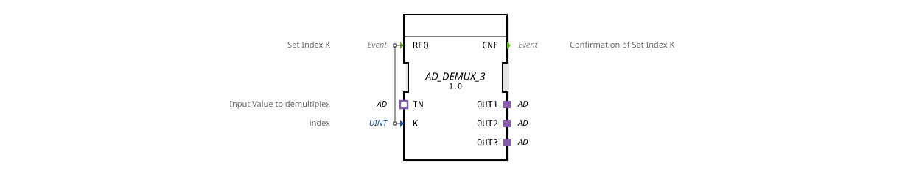

# AD_DEMUX_3

* * * * * * * * * *
## Introduction
The AD_DEMUX_3 is a generic demultiplexer function block that redirects an input value provided via an adapter (type `unidirectional::AD`) to one of three output adapters. The target output is selected using a numerical index. This function block is primarily used in control and automation technology to route signals to specific components.
## Interface Structure
### **Event Inputs**

| Name | Type | Comment |

|------|-----|------------|

| REQ | Event | Set Index K (with data output K) |

### **Event Outputs**

| Name | Type | Comment |

|------|-----|-----------|

| CNF | Event | Confirmation of Set Index K |

### **Data Inputs**

| Name | Type | Comment |

|------|------|-----------|

| K | UINT | Index for selecting the output (valid values 0, 1, 2) |

### **Data Outputs**
No data outputs available.

### **Adapters**

| Role | Name | Type | Comment |

|-------------|------|--------------------------------------|-----------|

| Socket (IN) | IN | adapter::types::unidirectional::AD | Input value to be demultiplexed |

| Plug (OUT1) | OUT1 | adapter::types::unidirectional::AD | First Output |

| Plug (OUT2) | OUT2 | adapter::types::unidirectional::AD | Second Output |

| Plug (OUT3) | OUT3 | adapter::types::unidirectional::AD | Third Output |

## Functionality
As soon as an event arrives at the **REQ** input, the current value of the index `K` is read. The adapter connected to the **IN** socket (and thus the transmitted information) is then forwarded to the output adapter (OUT1, OUT2, or OUT3) determined by `K`. After successful switching, an event is sent at the **CNF** output to confirm the operation. If the index value is invalid (e.g., greater than 2), the function block has no effect or, depending on the implementation, may trigger an error.

## Technical Features

- **Generic Type:** The FB is declared as a generic function block (`GenericClassName = 'GEN_AD_DEMUX'`) and can be instantiated for various adapter types, as long as the basic `unidirectional::AD` adapter is used.
- **Unidirectional Communication:** The adapters only allow data flow in one direction, from input to output. Feedback is not supported.
- **Simple Event Control:** There is no state machine – the FB operates strictly event-driven and immediately switches to the next output upon each request.

## State Overview

The FB does not have an explicit state machine in the XML model. Its behavior is purely sequential:

1. Wait for a request event.

2. Read K and forward the input from the IN adapter to the selected OUT adapter.

3. Send CNF.

Afterward, the FB is ready for the next request.

## Application Scenarios
- **Signal Distribution:** A single measurement signal (e.g., temperature or pressure) is routed to various controllers or displays depending on the index.
- **Actuator Switching:** A control signal is selectively sent to one of three actuators (e.g., valves or motors).
- **Testing and Diagnostic Tasks:** During commissioning, a test signal can be dynamically switched to different paths without changing the wiring.

## Comparison with Similar Components
- **AD_DEMUX_2 / AD_DEMUX_N:** Analog components with two or a flexible number of outputs. AD_DEMUX_3 is fixed to three outputs.
- **Multiplexer (e.g., AD_MUX):** A multiplexer switches multiple inputs to one output – precisely the reverse functionality.
- **Simple Switch:** AD_DEMUX_3 operates without intermediate storage and is therefore particularly suitable for time-critical routing during operation.

## Conclusion

The AD_DEMUX_3 is a compact, generic demultiplexer for adapter-based interfaces. Its clear event control and simple index selection make it ideal for dynamic signal distribution in distributed automation systems. The fixed number of three outputs covers many typical use cases and enables rapid implementation without unnecessary configuration.
