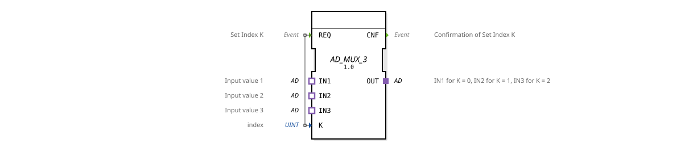

# AD_MUX_3

* * * * * * * * * *
## Introduction

The function block **AD_MUX_3** serves as a generic 3-channel multiplexer for analog data transmission via adapters of type `adapter::types::unidirectional::AD`. Based on an index value `K`, it selects one of the three input adapters (`IN1`/`IN2`/`IN3`) and forwards its data to the output adapter `OUT`. The block is suitable for dynamic switching between different analog signal sources in automation systems.
## Interface Structure

### **Event Inputs**

| Name | Type | Comment |
|------|-----|-----------|
| REQ | Event | Set Index K |

### **Event Outputs**

| Name | Type | Comment |
|------|-----|-----------|
| CNF | Event | Confirmation of Set Index K |

### **Data Inputs**

| Name | Type | Comment |
|------|-----|-----------|
| K | UINT | Index (0, 1, or 2) |

### **Data Outputs**

No data outputs defined (data is passed via the adapter `OUT`).

### **Adapter**

| Direction | Name | Type | Comment |
|----------|------|-----|-----------|
| Plug (Output) | OUT | adapter::types::unidirectional::AD | Output, provides the data of the selected input |
| Socket (Input) | IN1 | adapter::types::unidirectional::AD | Input value 1 (active when K=0) |
| Socket (Input) | IN2 | adapter::types::unidirectional::AD | Input value 2 (active when K=1) |
| Socket (Input) | IN3 | adapter::types::unidirectional::AD | Input value 3 (active when K=2) |

## Functionality

The function block operates in an event-driven manner:

1. An event at input `REQ` triggers processing.
2. The current value of the data input `K` (0, 1, or 2) determines which of the three input adapters is connected to the output adapter `OUT`:
- `K = 0` → `IN1` is connected to `OUT`.
- `K = 1` → `IN2` is connected to `OUT`.
- `K = 2` → `IN3` is connected to `OUT`.
3. After successful switching, confirmation is sent via the event output `CNF`.

After processing, the adapter `OUT` provides the data from the selected input. The switching occurs instantaneously within a single pass.

## Technical Features

- **Generic Function Block**: The function block is implemented as a generic function block (`GenericClassName = 'GEN_AD_MUX'`), which allows for flexible reuse with different adapter types, provided they are of the same unidirectional AD type.
- **No Data Buffering**: Data is transferred directly via the adapters without intermediate storage.
- **Input Protection**: The behavior for values of `K` outside the valid range (0–2) is not specified – in a concrete implementation, this should be handled by additional measures.

## State Overview

The function block does not have explicit states in the sense of a state machine. It reacts to each `REQ` event and immediately performs the switchover. After outputting `CNF`, the function block is ready for the next event.

## Application Scenarios

- **Switching between multiple analog sensors** (e.g., temperature, pressure, or level sensors) in a controller.
- **Calling different configurations** depending on operating modes or product variants.
- **Test benches** where changing signal sources are switched to a common evaluation unit.

## Comparison with Similar Components

Compared to a simple analog switch (e.g., `MUX_2` with two channels), `AD_MUX_3` expands the selection to three channels. Multichannel multiplexers with more than three channels (e.g., `AD_MUX_4_`) are conceivable by adjusting the adapter type and the number of sockets accordingly. This component offers a good balance between flexibility and simplicity.

## Change Detection

The selected output plug (`OUT`) is only written and its adapter event only sent if the incoming value differs from the value currently held on `OUT`. If the value is unchanged, no adapter event is sent, avoiding redundant updates on downstream peers.

## Conclusion

The **AD_MUX_3** is a compact, generic multiplexer component for unidirectional analog data. Its clear event-driven interface and the use of IEC 61499 adapters make it ideally suited for the modular design of automation applications requiring dynamic signal selection.
