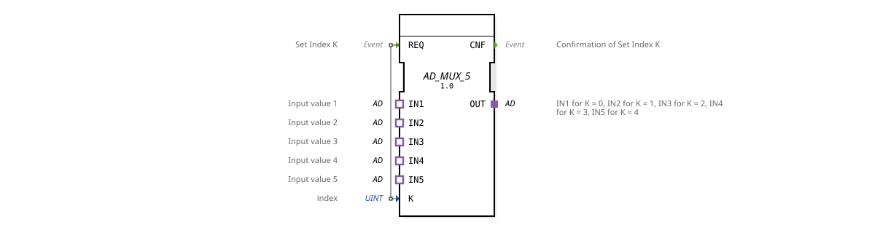

# AD_MUX_5

* * * * * * * * * *
## Introduction

The **AD_MUX_5** is a generic multiplexer IC for adapter interfaces. It allows the selection of one of five adapter inputs (IN1 to IN5) and forwards its data via the adapter output OUT. Selection is made using the index K, which is read upon a REQ event.

## Interface Structure

### **Event Inputs**

| Name | Type | Comment |

|------|-----|-----------|

| REQ | Event | Set Index K (triggered by data input K) |

### **Event Outputs**

| Name | Type | Comment |

|------|-----|-----------|

| CNF | Event | Confirmation of Set Index K |

### **Data Inputs**

| Name | Type | Comment |

|------|-----|-----------|

| K | UINT | index (0..4, corresponds to IN1..IN5) |

### **Data Outputs**

None.

### **Adapters**

- **Plugs (Output Adapters):** OUT – Type `adapter::types::unidirectional::AD`
- **Sockets (Input Adapters):** IN1, IN2, IN3, IN4, IN5 – each type `adapter::types::unidirectional::AD`

## Functionality

1. The function block is initially in idle state and waits for a REQ event.

2. Upon receipt of **REQ**, the current value of data input **K** is read. 3. Depending on **K** (0 to 4), the corresponding input adapter is switched to the output adapter **OUT**:

- K = 0 → IN1

- K = 1 → IN2

- K = 2 → IN3

- K = 3 → IN4

- K = 4 → IN5

4. After successful switching, the **CNF** event is sent to confirm the selection.

5. The function block returns to its idle state and waits for the next REQ.

The adapters are unidirectional, meaning data flows only from the selected input to the output.

## Technical Features

- **Generic Function Block:** The function block is declared as a generic type (`GEN_AD_MUX`) and can be used in different instances with the same adapter type.

- **Pure Adapter Interfaces:** No data outputs in the traditional sense are used; signal transmission occurs exclusively via adapters.

- **Type Security:** All adapters are of the same type, `adapter::types::unidirectional::AD`, ensuring a consistent data structure.

- **No Internal Behavior Beyond Switching:** The function block does not perform any data manipulation; it simply forwards the data.

## State Overview

The function block has a simple state machine:

- **IDLE:** Wait for REQ.

- **PROCESS:** Upon REQ: Evaluate K, connect the desired adapter, and output CNF.

- **Return to IDLE** after completion.

(The exact implementation depends on the target environment, but the principle remains the same.)

## Application Scenarios

- **Sensor Selection:** Connect multiple analog or digital sensors via adapters and select the currently required sensor using an index.

- **Signal Switching:** In control systems where different signal sources need to be switched to the same load (e.g., a display or a controller) depending on the operating mode.

**PROCESS:** - **Test and Simulation Setups:** Switching between different test signals in industrial automation solutions.

## Comparison with Similar Components

Compared to classic multiplexers (e.g., `MUX_2` or `MUX_4`), which are mostly designed for data inputs (INT, REAL, etc.), the **AD_MUX_5** works exclusively with adapter interfaces. This enables modular and type-safe wiring in a component-based system. The component is specifically optimized for cases where the signals to be multiplexed themselves contain complex data structures (addresses, channels, states) that are encapsulated by an adapter.

## Conclusion

The `AD_MUX_5` is a small but useful generic component for adapter-based signal selection. It reduces wiring effort and increases clarity in control systems where one must be selected from several similar interfaces. Thanks to its simple event control and clear interface, it can be easily integrated into existing projects.