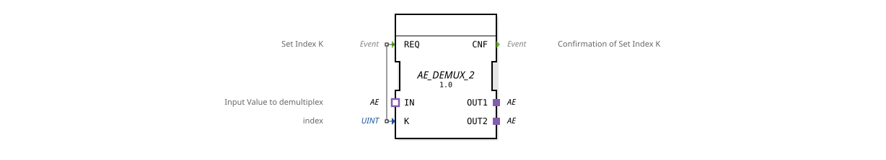

# AE_DEMUX_2

* * * * * * * * * *

## Introduction
The function block **AE_DEMUX_2** is a generic adapter demultiplexer. It distributes an incoming value via an adapter socket to either one of two adapter plugs, controlled by a numeric index.

## Interface Structure

### **Event Inputs**

| Event | Description |

|----------|--------------|

| `REQ` | Sets the index `K` and triggers the demultiplex function. |

### **Event Outputs**

| Event | Description |

|----------|--------------|

| `CNF` | Confirms successful index setting. |

### **Data Inputs**

| Variable | Type | Description |

|----------|-------|----------------------------|

| `K` | UINT | Target output index (1 or 2). |

### **Data Outputs**

No direct data outputs, as output is handled via the adapter plugs.

### **Adapters**

| Direction | Name | Adapter Type | Description |

|----------|-------|---------------------------------|-------------------------------------------------------|

| Socket | `IN` | `adapter::types::unidirectional::AE` | Input value that is forwarded depending on the index. |

| Plug | `OUT1` | `adapter::types::unidirectional::AE` | First output channel. |

| Plug | `OUT2` | `adapter::types::unidirectional::AE` | Second output channel. |

## Functionality
When an event occurs on `REQ`, the current value of `K` is read. The demultiplexer copies the value present at socket `IN` to the plug determined by the index:

- **K = 1** → Value is transferred to `OUT1`.

- **K = 2** → Value is transferred to `OUT2`.

After the transfer, the acknowledgment event `CNF` is output. The function block operates in an event-driven manner and does not store any internal state across multiple calls.

## Technical Features

- **Generic Design**: The function block is declared as a generic function block (`GenericClassName = 'GEN_AE_DEMUX'`). In this specific implementation (`AE_DEMUX_2`), exactly two outputs are defined.

- **Adapter-based communication**: All inputs and outputs are implemented as unidirectional adapters (type `AE`), enabling loose coupling and reusability in various application contexts.

- **No state machines**: Functionality is implemented purely through event processing; there is no explicit state machine.

## State overview
The function block has no documented internal states. Processing is strictly triggered by the `REQ` event. After completion of the switching operation, `CNF` is sent.

## Application scenarios

- **Signal distribution**: In control systems that need to switch an incoming analog or digital value (via adapter) to one of several outputs.

- **Channel switching**: When selecting between two data paths (e.g., sensors or actuators).

- **Generic Routing Logic**: As a building block in a library for flexible signal routing.

## Comparison with Similar Building Blocks

- **AE_DEMUX_N**: A demultiplexer with a variable number of outputs that can be configured generically. `AE_DEMUX_2` is a concrete instance with two outputs.

- **Multiplexer (MUX)**: Unlike a demultiplexer, a multiplexer selects one of several inputs.

- **State-Based Blocks**: Other demultiplexer implementations often use finite state machines to integrate additional logic such as reset behavior or error handling.

## Conclusion
The **AE_DEMUX_2** is a compact, event-driven adapter demultiplexer for two outputs. It is particularly suitable for flexible signal distribution in industrial automation solutions where values need to be dynamically switched via adapter interfaces. The generic base allows for easy adaptation to different project requirements.