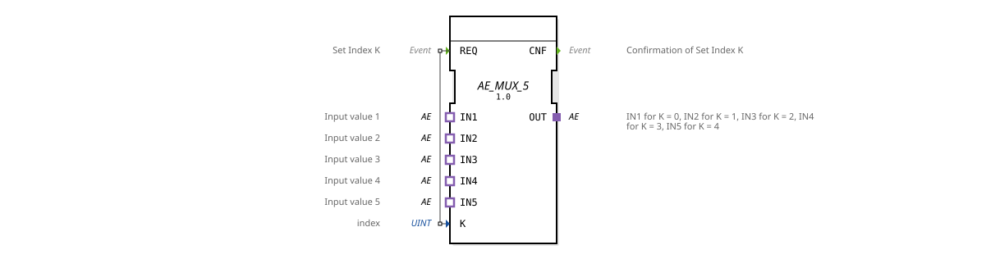

# AE_MUX_5

* * * * * * * * * *
## Introduction
The **AE_MUX_5** function block is a generic 5-way multiplexer for AE adapters (unidirectional). It selects one of five inputs (`IN1` … `IN5`) based on an integer index `K` and passes its data to the output `OUT`. The block operates in an event-driven manner: Upon receiving a `REQ` signal, the current index is evaluated, the input is passed through, and an acknowledgment (`CNF`) is then sent.

```
## Interface Structure

### **Event Inputs**

| Event | Comment |

|----------|-----------|

| **REQ** | Adopt the new index `K` and establish the corresponding connection between the selected `IN` adapter and the `OUT` adapter. |

### **Event Outputs**

| Event | Comment |

|----------|-----------|

| **CNF** | Confirmation that the switchover according to the requested index `K` has occurred. |

### **Data Inputs**

| Variable | Type | Comment |

|----------|-------|---------------------|

| **K** | UINT | Index (0 … 4) of the desired input. |

### **Data Outputs**

No dedicated data outputs – data transmission is exclusively via the adapter `OUT`.

### **Adapters**

| Adapter (Sockets) | Type | Comment |

|-------------------|-----------------------------------------------|----------------------------------|

| **IN1** … **IN5** | `adapter::types::unidirectional::AE` | The five inputs to be multiplexed. |

| **OUT** | `adapter::types::unidirectional::AE` (Plug) | The selected output. |

## Functionality

1. The block waits in idle mode for a `REQ` event.

2. Upon arrival of `REQ`, the value of the data input `K` is read.

3. Based on `K`, the corresponding adapter input is switched to the output adapter `OUT`:

- `K = 0` → Connection from `IN1` to `OUT`
- `K = 1` → Connection from `IN2` to `OUT`
- `K = 2` → Connection from `IN3` to `OUT`
- `K = 3` → Connection from `IN4` to `OUT`
- `K = 4` → Connection from `IN5` to `OUT`

4. After successful connection, the event `CNF` is sent.

5. If `K` is outside the valid range (0…4), the last valid connection remains active, or no new connection is established (depending on the implementation; by default, the value is not processed).

## Technical Features
- **Generic Function Block**: The function block is instantiated as `GEN_AE_MUX` and is designed for any AE adapter of type `adapter::types::unidirectional::AE`.
- **Pure Adapter Interface**: There are no direct data inputs/outputs – data flows entirely via adapters, enabling type-safe and flexible coupling in IEC 61499 systems.
- **Simple Event Model**: With only one event input and one event output, the behavior is deterministic and easily analyzed.

## State Overview

The function block (FB) does not have an explicit state machine. Its behavior is purely combinatorial (upon receipt of `REQ`, the selection is made immediately and `CNF` is sent). Its operation can be visualized as a single "active" state that exists only during the switching process.

```
## Application Scenarios

- **Sensor Multiplexing**: In an agricultural or industrial control system, multiple analog or digital AE interfaces (e.g., from sensors) are passed through a common output to a higher-level logic controller, with selection determined by an index.
- **Mode Switching**: Depending on the operating mode (index), a different data stream is used – e.g., different measurement channels or configuration data.
- **Redundancy Switching**: Five redundant AE sources are available, and the system switches to a specific source as needed.

## Comparison with Similar Components

| Component | Special Feature |

|----------|--------------|

| **AE_MUX_5** | Fixed 5-input multiplexer, specifically for AE adapters. |

| **MUX** (IEC 61499 Standard) | Mostly works with data inputs/outputs, not adapters. |

**SELECT** | Often more generic, but can also operate at the adapter level; requires additional configuration. |

**E_MUX** (event-based) | Similar principle, but at the data level; AE_MUX_5 is specifically optimized for unidirectional AE interfaces. |

## Conclusion

The `AE_MUX_5` is a clearly defined, powerful function block for selecting one of five AE data streams. Its adapter interface makes it flexible for use in IEC 61499 environments, and its simple event control allows for efficient integration into time-critical automation solutions. It represents an optimal, pre-built component for applications requiring a fixed number of 5 AE inputs.
