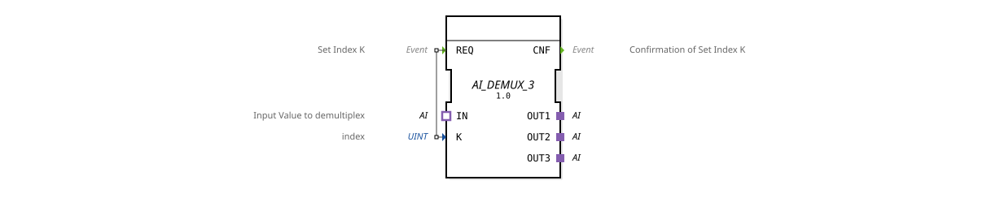

# AI_DEMUX_3

* * * * * * * * * *
## Introduction
The function block **AI_DEMUX_3** implements a generic demultiplexer for an analog input value. Based on an index parameter, the value present at the adapter input is redirected to one of three adapter outputs. The block operates unidirectionally and is event-driven.

## Interface Structure

### **Event Inputs**

| Event | Description |

|----------|--------------|

| REQ | Takes the index **K** and redirects the current value of the adapter input **IN** to the corresponding adapter output (**OUT1**, **OUT2**, or **OUT3**). |

### **Event Outputs**

| Event | Description |

|----------|--------------|

| CNF | Confirms successful forwarding after processing a **REQ** event. |

### **Data Inputs**

| Name | Type | Description |

|------|------|--------------|

| K | UINT | Index for selecting the output (valid values: 1, 2, 3). |

### **Data Outputs**
No data outputs available – output is exclusively via the adapter outputs.

### **Adapters**

| Type | Name | Direction | Description |

|-------|-------|-----------|--------------|

| AI | IN | Socket | Input adapter for the analog value to be distributed. |

AI | OUT1 | Plug | First output adapter. |

AI | OUT2 | Plug | Second output adapter. |

AI | OUT3 | Plug | Third output adapter. |

## Functionality
When a **REQ** event is received, the module reads the index **K**. The current value of the adapter input **IN** is then transferred to the output adapter determined by **K**:

- `K = 1` → Forwarding to **OUT1**
- `K = 2` → Forwarding to **OUT2**
- `K = 3` → Forwarding to **OUT3**

After successful transmission, the **CNF** event is triggered. If **K** has an invalid value (other than 1–3), the request is ignored or no output is activated. The manufacturer's documentation specifies the exact behavior.

## Technical Features

- **Generic Block:** The function block is defined as a generic type (`GEN_AI_DEMUX`) and can be used for different adapter instances of type `adapter::types::unidirectional::AI`.

- **Unidirectional Adapters:** All adapters (both inputs and outputs) are unidirectional, meaning data flows only from the socket to the plug.

- **No Data Outputs:** Output is not provided via traditional data outputs but exclusively via adapters, which facilitates modular wiring with other components.

## State Overview

The block does not have an explicit state machine. Its functionality is purely event-driven: A **REQ** event is followed by a **CNF** event after processing. No internal state is stored.

## Application Scenarios

- **Distribution of a measured value** to multiple control components, e.g., in agricultural technology for simultaneously supplying several control units with an analog sensor value.

- **Multiplexing in industrial plants**, when an analog signal needs to be supplied to different actuators depending on the operating mode.

- **Prototyping and flexible interconnection** in modular automation systems that rely on adapter-based data flows.

## Comparison with Similar Function Blocks
Compared to a classic **demultiplexer function block** with data outputs, the **AI_DEMUX_3** offers the advantage of adapter interfaces. This simplifies wiring at the function block level and increases reusability. Disadvantages may include the smaller number of outputs (3 instead of variable) and the requirement for the adapter type **AI**. A comparable **demultiplexer function block** with generic data outputs requires additional type conversions.

## Conclusion

The **AI_DEMUX_3** is an effective and specialized component for distributing analog values to up to three outputs. Thanks to its use of unidirectional adapters, it integrates seamlessly into modern, adapter-based architectures and is particularly suitable for modular automation solutions where clear interfaces and simple configuration are essential.