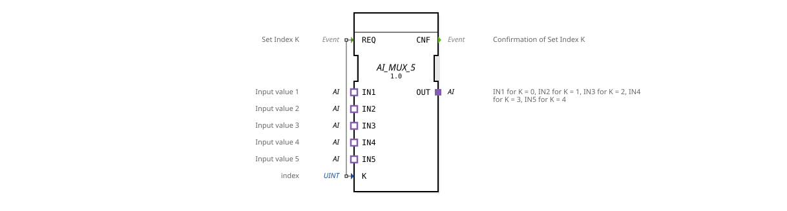

# AI_MUX_5

* * * * * * * * * *
## Introduction
The **AI_MUX_5** is a generic analog input multiplexer that allows you to select a single output signal (OUT) from five analog input signals (IN1 to IN5). Selection is made via an index value **K**, which is set by the **REQ** event. The function block is implemented as an adapter-based function block according to IEC 61499-2 and represents a flexible, reusable component for selecting analog signals in automation systems.
## Interface Structure
### **Event Inputs**

| Name | Type | Description |

|------|-----|---------------|

| REQ | Event | Triggers the input selection. The event takes the current value of **K** and sets the corresponding input to the output. |

### **Event Outputs**

| Name | Type | Description |

|------|-----|--------------|

| CNF | Event | Confirms successful selection. Outputs after the multiplexer has passed through. |

### **Data Inputs**

| Name | Type | Description |

|------|-----|--------------|

| K | UINT | Selection index (0…4). Determines which of the five inputs (IN1 to IN5) is connected to the output OUT. |

### **Data Outputs**
The module does not have direct data outputs. Output is provided via the **adapter output OUT**, which transmits the analog values of the selected input.

### **Adapter**

| Direction | Name | Type | Description |

|----------|------|-----|--------------|

| Plug | OUT | adapter::types::unidirectional::AI | Output adapter that provides the value of the selected analog input. |

| Socket | IN1 | adapter::types::unidirectional::AI | First analog input (K=0). |

| Socket | IN2 | adapter::types::unidirectional::AI | Second analog input (K=1). |

| Socket | IN3 | adapter::types::unidirectional::AI | Third analog input (K=2). |

| Socket | IN4 | adapter::types::unidirectional::AI | Fourth analog input (K=3). |

| Socket | IN5 | adapter::types::unidirectional::AI | Fifth analog input (K=4). |

The adapters use the type `adapter::types::unidirectional::AI`, which is designed for analog input signals.

## Functionality
On each **REQ** event, the current value of the data input **K** (integer index 0…4) is read. The function block then passes the analog signal from the corresponding socket adapter (IN1 for K=0, IN2 for K=1, …, IN5 for K=4) to the plug adapter **OUT**. After successful switching, the confirmation event **CNF** is sent. The multiplexer operates as a simple pass-through switch – no signal processing or conversion takes place.

## Technical Features
- **Generic Function Block**: The function block is declared as a generic type (`GEN_AI_MUX`) and can be instantiated by specifying a concrete type parameter (TypeHash).
- **Adapter-based**: Input and output are exclusively via adapters – no direct data outputs are used. This allows for flexible coupling with other analog adapter modules.
- **No state machine**: The function block does not have an explicit state machine (ECC). The function is executed directly upon each REQ event.
- **Fixed number of inputs**: Fixed five channels (IN1…IN5). Expansion is possible using identical modules or other multiplexer variants.

## State overview
Since the module does not contain an explicit state machine (ECC), only an implicit state exists. Upon receiving a **REQ**, this state executes the multiplexing function and immediately outputs **CNF**. The function block is always ready to process a new REQ.

## Application scenarios
- **Measuring point switching**: Selection of one of five analog sensors (e.g., temperature, pressure) for further processing in a control loop.
- **Signal Routing**: Forwarding different analog signals to a subsequent analog-to-digital converter or a higher-level controller.
- **Test and Verification Systems**: Dynamic switching between different measurement channels during a test sequence.

## Comparison with Similar Components
- **AI_MUX_2 / AI_MUX_10**: Components with two or ten analog inputs, respectively – here, the number of channels is fixed. AI_MUX_5 provides a medium number of channels for applications with five signals.
- **General MUX Components (e.g., MUX)**: These often use direct data ports instead of adapters. The adapter-based approach of AI_MUX_5 enables tighter integration into adapter-oriented architectures and facilitates the exchange of input and output interfaces.
- **Bit Multiplexers**: Separate multiplexers exist for binary signals – AI_MUX_5 is specifically designed for analog (continuous) signals.

## Conclusion

The **AI_MUX_5** is a compact, adapter-based analog multiplexer for five inputs. It is particularly suitable for use in modular automation solutions where analog signals need to be switched flexibly. Thanks to its generic nature and clear interface structure, it can be easily integrated into and expanded within existing projects.
