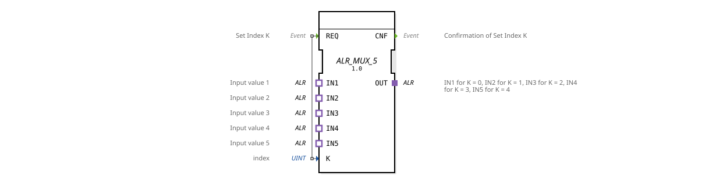

# ALR_MUX_5

* * * * * * * * * *
## Introduction

The function block **ALR_MUX_5** is a generic multiplexer for the adapter type `adapter::types::unidirectional::ALR`. It selects one of five input adapters (IN1 to IN5) and forwards its values via the output adapter OUT. The selection is made using the index K (an integer value from 0 to 4). The function block is controlled via the event input REQ and confirms execution with the output CNF.
## Interface Structure

### **Event Inputs**

| Name | Type | Comment |
|------|-----|------------|
| REQ | Event | Sets the index K and accepts the selection |

### **Event Outputs**

| Name | Type | Comment |
|------|-----|-----------|
| CNF | Event | Confirmation of execution after REQ |

### **Data Inputs**

| Name | Type | Value Range | Comment |
|------|-----|--------------|-----------|
| K | UINT | 0 .. 4 | Index of the input to be selected |

### **Data Outputs**

(No direct data outputs available – data transmission occurs via the OUT adapter.)

### **Adapters**

**Sockets (Inputs)**

| Name | Type | Comment |
|------|-----|-----------|
| IN1 | adapter::types::unidirectional::ALR | Input value 1 (K = 0) |
IN2 | adapter::types::unidirectional::ALR | Input value 2 (K = 1) |
IN3 | adapter::types::unidirectional::ALR | Input value 3 (K = 2) |
IN4 | adapter::types::unidirectional::ALR | Input value 4 (K = 3) |
IN5 | adapter::types::unidirectional::ALR | Input value 5 (K = 4) |

**Plug (Output)**

| Name | Type | Comment |
|------|-----|-----------|
OUT | adapter::types::unidirectional::ALR | Output: returns the selected input value |

## Functionality

1. The function block expects an event at the **REQ** input. Simultaneously, the index **K** must contain a valid value between 0 and 4.
2. Upon receiving a REQ, the adapter **IN(K+1)** is selected, and its data is provided via **OUT**.
3. After successful selection, the **CNF** event is sent to confirm acceptance.
4. If an invalid index (K > 4) is set, the behavior is undefined; the function block should be protected with a range check in the application context.

Data transmission is **unidirectional** from input to output. The function block is implemented generically and can be used for any adapter of type `adapter::types::unidirectional::ALR`, regardless of the specific contents of the adapter interface.

## Technical Features

- **Generic Function Block**: The function block is declared as a generic class (`GEN_ALR_MUX`) and can be adapted to various ALR adapters by typing.
- **Adapter-based**: All inputs and outputs are adapters of the same unidirectional type. This allows for flexible coupling with other function blocks that provide the same adapter.
- **No internal states** except for readiness upon REQ – the function block operates purely combinatorially for each event.
- **5 inputs** are hard-coded; expanding to other numbers requires a new version of the function block.

## State Overview

The function block does not have an explicit state machine. It remains in the **IDLE** state until a REQ arrives. Upon REQ, the selection is made and CNF is immediately sent. There are no waiting or blocking states.

| State | Description |
|---------|--------------|
| IDLE | Waiting for REQ |

## Application Scenarios

- **Signal switching** in automation technology: e.g. B. Selection of one of five sensor data streams (ALR format) for further processing.
- **Test and simulation environments**: Switching between different test sources without rewiring.
- **Multiplexing of ALR adapter data** in a central controller, where different data sources are activated depending on the operating mode.

## Comparison with similar function blocks

| Function block | Type | Inputs | Selection control | Remark |
|----------|-----|----------|------------------|-----------|
| ALR_MUX_5 | Adapter (ALR) | 5 | K (UINT) via REQ | Specifically for ALR adapters, generic |
| Standard MUX (e.g., MUX_INT) | Elementary (e.g., INT) | Variable | K via REQ | Works with simple data types, not generic via adapter |
| MUX_E_4 | Adapter (any) | 4 | K (BOOL) | Usually a fixed number, no generic adapter |

The ALR_MUX_5 is characterized by its adapter interface, which can transport complex composite data structures, and by its generic design.

## Conclusion

The **ALR_MUX_5** function block offers clean, event-driven multiplexing functionality for five unidirectional ALR adapters. It is generic, easy to use, and suitable for all applications that require dynamic selection from multiple data sources in ALR format. Thanks to the adapter technology, even complex data packets can be switched without additional effort.
