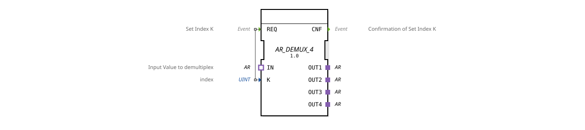

# AR_DEMUX_4

* * * * * * * * * *
## Introduction

The function block `AR_DEMUX_4` is a generic demultiplexer for the AR adapter type. It receives a data value via a single AR adapter socket (input) and forwards it to one of four AR adapter plugs (outputs). The target output is selected via the index K, which is evaluated upon the arrival of the event `REQ`. This function block is typically used in automation technology, particularly in agriculture, to distribute a data stream to various downstream consumers.
## Interface Structure

### **Event Inputs**

| Name | Type | Comment |
|------|-----|-----------|
| REQ | Event | Set Index K and trigger demultiplexing |

### **Event Outputs**

| Name | Type | Comment |
|------|-----|-----------|
| CNF | Event | Confirmation of K processing |

### **Data Inputs**

| Name | Type | Comment |
|------|-----|-----------|
| K | UINT | Index of the desired output channel (1..4) |

### **Data Outputs**

None.

### **Adapters**

| Name | Direction | Type | Comment |
|------|----------|-----|-----------|
| IN | Socket (Input) | `adapter::types::unidirectional::AR` | Input value to be demultiplexed |
| OUT1 | Plug (Output) | `adapter::types::unidirectional::AR` | Output channel 1 |
| OUT2 | Plug (Output) | `adapter::types::unidirectional::AR` | Output channel 2 |
| OUT3 | Plug (Output) | `adapter::types::unidirectional::AR` | Output channel 3 |
| OUT4 | Plug (Output) | `adapter::types::unidirectional::AR` | Output channel 4 |

## Functionality

A demultiplexer distributes the AR adapter value present at `IN` to one of the four output adapters `OUT1` … `OUT4`. The assignment is made via the data input `K` (index). Upon arrival of the event `REQ`, the current value of `K` is read, and the current state of the input adapter `IN` is copied to the output adapter designated by `K`. The other three outputs remain unchanged (their values are not reset). After successful forwarding, the event `CNF` is sent. Valid values for `K` are **1 to 4**. Values outside this range or undefined behavior are not specified in the standard function block; in practice, the application should ensure that only valid indices are passed.

## Technical Features

- **Generic Function Block**: The function block is declared as a generic type (`GEN_AR_DEMUX`), so it can be used for various AR adapter variants.
- **Unidirectional Adapters**: All adapters are of type `adapter::types::unidirectional::AR`. This means that data flows in only one direction (from the input to the outputs).
- **License**: The function block is subject to the Eclipse Public License 2.0 (EPL-2.0) and was created by HR Agrartechnik GmbH.
- **No Implicit State Machine**: The function block (FB) does not have an Execution Control Chart (ECC) – the logic is event-driven and purely functional.

## State Overview

An explicit state machine is not defined. The function block operates statelessly: Each `REQ` event triggers a single forwarding operation. There is no initialization or special internal states.

## Application Scenarios

- **Data Distribution in Agricultural Machinery**: E.g., distributing sensor data (e.g., field data, CAN messages) to various control units.
- **Selective Activation of Actuators**: A central AR data stream can be selectively forwarded to four different actuator connections.
- **Switching of Signal Sources** (in combination with a multiplexer): Can be used to configure bus or communication paths.

## Comparison with Similar Components

- **`AR_MUX_4` (Multiplexer)**: Accepts multiple AR inputs and outputs a selected one – the counterpart to `DEMUX`.
- **`DEMUX` for Simple Data Types (e.g., `BOOL_DEMUX_4`)**: Identical operating principle, but elementary data types are used instead of AR adapters.
- **`AR_DEMUX_n` with Variable Number of Channels**: `AR_DEMUX_4` is fixed at four channels; other variants (e.g., `AR_DEMUX_2`, `AR_DEMUX_8`) exist for different numbers of channels.

## Change Detection

The selected output plug is only written and its adapter event only sent if the incoming value differs from the value currently held on that plug. If the value is unchanged, no adapter event is sent, avoiding redundant updates on unrelated peers.

## Conclusion

The `AR_DEMUX_4` is a specialized yet generically usable demultiplexer for the AR adapter type. It is ideally suited for the simple and efficient distribution of a data stream to up to four outputs. Thanks to its clear event-driven interface and the separation of index and data, it can be easily integrated into industrial control architectures.
