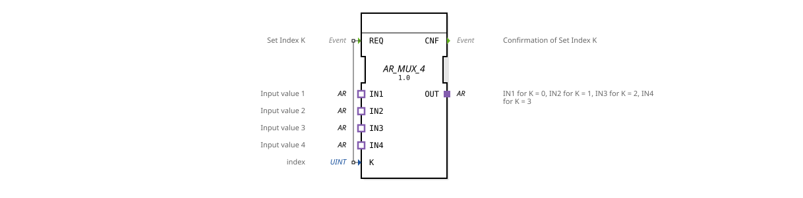

# AR_MUX_4

* * * * * * * * * *
## Introduction

The **AR_MUX_4** is a generic AR multiplexer that switches one of four input adapters (IN1 to IN4) to one output adapter (OUT). Selection is made via an index value K (0–3). The function block is implemented as a generic type (`GEN_AR_MUX`) and is based on unidirectional AR adapters.
## Interface Structure

### Event Inputs

| Event | Description |
|----------|--------------|
| **REQ** | Controls the switching based on the index K. |

## Event Outputs

| Event | Description |
|----------|--------------|
| **CNF** | Confirms successful switching. |

### Data Inputs

| Variable | Type | Description |
|----------|-------|--------------|
| **K** | UINT | Index (0–3) for selecting the active input. |

### Data Outputs

No data outputs available.

### Adapter

| Type | Name | Direction | Description |
|-----|------|----------|--------------|
| Plug (Output) | **OUT** | Output | Returns the signal path of the selected input. |
| Socket (Input) | **IN1** | Input | Input value for K = 0. |
Socket (Input) | **IN2** | Input | Input value for K = 1. |
Socket (Input) | **IN3** | Input | Input value for K = 2. |
Socket (Input) | **IN4** | Input | Input value for K = 3. |

## Functionality

When a **REQ** event arrives, the current value of the data input **K** is evaluated. The function block connects the output adapter **OUT** to the input adapter whose index corresponds to the value of K:

- K = 0 → **IN1** is connected to OUT.
- K = 1 → **IN2** is connected to OUT.
- K = 2 → **IN3** is connected to OUT.
- K = 3 → **IN4** is connected to OUT.

The confirmation event **CNF** is then output. If K is outside the range 0–3, the connection remains unchanged (no switching).

## Technical Features

- **Generic Type**: The function block is declared as generic `GEN_AR_MUX`, enabling flexible reuse in various applications.
- **Adapter-Based**: All interfaces (inputs and output) are unidirectional AR adapters (`adapter::types::unidirectional::AR`). This makes it suitable for transmitting actuator/reference signals.
- **Simple Event Control**: No complex state machine – switching occurs directly with each REQ event.

## State Overview

The function block does not have an explicit state machine. Its behavior is purely event-driven: After each REQ, CNF is immediately output as soon as the adapter connection is established.

- **Adapter-Based**:
## Application Scenarios

- **Signal Routing in Control Applications**: Selection of one of four actuator or reference signals, e.g., for controlling different loads.
- **Flexible Configuration**: Dynamic switching between different signal sources depending on the operating mode.

## Comparison with Similar Components

- **Standard MUX (for Data)**: Conventional multiplexers work with data types (e.g., INT, BOOL) and data outputs. In contrast, the AR_MUX_4 works with adapters, which enables the direct routing of complex signal paths (e.g., actuator control).
- **AR_SWITCH (Switch)**: A similar component that often executes a switching command in response to an event, but with a different number of inputs/outputs or a more general configuration.

## Conclusion

The AR_MUX_4 is a specialized multiplexer for AR adapters that allows for simple and fast switching between four input signals. Thanks to its generic implementation and clean event-driven interface, it is ideally suited for applications that require flexible signal forwarding in automation technology.
