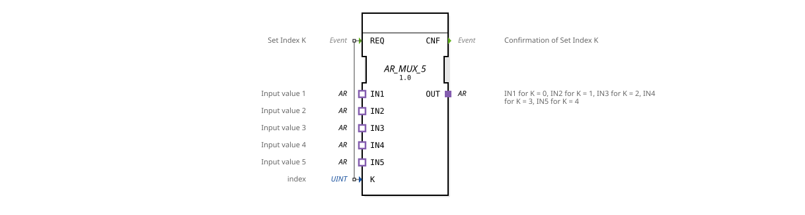

# AR_MUX_5

* * * * * * * * * *
## Introduction

The **AR_MUX_5** function block is a generic 5-channel multiplexer based on the adapter type `adapter::types::unidirectional::AR`. It allows the selection of one of five AR adapter inputs (IN1 … IN5) and routes this input to the single output adapter (OUT). Selection is made via the integer index K, which is set via the event input `REQ`. The function block is specified according to IEC 61499-2 and is used as a generic function block (`GEN_AR_MUX`).
## Interface Structure

### **Event Inputs**

| Name | Type | Description |
|------|-----|--------------|
| `REQ` | Event | Signals the adoption of the new index K and triggers the switchover. Connected to data input `K`. |

### **Event Outputs**

| Name | Type | Description |
|------|-----|---------------|
| `CNF` | Event | Confirmation that the multiplexer has adopted index K and established the corresponding connection. |

### **Data Inputs**

| Name | Type | Description |
|------|-----|---------------|
| `K` | UINT | Index of the selected input (0 … 4). K = 0 → IN1, K = 1 → IN2, …, K = 4 → IN5. |

### **Data Outputs**

No explicit data outputs. Output is handled entirely via the `OUT` adapter.

### **Adapters**

**Plugs (Output Side)**

| Name | Type | Description |
|------|-----|---------------|
| `OUT` | `adapter::types::unidirectional::AR` | Output adapter that passes on the selected input. |

**Sockets (Input Side)**

| Name | Type | Description |
|------|-----|--------------|
| `IN1` | `adapter::types::unidirectional::AR` | First Input (K = 0) |
| `IN2` | `adapter::types::unidirectional::AR` | Second Input (K = 1) |
| `IN3` | `adapter::types::unidirectional::AR` | Third Input (K = 2) |
| `IN4` | `adapter::types::unidirectional::AR` | Fourth Input (K = 3) |
| `IN5` | `adapter::types::unidirectional::AR` | Fifth Input (K = 4) |

## Functionality

Upon receiving a `REQ` event, the current value of the data input `K` is evaluated. The function block then switches the corresponding socket adapter (IN1 … IN5) to the plug adapter `OUT`. The output adapter `OUT` thus corresponds to the content of the input determined by K. After a successful switchover, the event `CNF` is sent. If K does not change between two calls, the connection remains unchanged, but a `CNF` event is still triggered.

...
## Technical Features

- **Generic Type**: The function block is declared as a generic FB (`GEN_AR_MUX`) and can be instantiated for specific applications using the 4diac IDE.
- **Adapter-Based Communication**: All inputs and outputs utilize the unidirectional AR adapter. This allows for the efficient transmission of complex data structures and continuous signals without the need to resolve individual data points.
- **Fixed Number**: The function block supports exactly 5 inputs (0 to 4). Modified versions (e.g., `AR_MUX_2`, `AR_MUX_8`) are required for other numbers.
- **No Intermediate Buffering**: Switching occurs directly without additional buffering; the output `OUT` immediately reflects the selected input.

## State Overview

The function block does not have an explicit state machine, but operates in an event-driven manner:

1. **Ready (Idle)**: Waits for a `REQ` event.
2. **Switching**: Upon arrival of `REQ`, the new index K is adopted, and the corresponding input is switched to `OUT`.
3. **Acknowledgement**: Sends the `CNF` event to signal the successful switching.

The function block then returns to the ready state.

## Application Scenarios

- **Signal Switching in Automation**: Selection of one of five analog or digital sensors (via AR adapter) in a controller.
- **Fault Switchover**: If a defective channel is detected, the system can switch to a backup sensor without rewiring the entire structure.
- **Test and Diagnostic Environments**: Sequential reading of various AR data sources for verification purposes.
- **Configurable Data Paths**: In modular systems for creating flexible connections between devices.

## Comparison with Similar Components

- **AR_MUX_2, AR_MUX_3, AR_MUX_8**: These components differ only in the number of inputs and the value range of K. They all use the same adapter type and identical event control.
- **Standard Multiplexer with Data Elements**: Unlike classic IEC 61499 components that multiplex individual variables (e.g., BOOL, REAL), the `AR_MUX_5` operates at the adapter level and can therefore forward complex, composite information as a whole.
- **Bus Coupler / Switch**: While bus couplers often support bidirectional or addressable communication, the `AR_MUX_5` is a simple, event-driven selector without feedback on the switching state.

## Change Detection

The selected output plug (`OUT`) is only written and its adapter event only sent if the incoming value differs from the value currently held on `OUT`. If the value is unchanged, no adapter event is sent, avoiding redundant updates on downstream peers.

## Conclusion

The `AR_MUX_5` is a clear, generic function block for selecting one of five AR adapter inputs. Thanks to its adapter-based interface, it is particularly suitable for modular automation solutions where data is passed in a structured format. The simple event control with `REQ`/`CNF` enables straightforward integration into existing control sequences. Variants are available for applications with more or fewer channels.

The `AR_MUX_5` is a clear, generic function block for selecting one of five AR adapter inputs. Thanks to its adapter-based interface, it is particularly suitable for modular automation solutions where data is passed in a structured format. ---

### 🌐 Related topic subpages on ms-muc-docs.de

* [🌐 Eclipse 4diac IDE & Color Reference on ms-muc-docs.de](https://www.ms-muc-docs.de/iec-61499/eclipse-4diac/)

]
