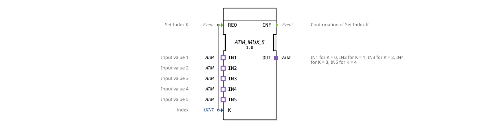

# ATM_MUX_5

* * * * * * * * * *
The function block **ATM_MUX_5** serves as a universal multiplexer for five unidirectional ATM data streams. Based on an index specified via the data input `K`, it selects one of the five inputs (`IN1` … `IN5`) and forwards its data to the output `OUT`. The selection is triggered by an event at the input `REQ` and acknowledged by an event at the output `CNF`.

| Name | Type | Comment |
|------|-------|--------------------------|
| REQ | Event | Set Index K and execute |
| Name | Type | Comment |
|------|-------|----------------------------------|
| CNF | Event | Index switching confirmation |
| Name | Type | Comment |
|------|------|-----------------|
| K | UINT | Selection index (0..4) |

No data outputs are available. Output is exclusively via the adapter plugin `OUT`.

### Data Outputs

### Data Inputs

### Event Outputs

### Event Inputs

## Interface Structure

## Introduction

### **Adapter**

| Direction | Name | Type | Comment |
| Name | Type | Comment |
| Plug | OUT | adapter::types::unidirectional::ATM | Output: for `K=0` = IN1, `K=1` = IN2, …, `K=4` = IN5 |
| Socket | IN1 | adapter::types::unidirectional::ATM | Input 1 |
| Socket | IN2 | adapter::types::unidirectional::ATM | Input 2 |
| Socket | IN3 | adapter::types::unidirectional::ATM | Input 3 |
| Socket | IN4 | adapter::types::unidirectional::ATM | Input 4 |
| Socket | IN5 | adapter::types::unidirectional::ATM | Input 5 |

## Functionality

1. ATM data streams are continuously present at sockets `IN1` … `IN5`.
2. The data input `K` determines which of these streams should be routed to plug `OUT`. Permitted values are 0 to 4 (corresponding to IN1 to IN5). Values outside this range result in undefined behavior.
3. An event at input `REQ` triggers the switching. Immediately afterward, the connection between the selected input and the output is established.
4. After successful switching, the event `CNF` is sent to signal completion to the calling function block.
- **Generic Function Block**: The XML definition contains an attribute `GenericClassName` that references `'GEN_ATM_MUX'`. Therefore, the function block can be used in development environments as a template for multiplexers with any number of inputs.
- **Adapter Coupling**: All data transmission occurs via the standardized adapter `adapter::types::unidirectional::ATM`. This avoids tight coupling between sender and receiver – the implementation of the adapter logic is the user's responsibility.
- **Event-Driven**: Switching does not occur without a trigger event at the `REQ` input. The function block remains static until a new `REQ` input arrives.

The function block does not have an explicit state machine. It operates as a reactive function block:

- **Idle State**: No event is present at `REQ`. The last selected input remains active.
- **Switching Phase**: After `REQ` arrives, the new index is applied and `CNF` is output.
- **Channel Switching** in a communication system that manages multiple ATM sources (e.g., in agricultural technology for data stream selection).
- **Test Environments** where different data sources are to be sequentially connected to a common consumer.
- **Redundancy solutions**, where a switch to a backup memory is performed manually or automatically in the event of a data stream failure.
- **ATM_MUX_2 / ATM_MUX_4**: Components with the same functionality, but only two or four inputs. The ATM_MUX_5 offers the maximum of five channels.
- **General MUX components (e.g., data MUX)**: These often work with scalar data (e.g., INT, REAL) and not with adapters. The ATM_MUX_5 is specifically designed for exchanging complex data types defined via adapters.

The **ATM_MUX_5** is a flexible, event-driven multiplexer for five unidirectional ATM data streams. Its adapter interface enables loose coupling of the components and allows for easy reuse in various automation and communication systems. The generic design makes it a practical basis for individual multiplexer variants.

## Technical Features

## State Overview

## Application Scenarios

## Comparison with Similar Function Blocks

## Conclusion