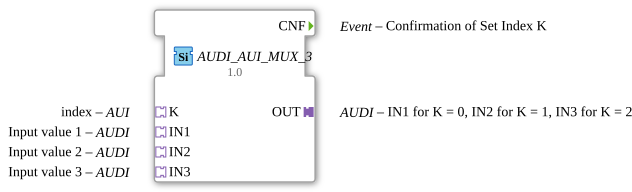

# AUDI_AUI_MUX_3

* * * * * * * * * *
## Introduction

`AUDI_AUI_MUX_3` is the adapter-based variant of the generic multiplexer for data type `UDINT`. Unlike [AUDI_MUX_3](AUDI_MUX_3.md), it does not receive the selection index through a REQ event with an associated K data input, but through its own adapter socket **K** of type `AUI` ("Adapter Unidirectional Interface"). This lets the index be fed directly from another block with a matching `AUI` plug, without wiring a separate event and data line for it.

## Interface Structure

### **Event Inputs**

- No explicit event inputs on the block itself. The index is received exclusively through the adapter socket **K**: as soon as the `AUI` plug connected there fires its internal event `E1` carrying the data value `D1`, `AUDI_AUI_MUX_3` evaluates the index internally and triggers processing.

### **Event Outputs**

- **CNF**: confirms that the index received via K has been evaluated and the target plug updated accordingly.

### **Data Inputs**

- No direct data inputs. The index (`UINT`, 0-based) arrives exclusively as the `D1` value of the `AUI` adapter connected to socket **K**.

### **Data Outputs**

- No direct data outputs.

### **Adapters**

- **K** (Socket, type `AUI`): index input -- selects the active input/output through the adapter's own `E1`/`D1` event.
- **IN1** (Socket): input adapter 1 of 3, passed through to `OUT` when the index is `K = 0` (AUDI adapter type).
- **IN2** (Socket): input adapter 2 of 3, passed through to `OUT` when the index is `K = 1` (AUDI adapter type).
- **IN3** (Socket): input adapter 3 of 3, passed through to `OUT` when the index is `K = 2` (AUDI adapter type).
- **OUT** (Plug): output adapter, forwards whichever input the index selected (AUDI adapter type).

## Functionality

`AUDI_AUI_MUX_3` selects one of the 3 input sockets `IN1` … `IN3` via the adapter socket **K** (type `AUI`) and forwards its value to the single output plug `OUT`. As soon as the `AUI` plug connected to K fires its internal `E1` event carrying the data value `D1`, `AUDI_AUI_MUX_3` interprets that value as a 0-based index (`0` … `2`), copies the value of the selected input to `OUT` and triggers its adapter event. `AUDI_AUI_MUX_3` then confirms the operation via the **CNF** event.

## Technical Details

- Adapter-based index input instead of the classic REQ/K input pair -- reduces wiring when the index is already available as an `AUI` adapter.
- Generic implementation (`GEN_AUDI_AUI_MUX`) -- shared across all port counts of this block family (AUDI_AUI_MUX_2 … AUDI_AUI_MUX_5).
- **Change detection**: the written output plug is only updated -- and its adapter event only sent -- when the new value differs from the value currently held on that plug. If the value is unchanged, no adapter event is sent, avoiding redundant updates for downstream peers.

## State Overview

The block is stateless with respect to any sequencing logic: it waits for the `E1` event on socket **K**, evaluates the index carried with it once it arrives, updates the affected adapter plug and reports completion via **CNF**. No state beyond the most recently written adapter value is kept between calls.

## Application Scenarios

- Choosing between up to 3 32-bit unsigned integer sources through a centrally managed adapter index
- Replacing a REQ/K input pair with a single AUI adapter link when the index is already provided as an adapter by another block
- Building selection networks in which several MUX blocks share the same index adapter

## ⚖️ Comparison with Similar Blocks

Compare with [AUDI_MUX_3](AUDI_MUX_3.md) (same selection logic, but the index arrives through a classic **REQ** event plus **K** data input instead of an adapter).

Compare with [F_MUX_3](../../../../../StandardLibraries/iec61131-3/selection/F_MUX_3.md), which performs the same 3:1 selection purely on data, without any adapter/event concept.

## Conclusion

`AUDI_AUI_MUX_3` carries the multiplexer logic of the `AUDI_MUX_3` family over to a purely adapter-based index supply. This makes it the right choice whenever the selection index is already available as an `AUI` adapter from another block and no additional event/data wiring for the index is wanted.
