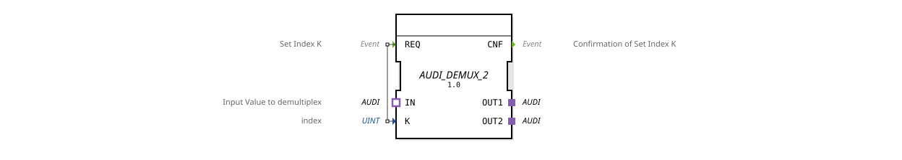

# AUDI_DEMUX_2

* * * * * * * * * *
## Introduction

The function block `AUDI_DEMUX_2` is a generic 1-to-2 demultiplexer for the unidirectional adapter type `AUDI`. It forwards an incoming AUDI value to one of two output plugs, controlled by a numeric index.
## Interface Structure

### **Event Inputs**

| Event | Description | With Data |
|----------|--------------|-----------|
| `REQ` | Request to forward the current input value according to index `K` | `K` |

### **Event Outputs**

| Event | Description |
|----------|--------------|
| `CNF` | Confirmation that the forwarding is complete |

### **Data Inputs**

| Name | Type | Description |
|------|-------|--------------|
| `K` | `UINT` | Selection index (0 → OUT1, 1 → OUT2) |

### **Data Outputs**

None.

### **Adapter**

| Role | Name | Type | Direction | Description |
|--------------|--------|--------------------------|------------|----------------------------------|
| Socket | `IN` | `adapter::types::unidirectional::AUDI` | Input | Input value to be demultiplexed |
| Plug | `OUT1` | `adapter::types::unidirectional::AUDI` | Output | First output (Index 0) |
| Plug | `OUT2` | `adapter::types::unidirectional::AUDI` | Output | Second output (Index 1) |

## Functionality

The function block waits in a default state for the event `REQ`. Upon arrival of `REQ`, the current value of the data input `K` is evaluated:

- **K = 0**: The AUDI value present at socket `IN` is forwarded to plug `OUT1`.
- **K = 1**: The value is forwarded to plug `OUT2`.
- **K > 1**: The behavior is undefined; the forwarding either does not occur or is sent to an unspecified output.

After successful forwarding, the event `CNF` is output, and the function block returns to its standby state.

## Technical Features

- The function block is implemented as a generic function block (`GEN_AUDI_DEMUX`) and can be parameterized for different AUDI variants by specifying a concrete type hash identifier.
- The interface uses only the unidirectional adapter `AUDI`, which is defined in an adapter package.
- The logic is event-driven and suitable for cyclic and event-driven automation environments.

## State Overview

The function block implicitly has an internal state machine:

- **START**: The function block is initialized and ready.
- **Waiting for REQ**: Initial state.
- **Processing**: After receiving `REQ`, the request is forwarded; no further `REQ` requests are accepted during this phase.
- **Return**: After outputting `CNF`, the system returns to its initial state.

## Application Scenarios

- **Signal Demultiplexing in Agricultural Engineering**: Distribution of an audio signal (e.g., sensor data) to two different control units.
- **Switching Between Operating Modes**: Depending on the index, a signal is routed to a different processing unit.
- **Testing and Diagnostic Tasks**: Targeted application of a test signal to one of two outputs.

## Comparison with Similar Components

- `AUDI_DEMUX_2` differs from general demultiplexers (e.g., `DEMUX` for elementary data types) through the use of the complex adapter type `AUDI`.

Compared to a multiplexer (`AUDI_MUX`), the data flow direction is reversed – here, a signal is distributed to multiple outputs, while a multiplexer combines multiple inputs into a single output.

## Change Detection

The selected output plug is only written and its adapter event only sent if the incoming value differs from the value currently held on that plug. If the value is unchanged, no adapter event is sent, avoiding redundant updates on unrelated peers.

## Conclusion

AUDI_DEMUX_2` is a specialized, generic demultiplexer for unidirectional AUDI interfaces. It enables clean and event-driven signal distribution in automation systems, especially in environments that use the AUDI adapter standard. Its simple interface (one index, two outputs) makes it intuitive to use and easy to integrate into existing control logic.
