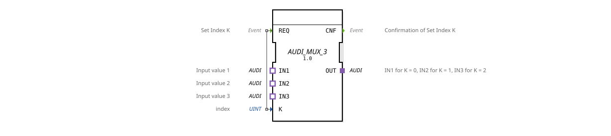

# AUDI_MUX_3
(No image available)

* * * * * * * * * *
## Introduction
The function block `AUDI_MUX_3` is a generic multiplexer (MUX) that allows you to select one of three adapter inputs (IN1, IN2, IN3) of type `adapter::types::unidirectional::AUDI` and connect it to the adapter output `OUT`. The selection is made via the index (0, 1, or 2) applied to the data input `K` and is triggered by an event at the input `REQ`. This function block is designed for use in automation systems that utilize the AUDI adapter standard.

## Interface Structure

### **Event Inputs**

| Event | Description |

|----------|--------------|

| `REQ` | This event triggers the switch to the adapter input specified by the index `K`. |

### **Event Outputs**

| Event | Description |

|----------|--------------|

| `CNF` | Confirmation that the desired adapter connection has been established. |

### **Data Inputs**

| Name | Type | Description |

|------|-------|---------------------------------------------------|

| `K` | UINT | Index of the adapter input to be selected (0, 1, or 2). |

### **Data Outputs**

No separate data outputs. Output is via the adapter output `OUT`.

### **Adapters**

| Direction | Name | Type | Description |

|----------|------|--------------------------------------------|------------------------------------------------------|

| Plug | `OUT`| `adapter::types::unidirectional::AUDI` | Output adapter that provides the selected input. |

| Socket | `IN1`| `adapter::types::unidirectional::AUDI` | First input adapter (switched on at `K=0`). |

Socket | `IN2`| `adapter::types::unidirectional::AUDI` | Second input adapter (switched on at `K=1`). |

Socket | `IN3`| `adapter::types::unidirectional::AUDI` | Third input adapter (switched on at `K=2`). |

## Functionality

The function block operates in an event-driven manner. As soon as the event `REQ` occurs, the current value of the data input `K` is evaluated. This value can be 0, 1, or 2. The function block then forwards the data and event interface of the corresponding socket adapter (`IN1`, `IN2`, or `IN3`) to the plug adapter `OUT`. The acknowledgment event `CNF` is then sent. The switchover occurs immediately, without traversing an internal state machine. The function block is implemented as a generic function block (`GenericClassName = 'GEN_AUDI_MUX'`), meaning it can be instantiated for any adapter type, as long as they use the `AUDI` type.

The acknowledgment event `CNF` is then sent. The switchover occurs immediately, without passing through an internal state machine.
## Technical Features

- **Generic Type**: The function block is declared as `generic FB`, which means that the specific adapter type can be determined at runtime. In the current configuration, the adapter type `adapter::types::unidirectional::AUDI` is used.
- **Index Range**: The index `K` is defined as `UINT`; however, only the values 0, 1, and 2 are processed meaningfully. Values outside this range lead to undefined behavior.
- **EPL 2.0 License**: The function block is provided under the Eclipse Public License 2.0 (Copyright HR Agrartechnik GmbH).
- **No Internal States**: The function block does not have a documented state machine but operates purely transactionally.

## State Overview

The `AUDI_MUX_3` does not have an explicit state machine. Its operation can be described as a one-step action:

1. Wait for event `REQ`.

2. Evaluate `K`.

3. Switch the corresponding input adapter to `OUT`.

4. Send `CNF`.

5. Return to the wait state.

## Application Scenarios
- **Signal Configuration**: A controller may have several similar AUDI signals (e.g., measured values) that need to be selected depending on the operating mode.
- **Switching Between Sensors**: Three sensors provide data via one AUDI adapter; the multiplexer selects the active sensor.
- **Test/Bypass Mode**: A module can be operated in normal mode (IN1), test mode (IN2), or bypass mode (IN3).

## Comparison with Similar Components
- **AUDI_MUX_2**: A two-input multiplexer – analogous design, but with only two socket adapters.
- **Standard MUX**: Conventional multiplexers (e.g., `MUX2` or `MUX4`) usually operate at the data type level (e.g., `ANY`), while `AUDI_MUX_3` is specifically designed for adapter interfaces and forwards the entire adapter connection, including events.
- **Conditional Adapters**: Some libraries offer conditional adapter routing, but usually with more complex state logic.

## Conclusion

The `AUDI_MUX_3` is a compact, generic function block for easily selecting one of three identical AUDI adapter inputs. Its event-driven operation and simplified interface make it ideal for fast switching tasks in automation applications. Feedback via the `CNF` event ensures reliable synchronization in the control sequence.
