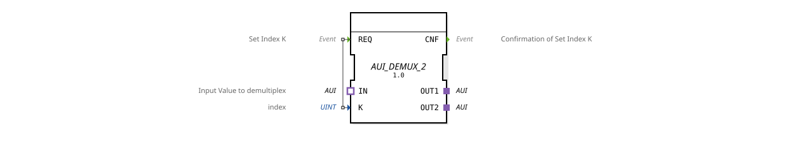

# AUI_DEMUX_2

* * * * * * * * * *
## Introduction
The function block `AUI_DEMUX_2` implements a generic demultiplexer for two output adapters. It selectively forwards incoming AUI data (unidirectional) to one of two outputs via an index. The block is designed as a generic function block and can be instantiated for various AUI types.
## Interface Structure

### **Event Inputs**

| Event | Comment |
|----------|-----------|
| `REQ` | Sets the index `K` and triggers the demultiplexer operation. |

### **Event Outputs**

| Event | Comment |
|----------|-----------|
| `CNF` | Confirms successful execution of indexing and data transfer. |

### **Data Inputs**

| Variable | Type | Comment |
|----------|-------|-----------|
| `K` | UINT | Index for selecting the target output (1 = OUT1, 2 = OUT2). |

### **Data Outputs**
No data outputs available.

### **Adapters**

| Direction | Label | Type | Comment |
|----------|-------------|----------------------------------|-------------------------------|
| Output | `OUT1` | `adapter::types::unidirectional::AUI` | First demultiplexer output. |
| Output | `OUT2` | `adapter::types::unidirectional::AUI` | Second demultiplexer output. |
| Input | `IN` | `adapter::types::unidirectional::AUI` | Input that is redirected to an output. |

## Functionality
When an event is triggered at input `REQ`, the value of data input `K` is evaluated:

- If `K = 1` is present, the data from adapter input `IN` is forwarded to adapter output `OUT1`.
- If `K = 2` is present, the data is forwarded to `OUT2`.
- For other values of `K`, no forwarding occurs.

After processing, event `CNF` is output to acknowledge successful execution.

- If `K = 2` is present, the data is forwarded to `OUT2`.
- For other values of `K`, no forwarding occurs.

After processing, event `CNF` is output to acknowledge successful execution.

-
## Technical Features
- **Generic Function Block**: The function block can be parameterized for various AUI adapter variants via `GenericClassName = 'GEN_AUI_DEMUX'`.
- **Unidirectional Adapters**: Both inputs and outputs use the AUI adapter type, which supports directional data transmission.
- **No State Machine**: The function block operates in an event-driven manner without an internal state memory.

## State Overview

The function block does not have an explicit state machine. The response occurs immediately upon each `REQ` event.

## Application Scenarios
- **Signal Distribution**: Splitting an AUI data stream across two different processing paths.
- **Channel Switching**: Dynamic selection of an output channel based on an index, e.g., for switching logic or routing.
- **Prototypical Demultiplexers**: As a basis for similar components with more outputs (e.g., `AUI_DEMUX_4`).

## Comparison with Similar Components
- **Standard IEC 61499 demultiplexers (e.g., `DEMUX`)** usually work with arbitrary data types, while `AUI_DEMUX_2` is specifically optimized for the AUI adapter type.
- **Generic variants** such as `AUI_DEMUX_n` (with n > 2) increase the number of outputs but retain the same logic.
- **Adapter-based alternatives** may require more complex cabling but offer greater flexibility in data storage.

## Conclusion
The `AUI_DEMUX_2` is a compact, generic demultiplexer for two AUI outputs. It is particularly suitable for applications where an incoming AUI data stream needs to be routed to one of two paths using an index. Thanks to its generic nature, it can be used for different AUI types without any code changes.
