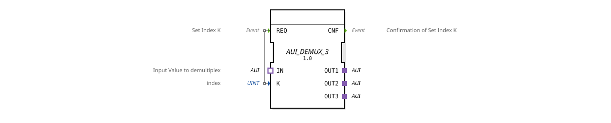

# AUI\_DEMUX\_3

* * * * * * * * * *
## Introduction

The AUI\_DEMUX\_3 function block implements a generic demultiplexer for the AUI adapter protocol. It distributes an incoming, unidirectional data stream to one of three output channels. The active output is selected via an index parameter, which is set by an event.
## Interface Structure

### **Event Inputs**

| Event | Data Type | Description |
| :--- | :--- | :--- |
| REQ | Event | Sets the active output channel K. Triggered by the incoming index signal. |

### **Event Outputs**

| Event | Data Type | Description |
| :--- | :--- | :--- |
| CNF | Event | Confirmed that index K has been adopted and the multiplex has been switched. |

### **Data Inputs**

| Name | Data Type | Description |
| :--- | :--- | :--- |
| K | UINT | Index of the desired output channel (value range: 0…2, corresponds to OUT1…OUT3). |

### **Data Outputs**

_No direct data outputs are available. Output is exclusively via the adapter plugs._

### **Adapters**

| Direction | Name | Type | Description |
| :--- | :--- | :--- | :--- |
| Socket | IN | `adapter::types::unidirectional::AUI` | Input interface – receives the data stream to be multiplexed. |
| Plug | OUT1 | `adapter::types::unidirectional::AUI` | First output channel. |
| Plug | OUT2 | `adapter::types::unidirectional::AUI` | Second output channel. |
| Plug | OUT3 | `adapter::types::unidirectional::AUI` | Third output channel. |

## Functionality

The module operates as a 1-to-3 demultiplexer based on the AUI adapter interface. By default, no output is active – only after the first REQ event is the output channel selected via K is connected to the IN input.

As soon as the REQ event arrives, the value of K is read and the corresponding output (OUT1 for K=0, OUT2 for K=1, OUT3 for K=2) is activated. The acknowledgment event CNF is then sent. During the connection, all adapter data arriving via IN is forwarded to the active output. A subsequent REQ can change the index and thus switch the active output.

## Technical Features

- **Generic Structure** – The function block is implemented as a generic FB (`GEN\_AUI\_DEMUX`), allowing the number of outputs to be extended by modifying the generic type.
- **Unidirectional Data Flow** – All adapters (IN, OUT1…OUT3) are of type `unidirectional::AUI`, meaning data flows only from the socket to the plug. Feedback from the output to the input is not supported.
- **Index Check** – If a value outside the valid range (0…2) is entered, the function block behaves in an undefined manner or ignores the value (depending on the specific implementation).
- **Synchronization** – The function block operates in an event-driven manner; a persistent connection remains active without a new REQ.

## State Overview

An explicit state machine is not defined in the XML. The behavior can be conceptually described as follows:

- **IDLE** – Waiting for the first REQ. No output is active.
- **ACTIVE_OUT1 / ACTIVE_OUT2 / ACTIVE_OUT3** – The corresponding output is connected to IN. A subsequent REQ switches to a different ACTIVE state.
- After switching, CNF is always output.

## Application Scenarios

- **Multipoint Data Distribution** – A sensor or data source (e.g., an AUI-compatible fieldbus master) is to be connected alternately to different actuators or subsystems.
- **Channel Switching** – In a control application that requires different output paths depending on the operating mode (e.g., diagnostics, normal operation, maintenance).
- **Test and Simulation Environments** – For targeted addressing of individual components within a system.

## Comparison with Similar Function Blocks

- **AUI\_DEMUX\_1 / AUI\_DEMUX\_2** – Simple demultiplexers with only one or two outputs. AUI\_DEMUX\_3 offers exactly three channels.
- **AUI\_MUX** – The associated multiplexer, which combines multiple inputs into one output. Both complement each other in symmetrical data paths.
- **Standard IEC 61499 demultiplexers (e.g., SELECT)** – These usually use simple data types, while AUI\_DEMUX\_3 is specifically designed for the AUI adapter protocol and thus enables complex, structured data transmission.

## Change Detection

The selected output plug is only written and its adapter event only sent if the incoming value differs from the value currently held on that plug. If the value is unchanged, no adapter event is sent, avoiding redundant updates on unrelated peers.

## Conclusion

The AUI\_DEMUX\_3 is a specialized function block for the unidirectional demultiplexing of AUI data streams onto three channels. Its clear, event-driven interface and generic architecture make it a flexible component in IEC 61499-based control systems that require dynamic switching of adapter connections.
