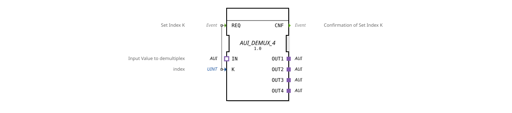

# AUI_DEMUX_4

* * * * * * * * * *
## Introduction
The function block `AUI_DEMUX_4` is a generic AUI demultiplexer for four output paths. It forwards the AUI signals arriving via the input adapter `IN` to one of the four output adapters (`OUT1`–`OUT4`), which is selected by the index `K`. The block operates on the principle of event-driven switching and is suitable for flexible data distribution in industrial control systems.
## Interface Structure

### **Event Inputs**

| Name | Type | Comment |
|------|-------|----------------------------------------------|
| REQ | Event | Set Index K; triggers forwarding |

The input `REQ` triggers processing: The current value of `K` is read, and the signal present at `IN` is forwarded to the corresponding output adapter.

### **Event Outputs**

| Name | Type | Comment |
|------|-------|---------------------------------------------|
| CNF | Event | Index takeover confirmation |

After successful demultiplexing, the event `CNF` is sent.

### **Data Inputs**

| Name | Type | Comment |
|------|-------|--------------------------------|
| K | UINT | Target output index (1..4) |

The value range for `K` is not defined in the XML, but values from 1 to 4 (corresponding to the four outputs) are common. Values outside this range do not result in any defined behavior (they can be ignored or trigger an error, depending on the implementation).

### **Data Outputs**

No data outputs are available. Signal forwarding is handled exclusively via the adapters.

### **Adapters**

| Name | Type | Direction | Comment |
|------|----------------------------------------------------------|----------|-------------------------------------|
| IN | `adapter::types::unidirectional::AUI` | Socket | Input signal (source) |
| OUT1 | `adapter::types::unidirectional::AUI` | Plug | Destination Output 1 |
OUT2 | `adapter::types::unidirectional::AUI` | Plug | Destination Output 2 |
OUT3 | `adapter::types::unidirectional::AUI` | Plug | Destination Output 3 |
OUT4 | `adapter::types::unidirectional::AUI` | Plug | Destination Output 4 |

All adapters are of the same type, `AUI` (unidirectional). The input adapter, `IN`, is a socket, and the four output adapters are plugs. This allows the module to be inserted into an adapter connection, typically established between an AUI transmitter and an AUI receiver.

All adapters are of the same type, `AUI` (unidirectional).
## Functionality

1. The function block waits for an event at input `REQ`.

2. Upon arrival of `REQ`, the current value of index `K` is read.

3. The AUI signal present at socket `IN` is switched to plug `OUT1` ... `OUT4` – depending on which index (1-4) is in `K`.

4. After successful switching, the event `CNF` is output to confirm processing to the calling instance.

The signals themselves are transported via the adapters. The demultiplexer only affects the connection logic, not the content of the AUI data.

## Technical Features
- **Generic Type**: The function block (FB) is declared as generic (`GenericClassName = 'GEN_AUI_DEMUX'`). This allows it to be reused in projects with different adapter types, provided the interfaces are adapted accordingly.
- **Unidirectional Adapters**: The adapters are designed to be unidirectional. Bidirectional communication is not supported.
- **No Buffering**: Switching is event-driven. No internal buffers are maintained for the AUI signals.
- **Validity Scope of K**: The index `K` should be set before triggering `REQ`. Multiple calls with the same index result in repeated forwarding without errors.

## State Overview

The FB has an implicit state:

- **Idle**: Waiting for `REQ`.
- **Processing**: Processing `REQ`. Upon completion, it automatically switches back to the Idle state and outputs `CNF`.

There are no additional error states. An invalid index (e.g., 0 or >4) can be ignored or treated as an error, depending on the implementation—this is not specified in the XML.

## Application Scenarios
- **Signal Distribution**: An AUI sender provides data that must be forwarded to up to four different receivers (e.g., actuators, subsystems).
- **Switching Control Commands**: In a machine controller, a clock generator can activate different modules sequentially via the demultiplexer.
- **Test and Simulation Environments**: The function block can be used to route test signals to specific components.

## Comparison with Similar Function Blocks
- **AUI_DEMUX_2** or similar: Demultiplexer with only two outputs – optimized for smaller distributions.
- **AUI_MUX_4**: Multiplexer that combines multiple inputs into one output – the reverse functionality.
- **AUI_ROUTER**: More complex function block with addressing and often multiple ports – often requires a configuration table.

The `AUI_DEMUX_4` is a simple, clearly defined function block without overhead and is particularly suitable for fixed, pre-defined distributions with a maximum of four paths.

## Conclusion

The `AUI_DEMUX_4` function block provides a simple and efficient solution for signal routing in AUI-based controllers. Thanks to its generic design and clear interfaces, it can be easily integrated into existing systems. The event-driven index switching allows for a rapid response to changes in the target address. This function block offers a robust foundation for many applications requiring dynamic distribution to up to four outputs.
