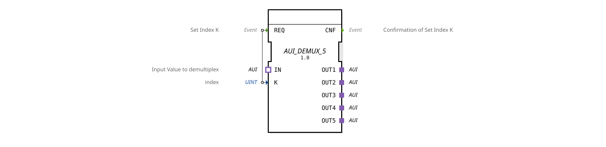

# AUI_DEMUX_5

* * * * * * * * * *
## Introduction
The function block **AUI_DEMUX_5** is a generic demultiplexer for the AUI adapter protocol (unidirectional). It forwards an incoming AUI data stream to one of five output adapters. The destination output is selected via the index `K` after a request at the event input `REQ`.
## Interface Structure
### **Event Inputs**

| Event | Data Type | Description |
|----------|----------|--------------|
| `REQ` | Event | Trigger to set the index `K` and forward the input signal to the corresponding output. |

### **Event Outputs**

| Event | Data Type | Description |
|----------|----------|--------------|
| `CNF` | Event | Confirmation that the index switching and forwarding are complete. |

### **Data Inputs**

| Name | Type | Description |
|------|------|--------------|
| `K` | UINT | Integer index (1 … 5) that specifies the target output. |

### **Data Outputs**
No data outputs available.

### **Adapter**

| Type | Direction | Quantity | Description |
|----------------|----------|--------|--------------|
| IN | Socket | 1 | Input adapter of type `AUI` (unidirectional). The signal to be distributed arrives here. |
| OUT1 … OUT5 | Plug | 5 | Output adapter of type `AUI`. The currently selected output receives the input signal. |

## Functionality

1. The FB expects an incoming AUI signal at socket `IN`.

2. When the event input `REQ` is activated, the FB reads the value of the data input `K`.

`` 3. Depending on the value of `K` (valid from 1 to 5), the signal from the input adapter is switched to the corresponding output adapter (`OUT1` … `OUT5`). The other outputs remain inactive or are reset (depending on the implementation in the generic function block).

4. After successful switching, the event output `CNF` is sent.

5. The function block is then ready for a new request.

**Note:** With invalid values of `K` (e.g., 0 or >5), the behavior may be undefined – it is recommended to limit the index to 1 … 5.

## Technical Features
- **Generic Type:** The function block is defined as a generic function block (`GEN_AUI_DEMUX`). In this instance, the number of outputs is fixed at five.
- **Event-Driven:** Switching occurs only upon a `REQ` event. Continuous switching without an event is not supported.
- **Adapter Interface:** The function block uses only `AUI` adapter connections (unidirectional), therefore it is optimized for use in modular AUI-based systems.
- **No Data Outputs:** The switching status is signaled exclusively via events (`CNF`).

## State Overview
The function block does not have any explicitly modeled states (ECC). Its behavior follows a simple reaction logic:

- **Idle State:** Waiting for a `REQ` event.
- **Active:** After `REQ`, the index is evaluated, forwarding is activated, and `CNF` is sent. The function block then returns to idle state.

## Application Scenarios
- **Modular Sensor or Actuator Distribution:** A central control unit sends AUI signals, which are forwarded to different submodules depending on the index.
- **Test and Simulation Environments:** Switching between different data sources on a single connection.
- **Resource Optimization:** Reducing the number of physical lines by time-multiplexing the same AUI connection and then demultiplexing it at the receiver.

## Comparison with Similar Function Blocks

| Function Block | Number of Outputs | Special Features |
|-----------------|-----------------|----------------|
| `AUI_DEMUX_2` | 2 | Simple 2-way demultiplexer. |
| `AUI_DEMUX_5` | 5 | This module. |
| `AUI_DEMUX_10` | 10 | Extended version for ten outputs. |
| `AUI_MUX_5` | 1 (Input) | Multiplexer that combines multiple inputs into one output. |

The `AUI_DEMUX_5` offers a good compromise between flexibility and complexity for systems with up to five participants.

## Conclusion
The `AUI_DEMUX_5` function block is a useful module for selectively distributing an AUI signal to one of five lines. Thanks to its event-driven index input and simple adapter interface, it can be easily integrated into larger automation or control projects. The generic architecture also allows for easy adaptation to other output requirements.
