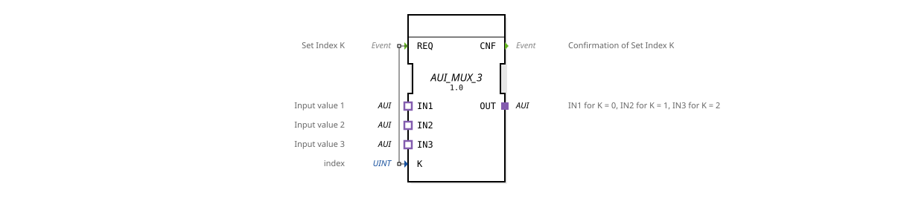

# AUI_MUX_3

* * * * * * * * * *
## Introduction

The function block `AUI_MUX_3` is a generic multiplexer for the AUI data type (unidirectional adapter). It selects one of three adapter inputs (`IN1`, `IN2`, `IN3`) based on an integer index `K` and forwards it to the adapter output `OUT`. The selection process is triggered by an event at input `REQ`.
## Interface Structure

### **Event Inputs**

| Event | Comment |
|----------|-----------|
| `REQ` (Event) | Sets the index `K` and starts the selection of the corresponding input. |

### **Event Outputs**

| Event | Comment |
|----------|-----------|
| `CNF` (Event) | Confirms the successful transmission of the selected adapter to `OUT`. |

### **Data Inputs**

| Name | Type | Comment |
|------|-----|-----------|
| `K` | UINT | Index that determines the active input (0 = IN1, 1 = IN2, 2 = IN3). |

### **Data Outputs**

No direct data outputs are available. Output is provided via the adapter output `OUT`.

### **Adapter**

| Direction | Name | Type | Comment |
|----------|------|-----|-----------|
| Plug (Output) | `OUT` | `adapter::types::unidirectional::AUI` | Output that forwards the selected input. |
| Socket (Input 1) | `IN1` | `adapter::types::unidirectional::AUI` | First input value (for K = 0). |
| Socket (Input 2) | `IN2` | `adapter::types::unidirectional::AUI` | Second input value (for K = 1). |
Socket (Input 3) | `IN3` | `adapter::types::unidirectional::AUI` | Third input value (for K = 2). |

## Functionality

The function block operates in an event-driven manner. When an event occurs at input `REQ`, the current value of index `K` is read. Depending on the value of `K`, one of the three adapter inputs (`IN1`, `IN2`, or `IN3`) is internally connected to the adapter output `OUT`. The connection becomes active immediately, and an acknowledgment event is subsequently sent at output `CNF`.

- If `K = 0`: Connect `IN1` to `OUT`.
- If `K = 1`: Connect `IN2` to `OUT`.
- If `K = 2`: Connect `IN3` to `OUT`.
- For other values of `K` (e.g., > 2), the behavior is undefined; the function block still sends a `CNF` event, but the selection remains undefined.

## Technical Features

- **Generic Function Block**: The function block is declared as a generic type (`GEN_AUI_MUX`) and can be parameterized for different instances of the `AUI` adapter.
- **Unidirectional Adapters**: All adapters (inputs and outputs) are of type `adapter::types::unidirectional::AUI`, meaning that data flows in only one direction – from the selected socket to the plug.
- **Simple Selection**: No additional default state or timeout is used. The index is evaluated directly at the time of the `REQ` event.

## State Overview

The function block does not have an explicit internal state machine. Its operation can be described as a single stable state:

1. **Waiting for `REQ`**: The function block is passive until an event arrives at the `REQ` input.
2. **Execute Selection**: After receiving `REQ`, `K` is read, the corresponding input is connected to `OUT`, and `CNF` is sent. The function block then returns to wait mode.

## Application Scenarios

- **Sensor Selection**: In a machine control system, switching between three different sensor values (e.g., temperature, pressure, flow rate) is possible without using separate function blocks.
- **Control Data Multiplexing**: Selection of different signal sources (e.g., from different actuators) for subsequent processing.
- **Test and Simulation Environments**: Fast switching between different data sets or adapters for testing purposes.

## Comparison with Similar Function Blocks

- **`AUI_MUX_2`**: A two-input multiplexer (K = 0, 1) – fewer selection options, but simpler.
- **`AUI_DEMUX`**: A demultiplexer that distributes one input to multiple outputs.
- **Standard `MUX` function blocks (for basic data types)**: These mostly work with elementary data types (INT, BOOL) and have a comparable selection mechanism, but without an adapter interface.

## Change Detection

The selected output plug (`OUT`) is only written and its adapter event only sent if the incoming value differs from the value currently held on `OUT`. If the value is unchanged, no adapter event is sent, avoiding redundant updates on downstream peers.

## Conclusion

The `AUI_MUX_3` is a specialized yet flexible multiplexer for the unidirectional AUI adapter. It enables clean, event-driven selection from three sources and is particularly suitable for modular automation solutions based on the adapter concept. Its ease of use and generic parameterization make it a useful tool in the 4diac IDE.

---

### 🌐 Related topic subpages on ms-muc-docs.de

* [🌐 Eclipse 4diac IDE & Color Reference on ms-muc-docs.de](https://www.ms-muc-docs.de/iec-61499/eclipse-4diac/)

]
