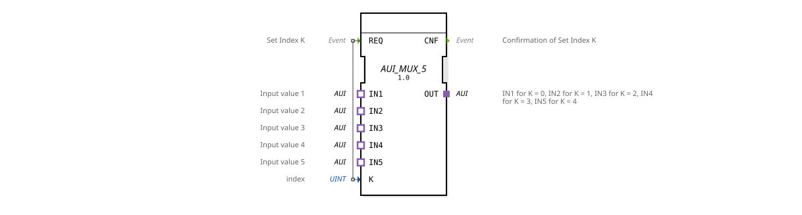

# AUI_MUX_5

* * * * * * * * * *
## Introduction

The function block **AUI_MUX_5** is a generic multiplexer for five unidirectional AUI adapter interfaces. Depending on an index value **K**, it selects one of the five inputs (**IN1** to **IN5**) and forwards its signal to the output **OUT**. Switching is event-driven via the input **REQ**.

## Interface Structure

### **Event Inputs**

| Event | Description |

|----------|--------------|

| **REQ** | Sets the index **K** and triggers the connection of the corresponding input to the output. |

### **Event Outputs**

| Event | Description |

|----------|--------------|

| **CNF** | Confirms that the index **K** has been accepted and the connection has been completed. |

### **Data Inputs**

| Variable | Type | Description |

|----------|-------|--------------|

| **K** | UINT | Index of the input to be selected (valid values: 0..4). |

### **Data Outputs**

*(None)*

### **Adapter**

| Role | Name | Type | Description |

|---------|------|------------------------------------------|--------------|

| **Plug**| OUT | adapter::types::unidirectional::AUI | Output that switches the selected input. |

**Socket** | IN1 | adapter::types::unidirectional::AUI | First input (activates when K=0). |

**Socket** | IN2 | adapter::types::unidirectional::AUI | Second input (activates when K=1). |

**Socket** | IN3 | adapter::types::unidirectional::AUI | Third input (activates when K=2). |

**Socket** | IN4 | adapter::types::unidirectional::AUI | Fourth input (activates when K=3). |

**Socket** | IN5 | adapter::types::unidirectional::AUI | Fifth input (activates when K=4). |

**Socket** ## Functionality

The **AUI_MUX_5** operates like a classic multiplexer: After an event at the **REQ** input, the current value of the **K** index is evaluated. Depending on **K** (0..4), the corresponding adapter socket (**IN1** to **IN5**) is switched to the **OUT** plug. The switching is unidirectional; the signal flows from the selected input to the output. After successful switching, the **CNF** event is output.

## Technical Features

- The function block is declared as a **generic type** (GenericClassName `'GEN_AUI_MUX'`). It can therefore be instantiated with parameters depending on the application.

- The multiplexer exclusively supports the unidirectional AUI adapter type, which is designed for transmitting user signals in one direction.

- The adapter interfaces are implemented as **type adapters**, which allows for easy integration into existing AUI-based communication structures.

- The selection is strictly based on the current index **K**; values outside the valid range result in undefined behavior (no plausibility check).

## State Overview

The function block does not have an explicit finite state machine. Its behavior is purely event-driven:

1. **Waiting** for a **REQ** event.

2. **Evaluating** **K** and **switching** the corresponding input to the output.

3. **Sending** a **CNF** as confirmation.

After step 3, the block returns to the wait state. Several **REQ** events are processed sequentially.

## Application Scenarios

- **Selection of one of five AUI sources**, e.g., sensor data or control signals in an agricultural machine control system.

- **Signal switching** in modular automation systems where various peripheral devices are connected to a common bus.

- **Test and simulation environments** where switching between different signal sources is required.

## Comparison with similar components

- **AUI_MUX_2 / AUI_MUX_3**: These components offer a smaller number of inputs (2 or 3) and are optimized for more compact applications.

- **AUI_DEMUX_5**: A demultiplexer that distributes one input to one of five outputs – essentially the inverse function.

- **Standard MUX components** (e.g., with simple data types such as INT or BOOL): The **AUI_MUX_5** is distinguished by its special adapter interface and unidirectional data flow, making it particularly suitable for AUI-based architectures.

## Conclusion

The **AUI_MUX_5** is a clear and flexible multiplexer for five unidirectional AUI adapters. Thanks to its generic implementation, it can be easily integrated into a wide variety of automation projects. The simple event-driven operation enables reliable signal selection without complex internal state logic.