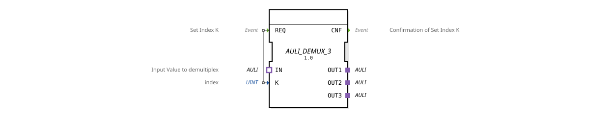

# AULI_DEMUX_3

* * * * * * * * * *
## Introduction

The function block **AULI_DEMUX_3** implements a generic demultiplexer for unidirectional AULI adapters. It forwards an incoming value (via socket `IN`) to one of three output adapters (`OUT1`, `OUT2`, `OUT3`), with the selection controlled by the index `K`.
## Interface Structure

### **Event Inputs**

| Name | Type | Description | With Variables |
|------|-------|--------------------------|---------------|
| REQ | Event | Sets the index K and triggers the forwarding | K (UINT) |

### **Event Outputs**

| Name | Type | Description |
|------|-------|-----------------------------------|
| CNF | Event | Confirmation of successful forwarding |

### **Data Inputs**

| Name | Type | Description |
|------|------|------------------------------|
| K | UINT | Index of the destination output (1..3) |

### **Data Outputs**

No dedicated data outputs. Data is transmitted via the adapter plugs.

### **Adapter**

**Plugs** (Outputs):

- `OUT1`: Type `adapter::types::unidirectional::AULI`
- `OUT2`: Type `adapter::types::unidirectional::AULI`
- `OUT3`: Type `adapter::types::unidirectional::AULI`

**Socket** (Input):

- `IN`: Type `adapter::types::unidirectional::AULI` – Input value to be demultiplexed.

## Operation

1. The module is in idle state and waits for an event at the **REQ** input.
2. The **REQ** event retrieves the current value of the index parameter `K`. `K` must be in the range 1 to 3 (the number of output adapters).
3. The current value of the AULI adapter at socket `IN` is forwarded to the plug specified by `K` (`OUT1`, `OUT2`, or `OUT3`).
4. After successful forwarding, the **CNF** event is output.

> Note: The behavior is not specified for invalid index values (e.g., 0 or >3); in practice, the application should only provide valid values.

## Technical Features

- **Generic Block**: The actual implementation is identified by the attribute `GenericClassName` as `'GEN_AULI_DEMUX'`. This allows for flexible adjustment of the number of outputs through parameterization.
- **Unidirectional Adapters**: All AULI adapters are declared as `unidirectional`, meaning data flows only in one direction (from the socket to the plugs).
- **No State Machine**: The block does not have an explicit ECC (Execution Control Chart); execution is event-driven and deterministic.

## State Overview

Since no state machine is defined in the XML, the internal logic can be considered a simple sequence without multiple states:

- **Waiting**: After initialization or after **CNF**, the block waits for the next **REQ**.
- **Processing**: Upon arrival of **REQ**, the signal is forwarded and **CNF** is immediately generated.

## Application Scenarios

- **Signal Distribution**: An AULI value (e.g., a sensor value) coming from a source can be selectively routed to different actuators or processing units.
- **Channel Switching**: Different operating modes can be implemented in a controller by selecting the output channel.
- **Test and Simulation Environments**: A generic demultiplexer allows data streams to be routed selectively to different analysis or logging modules.

## Comparison with Similar Function Blocks

- **AULI_MUX** (Multiplexer): Performs the reverse function – selects one of several inputs and routes it to a common output.
- **AULI_SELECT**: Often a more specialized function block with a fixed number of channels; `AULI_DEMUX_3` is explicitly designed for three channels.
- **Generic Demultiplexers**: The generic nature of the function block allows the number of channels (e.g., `AULI_DEMUX_N`) to be changed by parameterization without having to recreate the function block.

## Change Detection

The selected output plug is only written and its adapter event only sent if the incoming value differs from the value currently held on that plug. If the value is unchanged, no adapter event is sent, avoiding redundant updates on unrelated peers.

## Conclusion

The **AULI_DEMUX_3** is a simple yet useful function block for the targeted distribution of an AULI value to three outputs. Its generic architecture and clear event-driven interface make it a flexible tool in automation technology, especially when it comes to channel switching or signal distribution.
