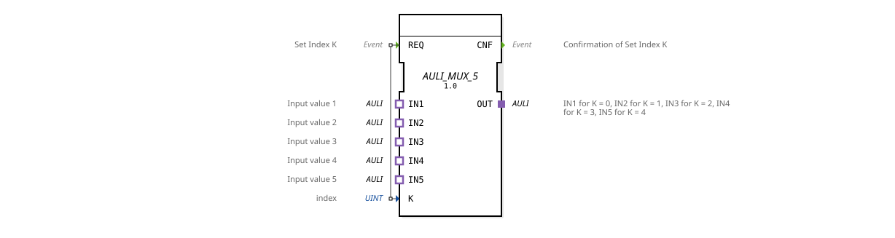

# AULI_MUX_5

* * * * * * * * * *
## Introduction

The function block **AULI_MUX_5** is a generic multiplexer that allows one of five AULI adapters (IN1 to IN5) to be selectively switched to the output adapter (OUT). The active channel is selected via the input parameter K (index). The block is triggered by an event at the REQ input and acknowledges the switchover with an event at the CNF output.
This block was defined as a generic type within the Eclipse 4diac IDE and is designed for use in automation solutions, particularly in the context of HR Agrartechnik GmbH.

## Interface Structure

### **Event Inputs**

| Event | Data Type | Comment |
|----------|----------|-----------|
| REQ | Event | Set Index K – triggers the multiplexer switching. |

### **Event Outputs**

| Event | Data Type | Comment |
|----------|----------|-----------|
| CNF | Event | Confirmation of Set Index K – acknowledges successful switching. |

### **Data Inputs**

| Variable | Data Type | Comment |
|----------|----------|-----------|
| K | UINT | Index (0…4) for selecting the active input adapter (0 → IN1, 1 → IN2, …, 4 → IN5). |

### **Data Outputs**

This function block does not have explicit data outputs. The output data is provided via the OUT adapter.

### **Adapters**

| Direction | Name | Type | Comment |
|----------|------|-----|-----------|
| Plug | OUT | adapter::types::unidirectional::AULI | Output adapter – provides the value of the input selected via K. |
| Socket | IN1 | adapter::types::unidirectional::AULI | Input value 1 (for K = 0) |
| Socket | IN2 | adapter::types::unidirectional::AULI | Input value 2 (for K = 1) |
| Socket | IN3 | adapter::types::unidirectional::AULI | Input value 3 (for K = 2) |
| Socket | IN4 | adapter::types::unidirectional::AULI | Input value 4 (for K = 3) |
| Socket | IN5 | adapter::types::unidirectional::AULI | Input value 5 (for K = 4) |

## Functionality

As soon as an event arrives at the **REQ** input, the current value of **K** is evaluated. The function block forwards the adapter connected to the corresponding socket (IN1…IN5) to the output adapter **OUT**. The **CNF** event is then output to signal successful execution.

The mapping is as follows:

- K = 0 → IN1
- K = 1 → IN2
- K = 2 → IN3
- K = 3 → IN4
- K = 4 → IN5

If other values are passed for K, the behavior is unspecified and should be avoided.

## Technical Features

- **Generic Function Block:** The function block is declared as a generic type (`GEN_AULI_MUX`) and can be instantiated in various forms with different numbers of inputs.
- **Unidirectional Adapters:** All adapters used are of type `AULI` and are unidirectional, meaning data flows in only one direction (from the inputs to the output).
- **No Internal State:** The function block is stateless – it responds to every REQ event regardless of previous calls.
- **Validity Range K:** K is expected to be in the range 0…4. Checking for other values is not included in the basic design.

## State Overview

Since the function block does not have an internal state machine, the only state logic describes the sequence of a single REQ-CNF cycle:

1. **Idle:** Waiting for a REQ event.
2. **Processing:** Upon arrival of REQ, K is evaluated and the corresponding input is switched to OUT.
3. **Done:** Output of CNF – return to the idle state.

A more detailed state machine is not required because the function block operates entirely event-driven and deterministic.

## Application Scenarios

- **Sensor Selection:** In a machine control system, the function block can be used to switch between different sensors (e.g., five temperature sensors) and pass the currently relevant value to a processing logic.
- **Signal Routing:** In communication systems, the multiplexer serves to connect different data sources (e.g., five fieldbuses) to a common interface.
- **Test and Verification Benches:** Selection of various test signals for a test setup.

## Comparison with Similar Components

| Component | Number of Inputs | Special Feature |
|----------|----------------|--------------|
| AULI_MUX_2 | 2 | Simple 2-to-1 Multiplexer |
| AULI_MUX_4 | 4 | 4-to-1 Multiplexer |
| **AULI_MUX_5** | **5** | **Extended Version for Five Channels** |
| Standard MUX (Data) | Any (Data-Based) | Works with Simple Data Types Instead of Adapters |

The AULI_MUX_5 is distinguished by its use of AULI adapters, which enables clean, modular encapsulation of data and protocols.

## Change Detection

The selected output plug (`OUT`) is only written and its adapter event only sent if the incoming value differs from the value currently held on `OUT`. If the value is unchanged, no adapter event is sent, avoiding redundant updates on downstream peers.

## Conclusion

The **AULI_MUX_5** is a flexible and easy-to-use function block for selecting one of five AULI signals. Its generic definition allows for reuse even with a different number of inputs. The clear, event-driven interface and stateless operation make it a reliable building block for modular automation solutions.

*Copyright (c) 2026 HR Agrartechnik GmbH – Published under the Eclipse Public License 2.0.*

---

### 🌐 Related topic subpages on ms-muc-docs.de

* [🌐 Eclipse 4diac IDE & color reference on ms-muc-docs.de](https://www.ms-muc-docs.de/iec-61499/eclipse-4diac/)

]
