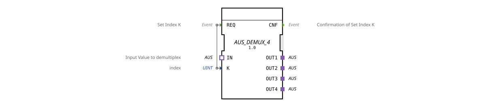

# AUS_DEMUX_4

* * * * * * * * * *
## Introduction
The function block **AUS_DEMUX_4** implements a demultiplexer for the adapter type `AUS`. It forwards the incoming value from adapter `IN` to one of four output adapters (`OUT1`–`OUT4`). The target output is selected via the index `K`, which is evaluated upon an event at input `REQ`. The block is designed for use in IEC 61499 applications and is particularly suitable for the dynamic distribution of a data stream to multiple devices.
## Interface Structure

### **Event Inputs**

| Event | Description |
|----------|-------------|
| `REQ` | Starts the demultiplex operation. The index `K` is read, and the value of the `IN` adapter is forwarded to the corresponding output adapter. |

### **Event Outputs**

| Event | Description |
|----------|--------------|
| `CNF` | Confirmation that the demultiplexing process is complete and the selected output carries the current value of the `IN` adapter. |

### **Data Inputs**

| Variable | Type | Description |
|----------|-------|-------------|
| `K` | UINT | Index of the desired output (1 = OUT1, 2 = OUT2, 3 = OUT3, 4 = OUT4). Values outside this range are ignored or do not result in any output change (implementation dependent). |

### **Data Outputs**

No direct data outputs – the values are provided via the adapter outputs.

### **Adapters**

| Adapter | Direction | Type | Description |
|----------|----------|-------|-------------|
| `IN` | Input | `adapter::types::unidirectional::AUS` | Value to be demultiplexed. |
OUT1` | Output | `adapter::types::unidirectional::AUS` | First output channel. |
OUT2` | Output | `adapter::types::unidirectional::AUS` | Second output channel. |
OUT3` | Output | `adapter::types::unidirectional::AUS` | Third output channel. |
OUT4` | Output | `adapter::types::unidirectional::AUS` | Fourth output channel. |

All adapters are unidirectional type `AUS` and transmit data in the specified direction.

## Functionality

The module operates in an event-driven manner:

1. In its idle state, it waits for a `REQ` event.

2. Upon arrival of `REQ`, the value of the data input `K` is read.

3. The current value of the `IN` adapter is copied to the output adapter determined by `K`. The other three outputs retain their current state.

4. Subsequently, the event `CNF` is sent to signal the completion of the operation.

The adapters used, of type `AUS`, are unidirectional, meaning data flows only from the source to the destination. A typical `AUS` adapter contains one or more data and/or event interfaces – the exact structure is defined in the respective adapter definition.

## Technical Features
- **Generic Origin**: The function block is based on the generic type `GEN_AUS_DEMUX`. For the specific instantiation with four outputs, the variant `AUS_DEMUX_4` was created. This allows the demultiplexer to be easily scaled to other channel numbers (e.g., `AUS_DEMUX_2`, `AUS_DEMUX_8`).
- **Index Range**: `K` is interpreted as an unsigned 16-bit value (UINT). Valid values are 1 to 4. Values outside this range should be avoided. The behavior is not specified.
- **No intermediate storage**: The demultiplexer operates without internal state memory – the `IN` value is passed directly at the time of the `REQ` event.
- **Adapter type `AUS`**: The interface of the component is defined via adapters. This promotes reusability and encapsulates complex data types.

## State overview
The component does not have an explicit state machine in the sense of an ECC (Execution Control Chart). Nevertheless, two operating states can be identified:

| State | Description |
|---------|-------------|
| **IDLE** | Waiting for a `REQ` event. No demultiplex operation active. |
**BUSY** | Processing the current `REQ` event. The `IN` adapter is read, the appropriate output adapter is set, and `CNF` is generated. The state immediately returns to IDLE. |

The switchover occurs within the same cycle; the function block is non-blocking.

## Application Scenarios
- **Control Applications**: Distribution of a sensor signal (e.g., temperature, pressure) to multiple downstream control modules, depending on the current operating mode.
- **Data Stream Routing**: In a modular machine control system, a common data channel can be switched to different actuators.
- **Test Environments**: Targeted injection of test values into different processing paths.
- **Multiplexing counterpart**: Flexible switching networks can be built together with a multiplexer (`AUS_MUX_4`).

## Comparison with similar function blocks
- **OFF_SWITCH**: A toggle switch for two channels. `AUS_DEMUX_4` extends this concept to four channels.
- **Standard demultiplexer**: Common function block libraries often contain demultiplexers with a fixed number of channels (e.g., DEMUX_4). However, the function block described here uses adapter types and is tailored to the specific data type `AUS`.
- **Generic variants**: The generic approach (`GEN_AUS_DEMUX`) allows the creation of function blocks with any number of channels, which increases reusability.

## Conclusion
The `AUS_DEMUX_4` is a specialized demultiplexer for the IEC 61499 adapter type `AUS`. It enables the flexible, event-driven distribution of an input signal to four output channels. The use of adapters makes the device compatible with other components of the same type and promotes a clean, modular system architecture. Its generic base allows it to be easily adapted to other channel counts.
