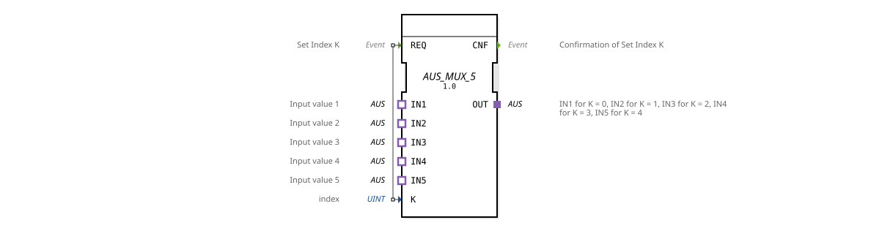

# AUS_MUX_5

* * * * * * * * * *
## Introduction

The function block **AUS_MUX_5** is a generic multiplexer that selects one of five OFF input signals (IN1 to IN5) and forwards it to the OFF output (OUT). Selection is made via an integer index K (value range 0 to 4). This function block is suitable for dynamically switching output values in automation systems.
## Interface Structure

### **Event Inputs**

| Name | Type | Comment |
|------|-----|-----------|
| REQ | Event | Sets the index K and triggers the multiplexer action. |

### **Event Outputs**

| Name | Type | Comment |
|------|-----|-----------|
| CNF | Event | Confirmation that the index has been adopted and the corresponding input has been assigned to the output. |

### **Data Inputs**

| Name | Type | Comment |
|------|-----|-----------|
| K | UINT | Selection index: 0 → IN1, 1 → IN2, 2 → IN3, 3 → IN4, 4 → IN5. |

### **Data Outputs**

*No data outputs available.*

### **Adapters**

| Name | Direction | Type | Comment |
|------|----------|-----|-----------|
| IN1 | Socket | adapter::types::unidirectional::OFF | First input value (for K=0) |
IN2 | Socket | adapter::types::unidirectional::OFF | Second input value (for K=1) |
IN3 | Socket | adapter::types::unidirectional::OFF | Third input value (for K=2) |
IN4 | Socket | adapter::types::unidirectional::OFF | Fourth input value (for K=3) |
IN5 | Socket | adapter::types::unidirectional::OFF | Fifth input value (for K=4) |
OUT | Plug | adapter::types::unidirectional::OFF | Output that reproduces the selected input |

The adapters are of type `adapter::types::unidirectional::AUS`, a unidirectional adapter that enables directional signal transmission.

## Functionality

An outgoing event at the **REQ** input causes the function block to read the current value of the **K** data input. The corresponding **OFF** input (IN1..IN5) is then switched to the **OUT** adapter (plug). Once the switchover is complete, an acknowledgment event is sent at the **CNF** output. The selection is made without any internal delay and is valid for each new REQ edge.

## Technical Features

- **Generic Function Block**: The function block is declared as a generic type (`GEN_AUS_MUX`) and can be adapted to specific applications using appropriate attributes.
- **Adapter-Based Interface**: The inputs and outputs are implemented as adapters, allowing for modular wiring and reuse in various contexts.
- **Unidirectional Data Transmission**: The AUS adapters used are unidirectional, meaning they only transmit data in one direction (from the socket to the plug).
- **Fixed Value Range**: The index K is interpreted as `UINT`; values greater than 4 result in undefined behavior (limit the range appropriately in the specific application).

## State Overview

The function block does not have an explicit state machine in its XML description. Its behavior is purely event-driven:

- In its idle state, the function block waits for a **REQ** event.
- Upon receiving **REQ**, multiplexing is performed immediately, and **CNF** is output.

There are no internal states or delays.

## Application Scenarios

- **Selection of Analog Values**: Several sensors deliver values via AUS adapters; the multiplexer selects the active sensor depending on the operating mode.
- **Parameter Switching**: In control applications, it is possible to switch between different parameter sets (e.g., speed profiles).
- **Diagnostic Output**: Depending on the error code, a specific diagnostic value is applied to the output.

## Comparison with Similar Function Blocks

- **AUS_MUX_2**, **AUS_MUX_4**: Function blocks with similar functionality but fewer inputs (2 and 4, respectively). The **AUS_MUX_5** covers the extended requirement for five sources.
- **AUS_MUX_N**: A generic multiplexer with a configurable number of channels – if available, this would be more flexible, but it does not directly support exactly five channels.

## Conclusion

The **AUS_MUX_5** offers a simple and efficient way to select one of up to five OFF signals. Thanks to its adapter interface and generic structure, it can be easily integrated into IEC 61499-based control systems. It is particularly suitable for applications that require dynamic and index-controlled signal switching.
