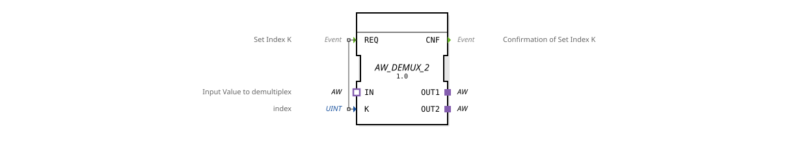

# AW_DEMUX_2

* * * * * * * * * *
## Introduction

The AW_DEMUX_2 function block implements a generic AW demultiplexer. It forwards an incoming AW value (via socket `IN`) to either one of the two output adapters (`OUT1` or `OUT2`). The selection of the target output is event-driven via the data input `K`.
## Interface Structure

### **Event Inputs**

| Event | Comment | With |
|----------|-----------|-----|
| `REQ` | Set Index K | `K` |

### **Event Outputs**

| Event | Comment |
|----------|-----------|
| `CNF` | Index Setting Confirmation |

### **Data Inputs**

| Name | Type | Comment |
|------|-------|-----------|
| `K` | UINT | index |

### **Data Outputs**

*None*

### **Adapters**

**Input Adapter (Socket)**

| Adapter | Type | Comment |
|---------|-----------------------------------|------------------------------------|
| `IN` | `adapter::types::unidirectional::AW` | Input Value to demultiplex |

**Output Adapters (Plugs)**

| Adapter | Type | Comment |
|---------|-----------------------------------|-----------|
| `OUT1` | `adapter::types::unidirectional::AW` | |
| `OUT2` | `adapter::types::unidirectional::AW` | |

## Functionality

The function block waits for an event at `REQ`. Upon its occurrence, the index currently present at data input `K` is evaluated.

- If `K = 0` is present, the AW value received via `IN` is forwarded to adapter `OUT1`.
- If `K = 1` is present, the forwarding occurs to `OUT2`.
- For values of `K` greater than 1, the behavior is undefined (implementation-dependent).

After a successful switchover, the confirmation event `CNF` is output.
...``

## Technical Features

- **Generic Function Block:** The function block (FB) is marked as generic by the attribute `GenericClassName` (`'GEN_AW_DEMUX'`). Depending on the adapter type, it can be used for various unidirectional AW interfaces.
- **Adapter-Based Communication:** Data is transferred via adapter connections, which enable loose coupling of the components and are type-safe.
- **Event-Driven Selection:** The demultiplex function is triggered exclusively by the event `REQ`. Without an event, the current connection remains active.

## State Overview

The FB does not have an explicit state machine (ECC). Its behavior can be described as follows:

| State (implicit) | Description |
|--------------------|--------------|
| **Idle** | Waiting for a `REQ` event. The last set index remains active. |
**Processing** | After receiving `REQ`, the index `K` is evaluated and the input value is redirected to the corresponding output. |
**Confirm** | After the switchover is complete, `CNF` is sent and the function block returns to idle mode. |

## Application Scenarios

- **Control of Parallel Processes:** An incoming data stream (e.g., measured values or control commands) is to be selectively distributed to two different processing units.
- **Switching of Signal Sources:** In a machine control system, a sensor value is alternately sent to two different evaluation algorithms.
- **Testing and Simulation:** In test environments, the same data value can be selectively routed to different simulation paths.

## Comparison with Similar Function Blocks

- **Standard DEMUX:** A classic demultiplexer for elementary data types (e.g., INT, BOOL) operates without adapters and requires multiple data outputs. AW_DEMUX_2, on the other hand, uses adapters, enabling higher abstraction and reusability.
- **AW_SWITCH:** A function block with similar functionality, but instead of duplicating the input value, it switches between different sources (multiplexer).
- **Advantages of AW_DEMUX_2:** Clear separation of control logic and data transfer, easy extensibility to additional outputs (e.g., AW_DEMUX_4).

## Conclusion

AW_DEMUX_2 is a compact, generic function block for adapter-based demultiplexing of AW values. Its event-driven selection and clear interface structure make it a flexible building block for modular automation solutions. Thanks to its generic design, it can be easily adapted to different AW types without changing its fundamental functionality.
