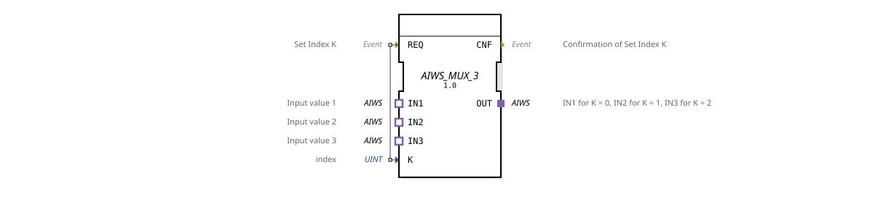

# AIWS_MUX_3

* * * * * * * * * *
The function block **AIWS_MUX_3** is a generic multiplexer for the unidirectional data type *AIWS*. It selects one of three input adapters (`IN1`, `IN2`, `IN3`) according to a passed index `K` and makes this adapter available at the output adapter `OUT`. The selection is initiated by an event `REQ` and acknowledged by `CNF`.

| Event | Comment |
|----------|-----------|
| `REQ` | Triggers the selection of index `K`. Linked to variable `K`. |
| Event | Comment |
|----------|-----------|
| `CNF` | Confirmation of successful index selection. |
| Name | Type | Comment |
|------|-------|-----------|
| `K` | UINT | Index of the input to be received (0 = IN1, 1 = IN2, 2 = IN3). |

No separate data outputs – data is transferred via the `OUT` adapter.

### Data Outputs

### Data Inputs

### Event Outputs

### Event Inputs

## Interface Structure

## Introduction

### **Adapters**

| Type | Name | Direction | Comment |
|-----|-------------|----------|-----------|
| `AIWS` (unidirectional) | `IN1` | Socket | First input value (index 0). |
| `AIWS` (unidirectional) | `IN2` | Socket | Second input value (index 1). |
| `AIWS` (unidirectional) | `IN3` | Socket | Third input value (index 2). |
| `AIWS` (unidirectional) | `OUT` | Plug | Output value of the selected input. |

## Functionality

1. The function block expects an event `REQ`. Simultaneously, the data input `K` must provide a valid index (0, 1, or 2).
- `K = 0`: The data stream from `IN1` is passed through to output `OUT`.
- `K = 1`: The data stream from `IN2` is passed through to output `OUT`.
- `K = 2`: The data stream from `IN3` is passed through to output `OUT`.

K = 2`: The data stream from `IN3` is passed through to output `OUT`.

OUT`:
... - Values outside the range (e.g., > 2) are undefined – in a concrete implementation, the function block could either do nothing or enter a predefined error state.

3. After successful switching, the event `CNF` is sent.
- **Generic Function Block**: The multiplexer is designed to be completely generic for the adapter type `AIWS`. This allows it to be reused in different contexts (e.g., analog inputs, sensor data) as long as the adapter fulfills the same unidirectional contract.
- **Adapter-Based Communication**: All data transmission between function blocks occurs via adapters, not via individual variables. This enables loose coupling and modular system design.
- **Unidirectional Interface**: Both input and output adapters are defined as unidirectional – data flows only in one direction (from the socket to the plug). This simplifies testability and avoids feedback loops.
- **Event-driven**: Switching occurs only upon explicit request (`REQ`). Without an event, the internal connections remain unchanged.

The function block has a simple state model implemented in the internal control flow (ECC):

| State | Description |
|---------|--------------|
| `IDLE` | Waiting for a `REQ` event. |
| `SELECT`| Evaluating `K` and switching the corresponding input to `OUT`. |
| `SEND` | Sending `CNF` and returning to `IDLE`. |

After each successful iteration, the system returns to the idle state `IDLE`.

- **Sensor Selection**: A system has several analog sensors (e.g., temperature, pressure, humidity). A sensor value can be alternately transmitted to a central processing unit via `K`.
- **Signal Routing**: A controller provides three different sources (e.g., alternative measurement paths or redundancy signals). The multiplexer selects the active source depending on the operating mode.
- **Testing and Diagnostics**: During operation, the system can switch to a predefined test input to check the function of the subsequent function block.
- **Standard MUX (e.g., IEC 61499 MUX)**: A conventional multiplexer typically works with basic data types (BOOL, INT, REAL) and has separate data inputs. In contrast, the `AIWS_MUX_3` uses adapters, which allows even complex, composite data objects (such as structures or entire measurement values with quality flags) to be passed through.
- **Adapter-Based Selectors**: Other components, such as the `AIWS_SELECT`, select between two adapters. The `AIWS_MUX_3` extends this to three inputs and a fixed index parameter.
- **Generic Multi-MUX**: Compared to a non-generic multiplexer, the generic definition allows the use of any number of instances with the same adapter type without having to redefine the component for each data type.
-

The **AIWS_MUX_3** is a flexible and generic multiplexer specifically designed for the unidirectional adapter type *AIWS*. It enables clean, event-driven selection from up to three sources and is particularly well-suited for modular automation solutions where data is encapsulated via adapters. Its simple interface (one index, one event) and clear state logic make it easy to integrate and test.

## Technical Features

## State Overview

## Application Scenarios

## Comparison with Similar Function Blocks

## Conclusion