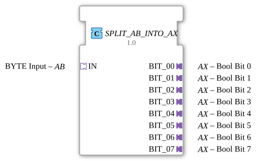

# SPLIT_AB_INTO_AX

* * * * * * * * * *
## Introduction
The function block **SPLIT_AB_INTO_AX** splits a byte received via a unidirectional AB adapter into its eight individual bits and provides these via separate AX adapters. The bits are transferred using clock-controlled D flip-flops, ensuring that the output values remain stable until a new byte is processed.
## Interface Structure
### **Event Inputs**
The function block does not have explicit top-level event inputs. Processing is triggered by an event arriving via the socket adapter **IN** (type AB). The **IN** adapter provides one event input (`E1`) and one data input (`D1`).

### **Event Outputs**

This function block does not have explicit event outputs at the top level. Results are output via the plug adapters **BIT_00** to **BIT_07** (type AX), which also contain an event output (`E1`).

### **Data Inputs**
- **IN.D1** – The byte to be processed is received via the socket adapter **IN** (type AB).

### **Data Outputs**
- **BIT_00.D1 … BIT_07.D1** – The individual Boolean values of the bits (bit 0 to bit 7) are output via the plug adapters **BIT_00** to **BIT_07** (type AX).

### **Adapters**

| Adapter | Type | Direction | Description |

|---------|------------------------------|----------|--------------------------------------------|

| IN | adapter::types::unidirectional::AB | Socket (Input) | BYTE value, decomposed into individual bits |

| BIT_00 | adapter::types::unidirectional::AX | Plug (Output) | Boolean value of bit 0 (LSB) |

| BIT_01 | adapter::types::unidirectional::AX | Plug (Output) | Boolean value of bit 1 |

| BIT_02 | adapter::types::unidirectional::AX | Plug (Output) | Boolean value of bit 2 |

| BIT_03 | adapter::types::unidirectional::AX | Plug (Output) | Boolean value of bit 3 |

| BIT_04 | adapter::types::unidirectional::AX | Plug (Output) | Boolean value of bit 4 |

| BIT_05 | adapter::types::unidirectional::AX | Plug (Output) | Boolean value of bit 5 |

| BIT_06 | adapter::types::unidirectional::AX | Plug (Output) | Boolean value of bit 6 |

| BIT_07 | adapter::types::unidirectional::AX | Plug (Output) | Boolean value of bit 7 (MSB) |

## Functionality

1. An incoming byte is received via the socket adapter **IN**. The event `E1` triggers the processing.

2. The internal function block `SPLIT_BYTE_INTO_BOOLS` splits the byte into eight Boolean signals (`BIT_00` … `BIT_07`). Simultaneously, the event `CNF` is generated.

3. This event is distributed to the clock inputs (`CLK`) of eight **E_D_FF** flip-flops. Each flip-flop receives the corresponding Boolean value at its data input `D` at the clock signal.

4. The outputs `Q` of the flip-flops provide the stabilized bits. These are passed via the data connections to the plug adapters **BIT_00** … **BIT_07**.

5. The event `EO` of each flip-flop is placed on the event output of the respective plug adapter, so that downstream components are notified of the new bit information.

## Technical Features
- **State Storage**: The use of D flip-flops (E_D_FF) ensures that the output values are retained even after the processing event until a new byte is processed.
- **Parallel Output**: All eight bits are updated simultaneously as soon as the jointly clocked event `CNF` of `SPLIT_BYTE_INTO_BOOLS` occurs.
- **Unidirectional Adapters**: Both the input and output adapters are unidirectional (from the application to the resource), therefore the component is suitable for transmission directions in which only one side controls the data flow.

## State Overview

The component itself does not have an explicit state machine. Its behavior results from the internal combination of:

- **SPLIT_BYTE_INTO_BOOLS**: Single-step – generates eight BOOL values and an acknowledgment event from one byte.
- **E_D_FF**: Each flip-flop stores a Boolean value on the rising clock edge and holds it until the next clock cycle.

Thus, the component can be described as a **pure combinational splitter with downstream hold elements**.

## Application Scenarios
- **Digital Output Control**: A byte (e.g., from a communication adapter) is split into individual digital outputs, each connected to actuators via AX getter adapters.
- **State Monitoring**: A byte signal (e.g., from a fieldbus) is decomposed into individual status bits, which can be processed or visualized separately.
- **Bit-level data preparation**: Before passing the data to internal processing that expects individual Boolean signals.

## Comparison with similar function blocks
- **SPLIT_BYTE_INTO_BOOLS**: Also splits a byte into Boolean values, but outputs them directly as data outputs and generates a single event.

**SPLIT_AB_INTO_AX** extends this with clock-controlled buffering and output via AX adapters, allowing for clean event synchronization with subsequent function blocks.

- **Simple data array splitters**: Some libraries offer function blocks that split arrays into individual elements, but without the additional storage and adapter interface.

## Conclusion

**SPLIT_AB_INTO_AX** is a specialized function block for splitting a byte value into eight stable Boolean outputs via AX adapters. The combination of splitter and flip-flops makes it particularly suitable for scenarios where individual bits need to be accessed asynchronously or with a time delay, without the value changing during processing. Its clear, adapter-based interface facilitates integration into modular IEC 61499 applications.