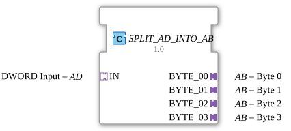

# SPLIT_AD_INTO_AB

* * * * * * * * * *
## Introduction

The function block **SPLIT_AD_INTO_AB** is used to split a 32-bit data word (AD adapter) into four individual bytes. The four bytes are output via separate unidirectional AB adapters. The block is implemented as a composite function block and uses a SPLIT_DWORD_INTO_BYTES and several edge-triggered D flip-flops (E_D_FF_ANY).
## Interface Structure

The function block does not have any traditional event or data interfaces. All communication takes place via adapters:

### **Adapters (Sockets)**

| Adapter | Type | Comment |
|---------|-----|------------|
| IN | `adapter::types::unidirectional::AD` | DWORD Input (32-bit) |

### **Adapter (Plugs)**

| Adapter | Type | Comment |
|---------|-----|------------|
| BYTE_00 | `adapter::types::unidirectional::AB` | Byte 0 (least significant byte) |
| BYTE_01 | `adapter::types::unidirectional::AB` | Byte 1 |
| BYTE_02 | `adapter::types::unidirectional::AB` | Byte 2 |
| BYTE_03 | `adapter::types::unidirectional::AB` | Byte 3 (most significant byte) |

Each AB adapter has at least one event output (E1) and one data output (D1) connected to the internal flip-flops.

## Functionality

1. An event at the **IN** adapter (E1) triggers the internal component `SPLIT_DWORD_INTO_BYTES`.
2. `SPLIT_DWORD_INTO_BYTES` parses the DWORD input at **IN.D1** into four individual bytes (BYTE_00 to BYTE_03) and outputs them as data.
3. Simultaneously, `SPLIT_DWORD_INTO_BYTES` generates an acknowledgment event (CNF), which is forwarded to the clock inputs (CLK) of all four `E_D_FF_ANY` flip-flops.
4. Each flip-flop stores its assigned byte (D input) on the rising edge of the clock and outputs it at its output (Q).
5. The flip-flop outputs are connected to the data outputs of the AB adapters (D1). Simultaneously, the event (EO) of each flip-flop is sent to the event input (E1) of the corresponding adapter, so that the connected consumer is informed of the new data.

## Technical Features

- **Synchronous Output**: All four bytes are output simultaneously with the same event (CNF of `SPLIT_DWORD_INTO_BYTES`). This ensures that the consumers of the individual bytes remain synchronized.
- **Use of E_D_FF_ANY**: These edge-triggered flip-flops ensure that the data is only transferred upon a new event and remains stable at the output until then.
- **Adapter-Based Interface**: The function block operates entirely via adapters, allowing it to integrate seamlessly into an adapter-oriented architecture (e.g., when using `adapter::types::unidirectional::AB` and `AD`).

## State Overview

The function block itself does not have an explicit state machine – it is a composite of standard function blocks. Internal flow control is managed through event and data flows:

- **Wait**: No input event → output remains unchanged.
- **Split**: Upon an event at the input adapter, the DWORD is split once, and all four bytes are output.

## Application Scenarios

- **Decomposition of 32-bit sensor data** (e.g., encoder values, A/D converters) into individual bytes for transmission via byte-oriented protocols.
- **Control of peripherals** that expect individual bytes as address or data words (e.g., register accesses).
- **Data collection in distributed systems** where a 32-bit value must be distributed among multiple independent processors.

## Comparison with similar components

- **SPLIT_DWORD_INTO_BYTES**: Also splits a DWORD into bytes, but outputs them directly as data outputs (BYTE_00..BYTE_03) without routing the data through adapters.
- **SPLIT_AD_INTO_AB**: Offers the same functionality, but encapsulates the output in unidirectional AB adapters. This allows for a clean separation of interfaces and facilitates reuse in different contexts.
- **AT** (Adapter-Type-Based Function Blocks): Other adapter splitters might, for example, split WORDs into nibbles, while this function block is specifically designed for DWORD → 4×BYTE.

## Conclusion

The **SPLIT_AD_INTO_AB** is a useful composite function block that synchronously splits a 32-bit data value into four individual bytes using an adapter. Edge-triggered flip-flops ensure stable outputs until the next input event arrives. The adapter interfaces integrate seamlessly into modular real-time systems according to IEC 61499 and facilitate structured data transfer.
