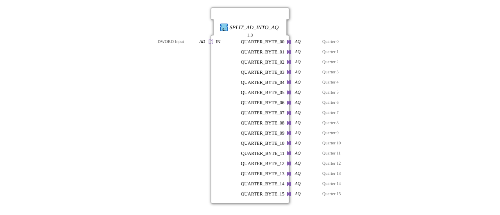

# SPLIT_AD_INTO_AQ

* * * * * * * * * *
## Introduction
The function block `SPLIT_AD_INTO_AQ` splits an incoming AD adapter (DWORD) into 16 individual AQ adapters (QUARTER). It serves as an interface to divide a wide data value (32 bits) into its 2-bit quarter components and forward these to separate output adapters. The block is implemented as a composite function block and internally uses a `SPLIT_DWORD_INTO_QUARTERS` block and 16 flip-flops (`E_D_FF_ANY`) for synchronous transmission.
## Interface Structure
### **Event Inputs**
The function block does not have its own independent event inputs. The event is received via the adapter interface `IN.E1` and processed internally.

### **Event Outputs**
The function block (FB) does not have its own event outputs. Event output is provided via the AQ adapter plugs (each via `QUARTER_BYTE_xx.E1`).

### **Data Inputs**
The FB does not have its own data inputs. Data is provided via the adapter interface `IN.D1`.

### **Data Outputs**
The FB does not have its own data outputs. The distributed data is output via the AQ adapter plugs (each via `QUARTER_BYTE_xx.D1`).

### **Adapters**

| Name | Type | Direction | Description |

|------|-----|----------|--------------|

| `IN` | `adapter::types::unidirectional::AD` | Socket (Input) | DWORD input adapter (32 bits). Events and data are received via `E1` and `D1`. |

| `QUARTER_BYTE_00` to `QUARTER_BYTE_15` | `adapter::types::unidirectional::AQ` | Plug (Output) | 16 output adapters, each providing one quarter (2 bits) of the original DWORD. Each adapter has an event output `E1` and a data output `D1`. |

## Functionality
The module operates entirely internally using a composite network. As soon as an event (`E1`) arrives via the `IN` adapter, it is forwarded to the internal module `SPLIT_DWORD_INTO_QUARTERS`. This module then parses the stored DWORD value (`IN.D1`) into 16 separate quarter bytes (each 2 bits).

After the division is complete, `SPLIT_DWORD_INTO_QUARTERS.CNF` signals a clock pulse, which is simultaneously sent to all 16 flip-flops (`E_D_FF_ANY_00` to `E_D_FF_ANY_15`). The flip-flops then receive the respective quarter data at their data input (from `SPLIT_DWORD_INTO_QUARTERS.QUARTER_BYTE_xx`) and output it at their output `Q`. Simultaneously, they fire an event at their output `EO`, which is forwarded to the corresponding AQ adapter plug (`QUARTER_BYTE_xx.E1`). This transfers the output data value (`Q`) to the target device via the adapter data path (`D1`).

The flip-flops then receive the respective quarter data at their data input (`SPLIT_DWORD_INTO_QUARTERS.QUARTER_BYTE_xx`) and output it at their output `Q`. Processing is strictly synchronous: all 16 quarter values are updated at the same clock cycle.

## Technical Features
- **Composite Architecture**: The function block (FB) uses other components (`SPLIT_DWORD_INTO_QUARTERS` and `E_D_FF_ANY`) to implement the decomposition and synchronization.
- **No Dedicated Inputs/Outputs**: All communication occurs exclusively via adapters. This enables clean encapsulation and reuse in adapter-based architectures.
- **Synchronization**: All 16 AQ outputs are updated simultaneously by a common clock (from `SPLIT_DWORD_INTO_QUARTERS.CNF`). This ensures that the split data is consistently available at the same time.
- **Scalability**: The FB is designed for 16 quarter values (corresponding to 32 bits). Adaptation to other bit widths would be possible by modifying the internal structure.

**No Dedicated Inputs/Outputs**:
## State Overview
As a composite function block (FB), `SPLIT_AD_INTO_AQ` does not have its own state machine. Internal data processing is determined by:

- **Waiting for Event**: No internal event is generated during idle time.
- **Processing**: Upon arrival of `IN.E1`, the flip-flops are split and updated.
- **Output**: All AQ outputs are available immediately after the clock signal.

## Application Scenarios
- **Data Splitting in Control Systems**: When a sensor or communication module provides a 32-bit data word (e.g., encoder position, measured value) that needs to be split into 16 separate 2-bit signals (e.g., brightness sensors, switching states).
- **Adapter-Based Communication**: Used in the 4diac IDE when adapters according to IEC 61499 are used to distribute data between different components.
- **Parallel processing of partial information**: Decomposition of a DWORD for subsequent components, each requiring only 2 bits of the original.

## Comparison with similar components

| Component | Description | Difference to `SPLIT_AD_INTO_AQ` |

|----------|--------------|-----------------------------------|

| `SPLIT_DWORD_INTO_QUARTERS` | Decomposes a DWORD into 16 quarter values and outputs them as direct data outputs. | `SPLIT_AD_INTO_AQ` additionally encapsulates this decomposition in adapter interfaces and adds flip-flop synchronization. |

| `SPLIT_INT_INTO_BITS` | Splits an integer into individual bits. | Operates at the bit level and not on 2-bit quarters; Output is typically in Boolean form. |

| Manual partitioning with `MUX` or `DEMUX` | Could be used to implement data partitioning without adapters. | `SPLIT_AD_INTO_AQ` is specifically optimized for adapter communication and offers a bundled, synchronized solution. |

## Conclusion

SPLIT_AD_INTO_AQ` is a useful building block for partitioning a DWORD (AD adapter) into 16 2-bit quarter-intercept adapters (AQ). Its composite architecture with internal synchronization ensures consistent data transmission and facilitates modular, adapter-based programming in the 4diac IDE. It is particularly suitable for applications that require parallel processing of partial information without the partitioning details needing to be visible in the higher-level network.

### 🌐 Related topic subpages on ms-muc-docs.de
* [🌐 Eclipse 4diac IDE & Color Reference on ms-muc-docs.de](https://www.ms-muc-docs.de/iec-61499/eclipse-4diac/)

]
