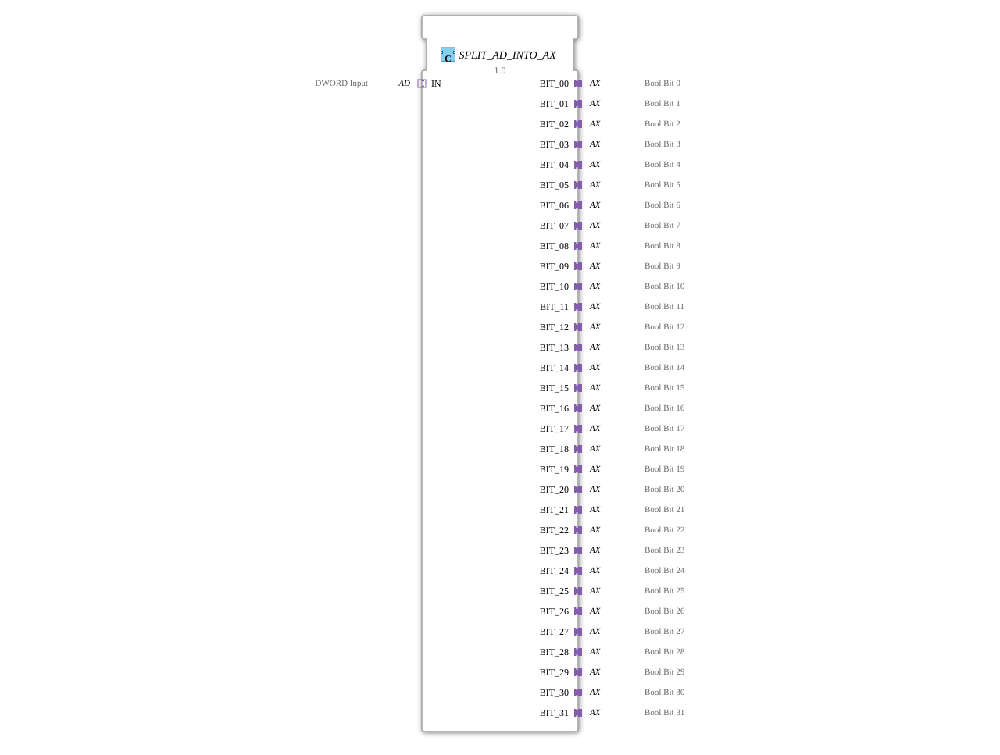

# SPLIT_AD_INTO_AX

* * * * * * * * * *
## Introduction

The SPLIT_AD_INTO_AX function block splits a 32-bit data word received via an AD adapter (DWORD) into 32 separate AX adapters (BOOL). Each AX adapter represents a single bit of the original DWORD value. The block encapsulates the necessary event control and data storage in a modular, easy-to-use function block.
## Interface Structure

### **Event Inputs**

None. Event control is handled indirectly via the adapter socket.

### **Event Outputs**

None. Output is provided via the adapter plugs, whose internal event behavior is defined by the types used (AX).

### **Data Inputs**

| Label | Type | Comment |
|-------------|-------|-----------------------|
| IN | AD | DWORD Input (32-bit) |

Data is received via the IN adapter socket. The AD adapter provides a DWORD value and an associated event (E1).

### **Data Outputs**

| Label | Type | Comment |
|-------------|-------|---------------------|
| BIT_00 | AX | Bool Bit 0 |
| BIT_01 | AX | Bool Bit 1 |
| … | … | … |
| BIT_31 | AX | Bool Bit 31 |

All 32 output adapters are of type AX (unidirectional BOOL adapter). Each output returns the state of the corresponding bit of the incoming DWORD.

### **Adapters**

- **Socket**: `IN` (type `adapter::types::unidirectional::AD`) – receives the DWORD value and its associated event.
- **Plugs**: 32 adapters `BIT_00` … `BIT_31` (type `adapter::types::unidirectional::AX`) – provide the individual bits as Boolean signals to the connected logic.

## Functionality

The internal process of the function block (FB) is divided into two steps:

1. **Division of the DWORD into Boolean Values**

An internal FB `SPLIT_DWORD_INTO_BOOLS` receives the DWORD via the data connection `IN.D1`. It divides the 32 bits into individual Boolean signals (`BIT_00` … `BIT_31`).

2. **Synchronization and Storage**

The event `IN.E1` triggers the input `REQ` of the splitter. After complete processing, the splitter sends the acknowledgment event `CNF`. This event is forwarded to the clock inputs (CLK) of 32 flip-flops (type `E_D_FF`). Simultaneously, the flip-flops receive the Boolean values provided by `SPLIT_DWORD_INTO_BOOLS` on their data inputs `D`.

The outputs `Q` of the flip-flops are permanently connected to the data inputs `D1` of the corresponding AX adapters, so the stored bit values are immediately passed on to the output adapters.

Thus, after each event at the input adapter, the entire 32-bit value is transferred in parallel to the 32 output adapters and held there until the next event.

## Technical Features

- **Parallel Processing**: All 32 bits are processed simultaneously by the flip-flops, ensuring a consistent snapshot of the DWORD.
- **Modular Design**: The function block (FB) utilizes existing standard components (`SPLIT_DWORD_INTO_BOOLS` and `E_D_FF`), facilitating maintainability and reuse.
- **Adapter-Based Communication**: All input and output is handled via adapters, allowing the FB to be seamlessly integrated into adapter-based applications.
- **No External Events**: The FB has no dedicated event inputs/outputs, as event control is handled entirely by the adapters.

## State Overview

The FB itself is stateless – its functionality is implemented by the internal flip-flops. Each `E_D_FF` has an internal memory state (0 or 1) that is updated by the clock event. After startup, all flip-flops are in their initial state (0) until the first event arrives at the input.

## Application Scenarios

- **Digital Signal Processing**: Decomposition of a 32-bit data word into individual Boolean control signals, e.g., for status or enable bits.
- **Interface Adaptation**: Connecting a DWORD source (e.g., bus system, register) to discrete digital inputs/outputs.
- **Testing and Simulation**: Targeted analysis of individual bits of a data word without complex bit manipulation in the application code.

## Comparison with Similar Components

- **SPLIT_WORD_INTO_BOOLS / SPLIT_BYTE_INTO_BOOLS**: These components operate at the 16-bit or 8-bit level and are optimized for smaller data word widths. SPLIT_AD_INTO_AX is specifically designed for 32-bit words and uses adapters instead of direct data ports.
- **Direct Bit Extraction with Adapters**: Alternatively, the `SPLIT_DWORD_INTO_BOOLS` could be used directly in an application, and the outputs connected via connectors. However, this function block encapsulates the entire synchronization process and provides a uniform, adapter-based interface, which simplifies reuse.

## Conclusion

SPLIT_AD_INTO_AX is a practical function block for splitting a 32-bit data word into 32 individual Boolean adapter signals. Its modular design, parallel processing, and adapter-based communication make it ideally suited for use in complex automation solutions where bit information from a compact data word needs to be resolved into separate logical paths.
