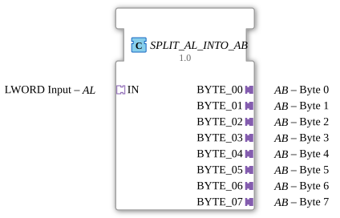

# SPLIT_AL_INTO_AB

* * * * * * * * * *
## Introduction
The function block **SPLIT_AL_INTO_AB** is used to split a 64-bit value (LWORD) received via an **AL adapter** (Long Word) into its eight individual bytes and to provide these bytes via eight separate **AB adapters** (Bytes). The splitting occurs synchronously with an event at the input adapter, and each byte is temporarily stored in its own flip-flop (E_D_FF_ANY) before being delivered to the corresponding output adapter. The block is designed as an **adapter splitting component** and is particularly suitable for structured data decomposition in IEC 61499 systems.
## Interface Structure

### Event Inputs
- **IN** (Socket, Type: `adapter::types::unidirectional::AL`):

The integrated event output **E1** of the AL adapter triggers processing. An incoming event at the IN adapter starts the decomposition of the simultaneously present data value.

### Event Outputs
The output adapters **BYTE_00** to **BYTE_07** (Plugs, Type: `adapter::types::unidirectional::AB`) each have an event input **E1**, which is triggered after successful data transfer. These events are generated by the internal network and signal that the corresponding byte is validly present at the adapter's data output.

### Event Outputs ### Data Inputs
- **IN** (Socket, Type: `adapter::types::unidirectional::AL`):

Supplies the 64-bit data value to be parsed via the **D1** data input of the adapter (Type LWORD).

### Data Outputs
- **BYTE_00** to **BYTE_07** (Plugs, Type: `adapter::types::unidirectional::AB`):

Each of these adapters provides a single byte (BYTE) via its **D1** data output. The mapping is as follows:

- BYTE_00: least significant byte (bits 0…7)
- BYTE_01: next byte (bits 8…15)
- …
- BYTE_07: most significant byte (bits 56…63)

### Adapter
- **IN**: Socket (AL – Adapter Long Word) – receiving adapter
- **BYTE_00 … BYTE_07**: Plugs (AB – Adapter Byte) – sending adapters

## Functionality

1. An event at the input adapter **IN** (E1) triggers the internal function block **SPLIT_LWORD_INTO_BYTES** (type: `eclipse4diac::utils::splitting::SPLIT_LWORD_INTO_BYTES`).

2. Simultaneously, the LWORD value (D1) provided by the IN adapter is forwarded to the input **IN** of this internal block.

3. The internal splitter divides the LWORD into eight separate bytes (**BYTE_00** … **BYTE_07**) and places them at its data outputs.

4. The splitter's completion event **CNF** is sent in parallel to eight **E_D_FF_ANY** flip-flops. Each flip-flop receives its assigned byte at this clock signal and outputs it at its **Q** output.

5. The flip-flops, in turn, generate an output event **EO**, which is directly connected to the event input **E1** of the corresponding **BYTE_XX** adapter.

6. This causes the individual bytes to be simultaneously output via the eight AB adapters – both as a data value (Q → D1) and as an acknowledgment event (EO → E1).

## Technical Features
- **Adapter-based interface**: The component uses only adapters (AL and AB) and no conventional event/data ports. This enables modular encapsulation and reuse in adapter-based architectures.
- **Simultaneous Output**: The eight bytes are output simultaneously through the parallel clocking of all flip-flops, which is advantageous for time-critical applications.
- **Cacheloading**: Each byte is cached in its own flip-flop (E_D_FF_ANY), so the output value is retained even if the input value changes or a new decomposition cycle begins.
- **Unidirectional Data Flow**: The adapters are designed as unidirectional (IN: AL, OUT: AB) – data flows only from the input to the outputs.
- **No State Machines in the Function Block itself**: The function block delegates state management to the internal flip-flops; it is purely combinatorial with clocked takeover.

## State Overview

The function block itself does not have its own visible state machine. The internal flip-flops **E_D_FF_ANY** have a dual state (Q = 0 or 1). The entire process follows a fixed pattern:

- **Idle**: No event at the input – outputs retain their last values.
- **Processing**: An event at the IN adapter is processed.
- **Output**: After the flip-flops have been clocked, all eight bytes are simultaneously available at the output adapters and are acknowledged by the respective events.

## Application Scenarios
- **Decomposition of Communication Data**: Splitting a received LWORD packet (e.g., from a fieldbus or serial interface) into individual byte signals for further processing in the controller.
- **Parallel Output of Diagnostic/Status Bytes**: Splitting a composite 64-bit status word into eight separate byte outputs for display or forwarding.
- **Adapter-oriented data processing**: Integration into architectures based on adapters to ensure a strict separation of data and event interfaces.
- **Interface to sub-function blocks**: Supplies data to multiple function blocks, each requiring one byte (e.g., for seven segment displays, stepper motor control, or D/A converters).

## Comparison with similar function blocks
- **SPLIT_LWORD_INTO_BYTES**: This internal function block performs the splitting without an adapter and outputs simple data outputs (BYTE) as well as an event (CNF). In contrast, **SPLIT_AL_INTO_AB** offers complete adapter encapsulation, including buffering and synchronized event output.
- **SPLIT_DWORD_INTO_BYTES** (analog, if available): Splits a 32-bit value into four bytes. SPLIT_AL_INTO_AB is designed for 64 bits and delivers eight bytes.
- **Simple MOVE Function Blocks**: Multiple MOVE blocks with bitmasks would need to be configured individually, whereas this block offers a ready-made, integrated solution.
- **Adapter-Based Alternatives**: Other splitting adapters might use symmetrical or different adapter types; this function block is specialized for AL→AB.

## Conclusion

**SPLIT_AL_INTO_AB** is a useful and efficient function block for splitting a 64-bit data word into eight individual bytes, specifically designed for use with IEC 61499 adapters (AL/AB). The combination of an internal splitter and flip-flops ensures simultaneous, buffer-based output of all bytes. Thanks to its adapter-based interface, the block can be seamlessly integrated into modular control architectures where a clean separation of event and data channels is desired. It is particularly suitable for applications requiring parallel, structured data transfer.

---

### 🌐 Related topic subpages on ms-muc-docs.de
* [🌐 Eclipse 4diac IDE & Color Reference on ms-muc-docs.de](https://www.ms-muc-docs.de/iec-61499/eclipse-4diac/)

]