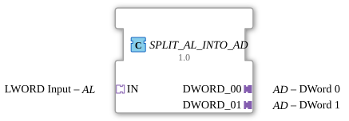

# SPLIT_AL_INTO_AD

* * * * * * * * * *
## Introduction
The function block `SPLIT_AL_INTO_AD` splits an incoming **AL (LWORD)** adapter into two separate **AD (DWORD)** adapters. It thus implements the necessary interface conversion for applications where a large data word (LWORD) needs to be split into two smaller DWORDs and made available via unidirectional adapters.
## Interface Structure

### **Event Inputs**
- **not directly available**

Events are received via the SOCKET adapter `IN` (signals `IN.E1`). Internally, this triggers processing.

### **Event Outputs**
- **Not directly available**

Output events occur via the PLUG adapters `DWORD_00.E1` and `DWORD_01.E1` as soon as a new value is available.

### **Data Inputs**
- **IN.D1** – Input data (`LWORD`) from the SOCKET adapter `IN`.

### **Data Outputs**
- **DWORD_00.D1** – First split DWORD (low part) on the PLUG adapter `DWORD_00`.
- **DWORD_01.D1** – Second split DWORD (high part) on the PLUG adapter `DWORD_01`.

### **Adapter**

| Type | Name | Direction | Comment |

|-------|------------|----------|------------------------------------|

| SOCKET | `IN` | Input | AL (LWORD) – Source Adapter |

| PLUG | `DWORD_00` | Output | AD (DWORD) – First Destination Adapter |

| PLUG | `DWORD_01` | Output | AD (DWORD) – Second Destination Adapter |

## Functionality

This function block operates purely event-driven. As soon as an event arrives at SOCKET `IN` (`IN.E1`), the corresponding data word (`IN.D1`, type `LWORD`) is internally forwarded to the sub-block `SPLIT_LWORD_INTO_DWORDS`. This sub-block splits the 64-bit word into two 32-bit DWORDs.

The two results are then passed in parallel to the inputs of the flip-flop blocks `E_D_FF_ANY_00` and `E_D_FF_ANY_01`. Simultaneously, the splitter block triggers a common acknowledgment event (`CNF`) that clocks both flip-flops. This allows the new DWORD values to be adopted and output as valid output data to the respective PLUG adapters (`DWORD_00.D1` and `DWORD_01.D1`). Simultaneously, an event is sent to the corresponding output adapter (`DWORD_00.E1` and `DWORD_01.E1`, respectively).

The flip-flops ensure that the output data remains stable until the next valid input event and is only updated during new processing.

## Technical Features
- **Full Adapter Encapsulation** – The module has no direct events or data ports, but communicates exclusively via standardized unidirectional adapters (AL/AD).
- **Internal Use of `SPLIT_LWORD_INTO_DWORDS`** – This separate, typed splitter module handles the data splitting; The flip-flops decouple data and event passing.
- **Zero latency for simultaneous events** – Since both flip-flops are clocked by the same `CNF`, both outputs are always updated synchronously.
- **No independent state behavior** – The function block is purely combinatorial with event-driven storage; there is no internal state machine.

## State Overview

The function block does not have an explicit state machine. Its behavior is purely data- and event-driven:

- **Idle** – No input event; output data remains unchanged.
- **Processing** – After the arrival of `IN.E1`, the data is split and passed to the outputs.
- **Stable** – The flip-flops hold the values until the next event.

## Application Scenarios
- **Industrial Automation** – When a sensor/actuator delivers an LWORD data word (e.g., a 64-bit counter or combined status/control words) via an AL adapter, but subsequent modules operate with two separate DWORD adapters.
- **Protocol Translation** – Decomposing large data packets into manageable subwords for adapter-based communication protocols.
- **Data Validation and Forwarding** – Splitting an LWORD into two DWORDs to serve different processing paths (e.g., visualization and control) in parallel.

## Comparison with Similar Components
- **`SPLIT_LWORD_INTO_DWORDS`** – Pure data splitter without adapter connectivity and without event synchronization. `SPLIT_AL_INTO_AD` extends this with the necessary adapter interfaces and flip-flops for correct event handling.
- **Manual Splitting** – Alternatively, the splitting could be programmed directly in the logic of the higher-level system; however, this module reduces the effort and improves reusability.

## Conclusion

`SPLIT_AL_INTO_AD` is a specialized yet elegant adapter module that enables seamless connectivity between an LWORD source and two DWORD sinks. Due to the clean separation of data splitting and event synchronization, it is particularly well-suited for modular, adapter-based control architectures.