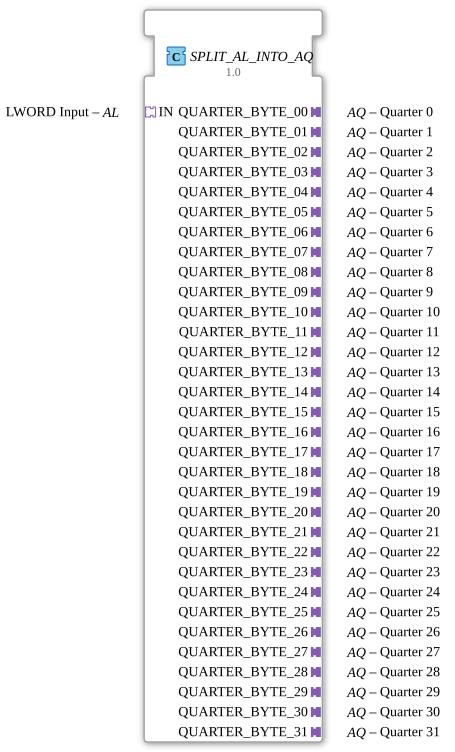

# SPLIT_AL_INTO_AQ

* * * * * * * * * *
## Introduction
The function block **SPLIT_AL_INTO_AQ** is a composite function block (FB) that splits an incoming LWORD value (via a `AL` adapter) into 32 separate 2-bit values and outputs each of these via its own `AQ` adapter (quarter byte). The splitting occurs synchronously with an event provided by the input adapter. The function block serves as an interface between a wide data word and several narrow, event-driven sub-segments.
## Interface Structure

### **Event Inputs**
No direct event inputs. The triggering event is provided via the incoming adapter `IN.E1`.

### **Event Outputs**
No direct event outputs. Output events are passed on via the outgoing adapter `QUARTER_BYTE_xx.E1`.

### **Data Inputs**
No direct data inputs. The LWORD data value is read via the incoming adapter `IN.D1`.

### **Data Outputs**
No direct data outputs. The 2-bit data values are output via the outgoing adapter `QUARTER_BYTE_xx.D1`.

### **Adapters**

| Direction | Name | Type | Comment |

|----------|------|-----|-----------|

| Socket (Input) | `IN` | `adapter::types::unidirectional::AL` | LWORD Input (64-bit) |

| Plug (Output) | `QUARTER_BYTE_00` … `QUARTER_BYTE_31` | `adapter::types::unidirectional::AQ` | 32 outputs, each providing a 2-bit value (quarter) |

Each adapter has one event channel and one data channel (`E1`, `D1`).

- The `AL` adapter provides an event (`E1`) and the LWORD data value (`D1`).
- The `AQ` adapters receive an event (`E1`) and the associated 2-bit value (`D1`).

## Functionality

The module operates in the following steps:

1. **Event Reception**: An event at the input adapter `IN.E1` triggers the internal processing.

2. **Splitting**: The internal instance `SPLIT_LWORD_INTO_QUARTERS` splits the incoming LWORD (64 bits) into 32 consecutive 2-bit segments (quarter bytes 0 to 31). Each segment is forwarded to the data input of one of 32 `E_D_FF_ANY` flip-flops. Simultaneously, the event is distributed to the clock input (`CLK`) of all flip-flops.

3. **Output**: On the rising edge of the clock signal, the flip-flops receive the 2-bit values. The flip-flops then pass the data and an output event to the corresponding `AQ` adapters via their outputs (`Q` and `EO`). This means that the segmented values are available at all 32 outputs simultaneously.

The entire process is strictly event-driven – a new input event updates all outputs at once.

## Technical Features
- **Use of D flip-flops**: The `E_D_FF_ANY` function blocks ensure that the output data is stable only after the clock event and is not affected by intermediate values.
- **Parallelization**: All 32 partial values are calculated and output in a single step. The function block is therefore deterministic and requires no loops or sequential processing.
- **Adapter-based interface**: The function block communicates exclusively via IEC 61499 adapter interfaces. This enables a clean separation of event and data flows and facilitates reuse in different contexts.
- **Use of 32-way chaining**: The vertical arrangement of the flip-flops and adapters in the network shows a systematic but very extensive structure – sufficient performance (e.g., propagation delay of the common clock signal) must be ensured during implementation.

## State Overview

The component does not contain its own state machine. The internal functionality results from the combination of:

- **one** `SPLIT_LWORD_INTO_QUARTERS` (combinational partitioning)
- **32** `E_D_FF_ANY` (storage elements with set/reset states)

Each flip-flop stores the last loaded 2-bit value. A new input event overwrites all 32 values simultaneously.

## Application Scenarios
- **Decomposition of a Fieldbus Data Telegram**: An LWORD contains multiple status or control bits that need to be distributed to separate actuators or sensors.
- **Parallelization of 2-Bit Signals**: When connecting BCD or quadrature encoders, multiple 2-bit pieces of information can be transmitted compactly and then processed separately.
- **Bridge between Wide and Narrow Data Buses**: If a system uses 64-bit words, but the target components only have 2-bit interfaces, this function block offers a simple way to split the data.

## Comparison with Similar Function Blocks

| Function Block | Output Format | Number of Outputs | Synchronization |

|----------|---------------|----------------|-----------------|

| `SPLIT_AL_INTO_AQ` | 2-bit AQ adapter | 32 | Common event |

| `SPLIT_LWORD_INTO_BYTES` (hypothetical) | 8-bit adapter | 8 | Event |

| `SPLIT_LWORD_INTO_WORDS` (hypothetical) | 16-bit adapter | 4 | Event |

This component is specifically optimized for the fine granularity of 2-bit segments and utilizes event-driven IEC 61499 adapter technology. The main difference compared to simpler split devices lies in the number of outputs (32 instead of the typical 4 or 8) and the use of flip-flops for stable output.

This component is specifically optimized for the fine granularity of 2-bit segments and utilizes event-driven IEC 61499 adapter technology.
## Conclusion

The `SPLIT_AL_INTO_AQ` function block offers efficient, parallelized partitioning of a 64-bit LWORD into 32 separate 2-bit channels. Thanks to strict event control and D flip-flop storage, deterministic and time-accurate output is guaranteed. The block is particularly suitable for applications where many narrow data streams need to be derived from a compact data word. Its adapter-based interface makes it flexible and easily integrated into existing IEC 61499 systems.
