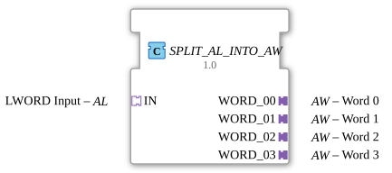

# SPLIT_AL_INTO_AW

* * * * * * * * * *
## Introduction
The function block **SPLIT_AL_INTO_AW** is used to split a 64-bit integer received via an AL adapter (LWORD) into four separate 16-bit values and output them via four individual AW adapters. It implements a hard-coded split that is triggered by an incoming event.
## Interface Structure

### **Event Inputs**
- **IN.E1** (Event) – Received via the **IN** socket and starts the splitting process.

#### **Event Outputs**
- **WORD_00.E1** – Output via the **WORD_00** plug.
- **WORD_01.E1** – Output via the **WORD_01** plug.
- **WORD_02.E1** – Output via the **WORD_02** plug.
- **WORD_03.E1** – Output via the **WORD_03** plug.

Each event output is activated in parallel as soon as the splitting is complete.

### **Data Inputs**
- **IN.D1** (LWORD) – The 64-bit input size to be split. Provided via the **IN** socket.

### **Data Outputs**
- **WORD_00.D1** (WORD) – The least significant word (bits 0–15).
- **WORD_01.D1** (WORD) – The second word (bits 16–31).
- **WORD_02.D1** (WORD) – The third word (bits 32–47).
- **WORD_03.D1** (WORD) – The most significant word (bits 48–63).

Each output is provided by an edge-triggered memory (E_D_FF_ANY) and remains stable until the next split operation.

### **Adapters**
- **Socket IN** – Type: `adapter::types::unidirectional::AL` (LWORD)
- **Plugs WORD_00 … WORD_03** – Type: `adapter::types::unidirectional::AW` (WORD)

## Operation

1. An incoming event at **IN.E1** activates the internal function block **SPLIT_LWORD_INTO_WORDS** via its event input **REQ**.

### **Adapters**

**Socket IN** – Type: `adapter::types::unidirectional::AL` (LWORD)

**Plugs WORD_00 … WORD_03** – Type: `adapter::types::unidirectional::AW` (WORD)

**Functionality**

**An incoming event at **IN.E1** activates the internal function block **SPLIT_LWORD_INTO_WORDS** via its event input **REQ**.**

**** 2. Simultaneously, the data **IN.D1** is transferred to the data input **IN** of the split function block.

3. **SPLIT_LWORD_INTO_WORDS** splits the LWORD into four word parts (**WORD_00**…**WORD_03**) and generates a termination event at **CNF**.

4. This termination event is forwarded to all four edge-triggered flip-flops (**E_D_FF_ANY**). Each flip-flop receives its assigned subword at its data input **D** and places it at its output **Q**.

5. Simultaneously, the event outputs **WORD_00.E1** … **WORD_03.E1** are activated so that the downstream adapters can receive the new data together.

4. This termination event is forwarded to all four edge-triggered flip-flops (**E_D_FF_ANY**).
## Technical Features

- **Use of E_D_FF_ANY**: Each partial value is temporarily stored in an edge-triggered flip-flop. This ensures that the output value is retained even if no new event is present at the input. The values are only updated during the next splitting operation.
- **Parallel Output**: All four output events are triggered simultaneously – the data is available at all plugs at the same time.
- **Adapter-Based Interface**: The function block works exclusively with adapters, enabling clean encapsulation and reusability in modular applications.

## State Overview

The function block itself does not have an explicit state machine. The internal flip-flops (E_D_FF_ANY) can assume the following states:

- **Idle**: No event is present – the output plugs hold the last stored value.
- **Busy**: The function block is briefly occupied during processing (between **IN.E1** and the appearance of the output events).
- **Output Active**: Upon completion, the new data is output to the plugs and the events are sent.

## Application Scenarios
- **De-Seeralization**: Splitting a 64-bit telegram component into individual 16-bit register values for further processing.
- **Control Engineering**: Splitting a long bitmask into multiple submasks that are sent to different actuators or display units.
- **Data Preparation**: Decomposing an LWORD measurement value (e.g., from an encoder or an analog-to-digital converter card) into usable word channel values.

## Comparison with Similar Components
- **SPLIT_LWORD_INTO_WORDS** (not adapter-based): Works with pure data and event ports. **SPLIT_AL_INTO_AW** encapsulates this function block and adds the adapter interfaces and edge-triggered storage.
- **MUX** or **DEMUX** (IEC 61499 standard): These typically split or combine data streams at the bit or bit level, while **SPLIT_AL_INTO_AW** is specifically designed for fixed 64-bit partitioning.

## Conclusion

**SPLIT_AL_INTO_AW** offers a simple, robust solution for splitting an LWORD into four WORDS using adapters. Thanks to its integrated edge-triggered buffering, the function block is particularly well-suited for event-driven systems where data must be available in parallel and stably at different outputs. The adapter-based interface simplifies integration into existing component libraries.
