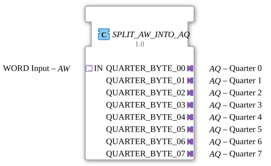

# SPLIT_AW_INTO_AQ

* * * * * * * * * *
## Introduction
The function block **SPLIT_AW_INTO_AQ** divides the eight quarter adapters (AQ) of a word adapter (AW). The incoming word (16 bits) is split into eight quarter units (2 bits each) and output via the corresponding AQ plugs.
## Interface Structure
### **Event Inputs**
- `IN.E1` (via Socket IN) – Triggers the splitting of a new word value.

### **Event Outputs**
- `QUARTER_BYTE_00.E1` to `QUARTER_BYTE_07.E1` – Signals the availability of the respective quarter result.

### **Data Inputs**
- `IN.D1` – Receives the incoming word (16 bits, type compatible with the AW adapter).

### **Data Outputs**
- `QUARTER_BYTE_00.D1` to `QUARTER_BYTE_07.D1` – Provide the eight divided quarter values (2 bits each).

### **Adapters**
- **Socket:** `IN` – Adapter type `adapter::types::unidirectional::AW`
- **Plugs:** `QUARTER_BYTE_00` … `QUARTER_BYTE_07` – Adapter type `adapter::types::unidirectional::AQ`

## Functionality

1. An event at input `IN.E1` activates the internal module `SPLIT_WORD_INTO_QUARTERS`.

2. `SPLIT_WORD_INTO_QUARTERS` decomposes the 16-bit word received via `IN.D1` into eight separate 2-bit quarter values.

3. The split values are temporarily stored in parallel in eight `E_D_FF_ANY` flip-flops (`D` inputs).

4. After processing is complete (CNF event of `SPLIT_WORD_INTO_QUARTERS`), all flip-flops simultaneously receive a clock pulse (`CLK`).

5. The outputs `Q` of the flip-flops are connected to the corresponding `QUARTER_BYTE_xx.D1` outputs.

6. Simultaneously, the event `QUARTER_BYTE_xx.E1` is triggered to signal the data transfer to downstream components.
...``

## Technical Features

- **Synchronization via Flip-Flops:** All eight quarter values are taken from the internal splitter in sync with the clock.
- **No Persistent State Storage:** The chip only buffers the quarter values until the next processing cycle.
- **Uniform Interfaces:** The adapters follow the unidirectional AW/AQ protocol and enable easy integration in the 4diac IDE.

## State Overview

The chip does not have its own state machine. The internal `E_D_FF_ANY` flip-flops can be in two states:

- **Stores Previous Value** – Until a new event occurs.
- **Updated Value** – After a clock pulse from the CNF event.

## Application Scenarios
- **Data Preparation:** Splitting a 16-bit word from a communication adapter into eight 2-bit quarter-wave signals, e.g., for parallel processing in control logic.
- **Multiplexing/Demultiplexing:** Separating word data streams into separate quarter-wave channels.
- **Bus Structure Extension:** Easily splitting address or control words across multiple subsequent components.

## Comparison with Similar Components
- **SPLIT_BYTE_INTO_NIBBLES** – Splits a byte into two 4-bit nibbles.
- **SPLIT_WORD_INTO_BYTES** – Splits a 16-bit word into two 8-bit bytes.
- **SPLIT_AW_INTO_AQ** is specifically designed for splitting one AW adapter (Word) into eight AQ adapters (Quarters). The interfaces are directly tailored to the adapter types and require no manual configuration.

## Conclusion
The **SPLIT_AW_INTO_AQ** module offers a compact and reliable way to split an incoming Word signal into eight Quarter signals. Thanks to its integrated clock synchronization and standardized adapter interfaces, it is ideally suited for modular IEC 61499 applications that require simultaneous data processing for multiple participants.

---

### 🌐 Related topic subpages on ms-muc-docs.de
* [🌐 Eclipse 4diac IDE & color reference on ms-muc-docs.de](https://www.ms-muc-docs.de/iec-61499/eclipse-4diac/)
