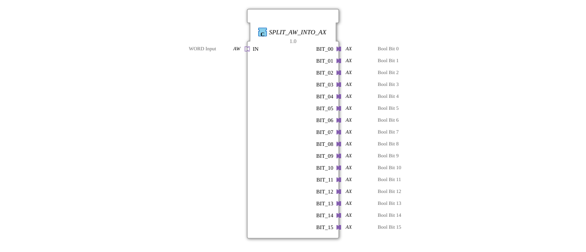

# SPLIT_AW_INTO_AX

* * * * * * * * * *
## Introduction

The function block `SPLIT_AW_INTO_AX` is used to split a 16-bit word (type `AW`) into 16 individual binary signals (type `AX`). Each of the 16 outputs represents one bit of the incoming word and is provided as an independent adapter with event and data lines. The splitting occurs synchronously upon the arrival of an event at the input adapter.
## Interface Structure

### **Event Inputs**

The function block does not have any independent event inputs on the interface. The initial event is received via the socket adapter `IN` (see Adapters).

### **Event Outputs**

This module does not have any independent event outputs on the interface. Output events are provided via the plug adapters `BIT_00` … `BIT_15` (see Adapters).

### **Data Inputs**

This module does not have any independent data inputs on the interface. The 16-bit value to be processed is provided as a data value `D1` (type `WORD`) via the socket adapter `IN` (see Adapters).

### **Data Outputs**

This module does not have any independent data outputs on the interface. The 16 extracted binary values are output via the plug adapters `BIT_00` … `BIT_15` as data values `D1` (type `BOOL`).

### **Adapter**

| Direction | Name | Type | Comment |
|----------|------|-----|-----------|
| **Socket** (Input) | `IN` | `adapter::types::unidirectional::AW` | 16-bit word as input, event input `E1`, data input `D1` |
| **Plug** (Output) | `BIT_00` … `BIT_15` | `adapter::types::unidirectional::AX` | One bit of each word, event output `E1`, data output `D1` |

## Functionality

1. An external event at socket `IN.E1` triggers processing.
2. The current value of `IN.D1` (type `WORD`, 16 bits) is read.
3. The internally embedded component `SPLIT_WORD_INTO_BOOLS` divides the word into 16 individual Boolean values (`BIT_00` … `BIT_15`).
4. These 16 values are passed to a `E_D_FF` (D flip-flop) at each clock cycle. The flip-flops receive the data at each clock cycle (here, the event `CNF` from `SPLIT_WORD_INTO_BOOLS`).
5. Each flip-flop outputs its stored value via the associated plug adapter `BIT_xx.D1` and an event via `BIT_xx.E1`.

... This distributes the entire word value across the 16 output adapters in a single cycle and holds it there until the next event.

## Technical Features

- **Event-Synchronous Distribution:** The entire distribution occurs within a single event cycle – all 16 outputs are updated simultaneously.
- **Storage:** Each bit value is held by its own `E_D_FF`, ensuring the outputs remain stable even without constantly repeated events.
- **Adapter-Based Input/Output:** The module communicates exclusively via adapters – it can therefore be seamlessly integrated into 4diac systems that use unidirectional adapters for word or Boolean signals.
- **No Dedicated Event/Data Inputs:** The entire interface is implemented via the adapters; direct wiring on the facade is not required.

## State Overview

The module does not have its own top-level state machine. The internal state is determined by the 16 D flip-flops (`E_D_FF_00` … `E_D_FF_15`):

- Each flip-flop can be in one of two states: `Q = 0` or `Q = 1`.
- The state is updated only on each clock cycle (i.e., with each new event arriving at the input).
- In the idle state between events, the last stored value is retained.

## Application Scenarios

- **Control Tasks:** A higher-level controller or PLC sends a 16-bit word (e.g., as a control word) – the function block converts it into 16 individual binary control signals (e.g., for relays, valves, or indicators).
- - **Protocol Conversion:** Input signals from a bus system are stored as a word and must be distributed to discrete outputs.
- **Testing and Simulation:** Representation of a word as 16 Boolean channels for visualization or troubleshooting.

## Comparison with Similar Components

- **`SPLIT_WORD_INTO_BOOLS`** – This component also divides a word into Boolean values, but without adapters and without event-driven output. It serves as an internal component of the present component.
- **`SPLIT_AW_INTO_AX`** – Extends the pure data division with adapters and event output, so that the individual bits are available as fully-fledged AX interfaces (with their own event and data). This enables direct interconnection with other 4diac components that expect AX adapters.
- **Alternative In-House Development:** Theoretically, 16 separate `SLICE` modules could be used to extract bits from a word – however, this would be more complex and would not offer synchronous event output.

## Conclusion

SPLIT_AW_INTO_AX` is a compact yet powerful converter that reliably and event-synchronously divides a 16-bit word into 16 individual binary outputs. Thanks to the use of adapters and flip-flops, it is particularly well-suited for use in modular IEC 61499 applications where a clean separation of word and bit interfaces is required. It simplifies interface adaptation and improves the readability and maintainability of the application network.

---

### 🌐 Related topic subpages on ms-muc-docs.de

- [🌐 Eclipse 4diac IDE & Color Reference on ms-muc-docs.de](https://www.ms-muc-docs.de/iec-61499/eclipse-4diac/)

]
