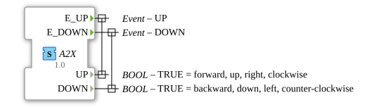

# A2X (BOOL)
Unidirectional adapter interface for 2 events and 2 bools
## Interface
### Events
| Name | Comment | With |
| :--- | :--- | :--- |
| E_UP | UP | UP |
| E_DOWN | DOWN | DOWN |

###Data

| Name | Type | Comment |
| :--- | :--- | :--- |
| UP | BOOL | TRUE = forward, up, right, clockwise |
| DOWN | BOOL | TRUE = backward, down, left, counter-clockwise |
### Data