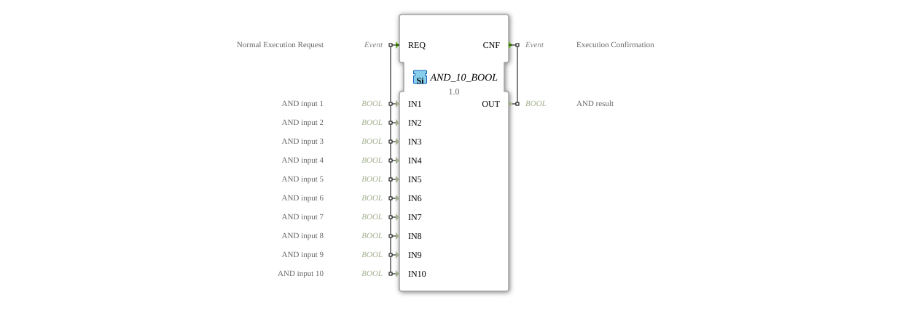

# AND_10_BOOL

* * * * * * * * * *
## Introduction
The function block `AND_10_BOOL` is a generic block for calculating the logical AND operation. It performs a bitwise AND operation on up to ten separate BOOL inputs. The block is classified according to the IEC 61131-3 standard and belongs to the category of standard Boolean functions. It is typically used in control logic to link conditions where all input signals must be true (TRUE) to activate an output signal.

## Interface Structure

### **Event Inputs**
* **REQ (Normal Execution Request):** This event triggers the execution of the function block. Upon its arrival, the values of all ten data inputs (`IN1` to `IN10`) are read, and the AND operation is performed.

### **Event Outputs**
* **CNF (Execution Confirmation):** This event signals the completion of the calculation. It is output along with the calculated result at data output `OUT`.

### **Data Inputs**
* **IN1 (AND input 1):** Boolean input 1.
* **IN2 (AND input 2):** Boolean input 2.
* **IN3 (AND input 3):** Boolean input 3.
* **IN4 (AND input 4):** Boolean input 4.
* **IN5 (AND input 5):** Boolean input 5.
* **IN6 (AND input 6):** Boolean input 6.
* **IN7 (AND input 7):** Boolean input 7.
* **IN8 (AND input 8):** Boolean input 8.
* **IN9 (AND input 9):** Boolean input 9.
* **IN10 (AND input 10):** Boolean input 10.

### **Data Outputs**
* **OUT (AND result):** The result of the AND operation of all ten inputs. The output is only TRUE if **all** inputs `IN1` to `IN10` have the value TRUE. In all other cases, the output is FALSE.

### **Adapter**
This function block has no adapter interfaces.

## Operation
The operation is deterministic and event-driven. Upon each occurrence of the event `REQ`, the following logical operation is performed:

`OUT = IN1 AND IN2 AND IN3 AND IN4 AND IN5 AND IN6 AND IN7 AND IN8 AND IN9 AND IN10`

The result is then made available at the data output `OUT`, and the acknowledgment event `CNF` is triggered to inform subsequent blocks of the availability of the new result.

## Technical Features
* **Generic Block:** The block is implemented as a generic block (attribute `GenericClassName = 'GEN_AND'`). This means that its functionality can potentially be parameterized for a different number of inputs, although this specific instance is fixed to ten inputs.
* **Package:** The block is included in the package `iec61131::bitwiseOperators`.
* **Full Evaluation:** All ten inputs are evaluated on each execution.

## State Overview
The `AND_10_BOOL` block has no internal state (memoryless). Its output depends solely on the current values of the inputs at the time of triggering by `REQ`. There are no delays, filters, or hysteresis.

## Application Scenarios
* **Safety Interconnects:** In machine safety circuits, where multiple safety switches (emergency stop, light barriers, door contacts) must all be closed before a hazardous process can begin.
* **Multiple Conditions:** In process control systems, to check whether multiple conditions (e.g., fill level, temperature, pressure) are simultaneously within their target ranges.
* **Enable Logic:** As part of an enable chain where multiple stations or operators must give their approval (TRUE signal).

## ⚖️ Comparison with Similar Function Blocks
* **`AND` (with 2 inputs):** The standard AND block according to IEC 61131-3 typically has only two inputs. `AND_10_BOOL` extends this functionality to ten inputs without the need to connect multiple two-input AND blocks. See: [AND_10](../../../StandardLibraries/iec61131-3/bitwiseOperators/AND_10.md)
* **`OR_10_BOOL`:** Performs a logical OR operation. The result is TRUE if at least one input is TRUE, while `AND_10_BOOL` requires all inputs to be TRUE.
* **`XOR` / `XNOR`:** Compute the exclusive OR and equivalent operations, respectively, which are based on the parity of the TRUE signals, not an all-or-none condition like AND.
* **Generic Blocks (`GEN_AND`):** `AND_10_BOOL` is a specific instance of a generic AND block. In other environments, a configurable `GEN_AND` block could be used, to which the desired number of inputs are parameterized.

## Conclusion
The `AND_10_BOOL` is a specialized, reliable, and easy-to-use function block for applications that require a logical AND operation across a large, fixed number of conditions. Its event-driven, stateless nature makes it predictable and easy to integrate into existing control flows. For scenarios with a variable number of conditions, flexible, parameterizable blocks should be considered.