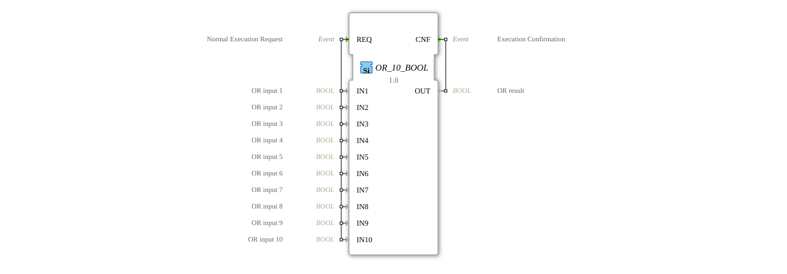

# OR_10_BOOL

* * * * * * * * * *
## Introduction

The function block `OR_10_BOOL` is a generic block for calculating the logical OR operation. It performs the OR operation on up to ten separate Boolean input values and outputs the result on a single output. This block is classified according to the IEC 61131-3 standard and serves as a standard function for bitwise operations in control applications.

## Interface Structure

The function block follows the standard I/O and event model of the 4diac IDE.

### **Event Inputs**

* **REQ (Normal Execution Request):** This event triggers the execution of the function block. Upon its arrival, all ten data inputs (`IN1` to `IN10`) are read and the OR operation is calculated.

### **Event Outputs**

* **CNF (Execution Confirmation):** This event signals the completion of the calculation. It is output along with the calculated result at data output `OUT`.

### **Data Inputs**

* **IN1 (OR input 1):** Boolean input 1.
* **IN2 (OR input 2):** Boolean input 2.
* **IN3 (OR input 3):** Boolean input 3.
* **IN4 (OR input 4):** Boolean input 4.
* **IN5 (OR input 5):** Boolean input 5.
* **IN6 (OR input 6):** Boolean input 6.
* **IN7 (OR input 7):** Boolean input 7.
* **IN8 (OR input 8):** Boolean input 8.
* **IN9 (OR input 9):** Boolean input 9.
* **IN10 (OR input 10):** Boolean input 10.

### **Data Outputs**

* **OUT (OR result):** Boolean result of the OR operation of all ten inputs. The output is `TRUE` (1) if at least one of the inputs is `TRUE`. It is only `FALSE` (0) if all ten inputs are `FALSE`.

### **Adapter**

This function block has no adapter interfaces.

## Operation

The operation is deterministic and event-driven:

1. The arrival of the event `REQ` starts the execution.
2. The current values of all ten Boolean inputs (`IN1` to `IN10`) are read.
3. The logical OR operation `OUT = IN1 OR IN2 OR IN3 OR ... OR IN10` is calculated.
4. The result is made available at data output `OUT`.
5. The event `CNF` is triggered to signal the successful completion of the operation to subsequent blocks.

## Technical Features

* **Generic Block:** The block is implemented as a generic function block (`GEN_OR`), which allows for flexible reuse in different contexts.
* **Fixed Number of Inputs:** Unlike blocks with a variable number of inputs, `OR_10_BOOL` has exactly ten fixed inputs. Unused inputs should be set to `FALSE`.
* **Event-driven:** The calculation only occurs when a `REQ` event occurs, enabling energy- and computationally efficient processing in the control system.

## State Overview

The function block has no internal state (memoryless). The output signal `OUT` is a pure function of the current input values at the time of the `REQ` request. There is no delay, hysteresis, or storage of previous states.

## Application Scenarios

* **Monitoring Logic:** Combining multiple error or warning signals (e.g., from different sensors) into a single alarm signal.
* **Enable Logic:** Generating an enable signal for a process step when at least one of several prerequisites is met.
* **Button Group Linking:** In an operator station where a process can be initiated by pressing at least one of several "Start" buttons.
* **Redundant Sensor Evaluation:** Evaluates multiple redundant sensors, where the signal from any one sensor is considered valid.

## ⚖️ Comparison with Similar Blocks

* **`OR_2_BOOL` / `OR_4_BOOL`:** These blocks offer the same OR functionality, but for a smaller number of inputs (2 and 4, respectively). `OR_10_BOOL` is intended for applications with a higher number of signals to be linked. See: [OR_10](../../../StandardLibraries/iec61131-3/bitwiseOperators/OR_10.md)]
* **`AND_10_BOOL`:** Performs the logical AND operation. The result is only `TRUE` if *all* inputs are `TRUE`, whereas for `OR_10_BOOL`, it is sufficient if *at least one* input is `TRUE`.
* **`XOR_10_BOOL`:** Performs the exclusive OR operation. The result is `TRUE` if an odd number of inputs are `TRUE`, which is fundamentally different from inclusive OR logic.
* **Blocks with variable input count:** Some libraries offer OR blocks where the number of inputs is configurable. `OR_10_BOOL`, however, offers a fixed, explicit interface.

**`OR_10_BOOL`:**
## Conclusion

The `OR_10_BOOL` is a robust and easy-to-use basic building block for logical signal processing in IEC 61131-3-based control applications. Its strength lies in its clear interface with ten inputs and the reliable, event-driven calculation of the inclusive OR function. It represents an optimal solution for applications that require combining multiple Boolean sources into a single signal.

---

### 🌐 Related topic subpages on ms-muc-docs.de

* [🌐 Eclipse 4diac IDE & color reference on ms-muc-docs.de ](https://www.ms-muc-docs.de/iec-61499/eclipse-4diac/)

]
