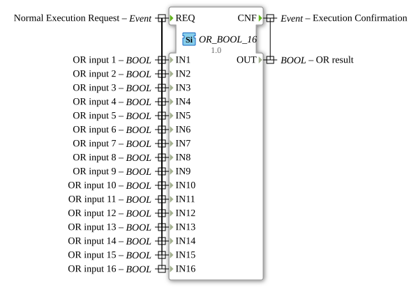

# OR_BOOL_16

* * * * * * * * * *
## Introduction

The function block `OR_BOOL_16` is a standard function block for calculating the logical OR operation. It performs the OR operation via 16 separate Boolean inputs and provides the result at a single output. This function block is part of the IEC 61131-3 compliant library for bitwise operations and is suitable for applications where a logical combination of multiple signals is required.

## Interface Structure

### **Event Inputs**

- **REQ (Normal Execution Request):** This event triggers the calculation of the OR function. It is linked to all 16 data inputs (`IN1` to `IN16`).

### **Event Outputs**

- **CNF (Execution Confirmation):** This event signals the completion of the calculation. It is output along with the updated data output `OUT`.

### **Data Inputs**

The function block has 16 identical Boolean data inputs:

- **IN1** to **IN16 (BOOL):** The input signals to be combined. Each input represents an operand for the OR operation.

### **Data Outputs**

- **OUT (BOOL):** The result of the logical OR operation on all 16 inputs. The output is `TRUE` (1) if at least one of the inputs is `TRUE`. It is only `FALSE` (0) if all 16 inputs are `FALSE`.

### **Adapter**

This function block does not use any adapter interfaces.

## Operation

The operation is deterministic and event-driven:

1. The block is activated when an event occurs at input `REQ`.
2. The block reads the current values of all 16 inputs `IN1` to `IN16`.
3. The logical OR operation is calculated on all read values: `OUT = IN1 OR IN2 OR ... OR IN16`. 4. The result is set at the data output `OUT`.
4. Immediately after the calculation, the confirmation event `CNF` is output along with the new value of `OUT`.

## Technical Features

- **Generic Block:** The block is marked as a generic block (`GEN_OR`), indicating that the underlying logic can be reused for other OR blocks with different numbers of inputs.
- **Fixed Number of Inputs:** Unlike blocks with a variable number of inputs, `OR_BOOL_16` has exactly 16 inputs. This provides a clear and fixed interface.
- **Event-driven execution:** The calculation only occurs upon receipt of an incoming `REQ` event, enabling energy-efficient and demand-based processing in the real-time system.

## State overview

The function block does not have an internal state in the sense of a memory. It behaves purely combinatorially with respect to the input data. Its "state" is defined solely by the presence or absence of a pending calculation job (`REQ`). After processing and sending `CNF`, it returns to a passive waiting state.

## Application scenarios

- **Monitoring logic:** Combining multiple error or warning signals into a single fault signal. (e.g., "Stop the machine if sensor A OR sensor B OR ... OR sensor P reports a fault").
- **Enable Logic:** Checks whether at least one of several conditions for starting a process is met.
- **Button Group Linking:** In an operator station where an action can be triggered by pressing at least one of several (up to 16) buttons.

## ⚖️ Comparison with Similar Function Blocks

- **`OR_BOOL_2`, `OR_BOOL_8`:** These are identical OR function blocks with a smaller number of inputs (2 and 8, respectively). `OR_BOOL_16` extends this series for applications with a higher number of inputs. See: [OR_16](../../../StandardLibraries/iec61131-3/bitwiseOperators/OR_16.md)
- **`AND_BOOL_16`:** Performs the logical AND operation. The result is only `TRUE` if *all* inputs are `TRUE`, whereas for `OR_BOOL_16`, it is sufficient if *at least one* input is `TRUE`.
- **Blocks with variable input count:** Some libraries offer OR blocks where the number of inputs is configurable. `OR_BOOL_16`, on the other hand, offers a fixed, optimized interface for exactly 16 signals.

## Conclusion

The `OR_BOOL_16` is a robust and easy-to-use standard block for the logical OR operation of a large group of Boolean signals. Its fixed structure with 16 inputs makes it predictable and easy to use, especially when the required number of signals is known and constant. Event-driven execution seamlessly integrates it into 4diac's dataflow-oriented architecture. It's the ideal choice when up to 16 digital signals need to be reduced to a common OR result.

---

### 🌐 Related topic subpages on ms-muc-docs.de

- [🌐 Eclipse 4diac IDE & Color Reference on ms-muc-docs.de](https://www.ms-muc-docs.de/iec-61499/eclipse-4diac/)

]
