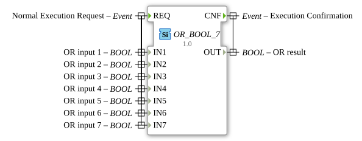

# OR_BOOL_7

* * * * * * * * * *
## Introduction

The function block `OR_BOOL_7` is a standard function block for calculating the logical OR operation. It performs an OR operation on seven separate Boolean inputs and provides the result at a single output. This function block is part of the IEC 61131-3 compliant library for bitwise operations.

## Interface Structure

### **Event Inputs**

- **REQ** (Normal Execution Request): This event triggers the calculation of the OR function. It is associated with all seven data inputs (`IN1` to `IN7`).

### **Event Outputs**

- **CNF** (Execution Confirmation): This event signals the completion of the calculation. It is output along with the calculated result at data output `OUT`.

### **Data Inputs**

- **IN1** (BOOL): OR input 1.
- **IN2** (BOOL): OR input 2.
- **IN3** (BOOL): OR input 3.
- **IN4** (BOOL): OR input 4.
- **IN5** (BOOL): OR input 5.
- **IN6** (BOOL): OR input 6.
- **IN7** (BOOL): OR input 7.

### **Data Outputs**

- **OUT** (BOOL): Result of the OR operation of all seven inputs.

### **Adapters**

This function block does not have any adapter interfaces.

## Functionality

Upon receiving the event `REQ`, the function block reads the values of all seven Boolean inputs (`IN1` to `IN7`). A logical OR operation is then applied to these values. The result of this operation is set at the data output `OUT`, and simultaneously, the confirmation event `CNF` is triggered.

The logical function can be described as follows:

OUT = IN1 OR IN2 OR IN3 OR IN4 OR IN5 OR IN6 OR IN7`

This means that the output `OUT` is `TRUE` (1) if at least one of the seven inputs is `TRUE`. The output is `FALSE` (0) only if all seven inputs are `FALSE`.

## Technical Features

- **Generic Block:** The function block is marked as a generic implementation (`GEN_OR`), indicating that the core can be reused for similar blocks.
- **Hard-wired Logic:** The OR operation is hard-coded for exactly seven inputs. For a different number of inputs, a corresponding block (e.g., `OR_BOOL_2`, `OR_BOOL_4`) must be used.
- **Event-driven Execution:** The calculation is performed only when the input event `REQ` occurs, enabling resource-efficient and deterministic processing in the real-time system.

## State Overview

The function block has no internal state or memory. Its behavior is purely combinatorial and event-driven:

1. **Idle State:** Waits for the event `REQ`.
2. **Calculation State:** Upon `REQ`, the inputs are read and the OR operation is performed.
3. **Output State:** The result is output to `OUT`, and the event `CNF` is generated. The block then returns to the idle state.

## Application Scenarios

- **Monitoring Logic:** Combines multiple error or warning signals into a common alarm output. If one of seven possible sources of interference is activated, a common warning light illuminates.
- **Leverage Logic:** Combines multiple enable signals (e.g., from different safety systems) for a process step. The process starts when at least one condition is met.
- **Sensor Linking:** Evaluates multiple limit detectors to check if at least one sensor has exceeded a threshold.

## ⚖️ Comparison with Similar Function Blocks

- **AND_BOOL_7:** Performs a logical AND operation. The output is only `TRUE` if *all* inputs are `TRUE`.
- **XOR_BOOL_7:** Performs an exclusive OR (XOR) operation. The output is `TRUE` if an odd number of inputs are `TRUE`.
- **OR_n_BOOL (n=2,4,...):** Function blocks of the same family that provide the OR function for a different, fixed number of inputs. The choice of block depends on the required number of signals. See: [OR_7](../../../StandardLibraries/iec61131-3/bitwiseOperators/OR_7.md)
- **Generic FB (GEN_OR):** The underlying generic implementation used to create the specific `OR_n_BOOL` variants.

## Conclusion

The `OR_BOOL_7` is a simple, robust, and standardized function block for the logical OR operation of seven Boolean signals. Its event-driven architecture makes it ideal for integration into control engineering applications according to IEC 61131-3, where it operates reliably and deterministically. It is the right choice when exactly seven binary states need to be combined to produce a common result.
