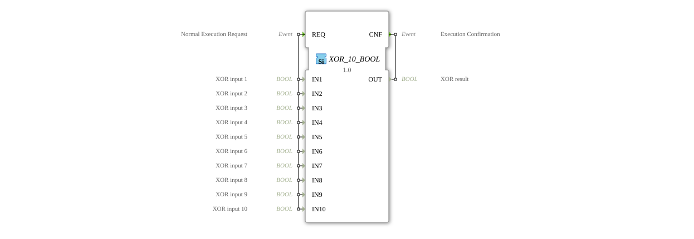

# XOR_10_BOOL

* * * * * * * * * *
## Introduction

The function block `XOR_10_BOOL` is a generic function block for calculating the logical exclusive OR (XOR) operation on up to ten Boolean input signals. It complies with the IEC 61131-3 standard and is designed for use in the 4diac IDE. The function block evaluates all connected inputs for each request and returns the corresponding result.

## Interface Structure

### **Event Inputs**

* **REQ (Normal Execution Request):** This event triggers the calculation of the XOR function. It is linked to all ten data inputs (`IN1` to `IN10`).

### **Event Outputs**

* **CNF (Execution Confirmation):** This event signals the completion of the calculation. It is output along with the calculated result at the data output `OUT`.

### **Data Inputs**

* **IN1 (XOR input 1):** Boolean input 1.
* **IN2 (XOR input 2):** Boolean input 2.
* **IN3 (XOR input 3):** Boolean input 3.
* **IN4 (XOR input 4):** Boolean input 4.
* **IN5 (XOR input 5):** Boolean input 5.
* **IN6 (XOR input 6):** Boolean input 6.
* **IN7 (XOR input 7):** Boolean input 7.
* **IN8 (XOR input 8):** Boolean input 8.
* **IN9 (XOR input 9):** Boolean input 9.
* **IN10 (XOR input 10):** Boolean input 10.

### **Data Outputs**

* **OUT (XOR result):** Boolean result of the XOR operation of all active inputs Inputs.

### **Adapter**

This function block has no adapter interfaces.

## Functionality

Upon receiving the `REQ` event, the block reads the values of all ten Boolean data inputs (`IN1`...`IN10`). It then performs the logical XOR operation on all these inputs. The XOR function outputs a `TRUE` signal (1) at the output `OUT` if and only if there is an odd number of inputs (`TRUE`). If there are zero, two, four, six, eight, or ten inputs (`TRUE`), the result is `FALSE`. After the calculation, the `CNF` event is triggered along with the current result value.

## Technical Features

* **Generic Block:** The block is marked as a generic block (`GEN_XOR`). This allows for flexible reuse and potential specialization.
* **Fixed Number of Inputs:** Unlike blocks with a variable number of inputs, this block offers exactly ten fixed inputs. Unused inputs should be set to a defined logic level (e.g., `FALSE`).
* **Event-Driven Execution:** The calculation is performed exclusively event-driven by the `REQ` input. There is no cyclic execution.

## State Overview

The function block does not have an internal state in the sense of a memory. Its behavior is purely combinatorial and depends on the current input values. The only "state" is waiting for a `REQ` event. Upon receiving this event, the system immediately calculates and sends the `CNF` event.

## Application Scenarios

* **Parity Check:** Detects whether an odd number of signals (e.g., error messages, switch positions) are active.
* **Control Logic:** Implements special logic logic in sequence controls where a state change should only occur with an odd activation pattern.
* **Encoding/Decoding:** Simple cryptographic or coding tasks based on the XOR operation.
*
## ⚖️ Comparison with Similar Blocks

* **Standard XOR Blocks (e.g., 2-Input XOR):** This block extends the classic 2-input XOR function to up to ten inputs in a single block, improving clarity when dealing with many signals. See: [XOR_10](../../../StandardLibraries/iec61131-3/bitwiseOperators/XOR_10.md)]
* **Blocks with Variable Input Count:** Some libraries offer XOR blocks to which inputs can be dynamically added. `XOR_10_BOOL` has a fixed, explicitly declared interface, which can simplify code analysis.
* **Combinatorial Logic in SFC/ST:** The same functionality could also be implemented in Structured Text (ST) using an expression like `OUT := IN1 XOR IN2 XOR ... XOR IN10;`. The advantage of the FB lies in its clear encapsulation and event-driven interface, which integrates better into FB networks.

## Conclusion

The `XOR_10_BOOL` is a specialized and useful function block for applications requiring XOR operations across more than two signals. Its robust, well-documented ten-input interface and event-driven IEC 61499 model make it a reliable building block for implementing parity checks and specialized control logic. However, for simpler operations with fewer inputs or for maximum flexibility, alternative implementations should be considered.

--

### 🌐 Related topic subpages on ms-muc-docs.de

* [🌐 Eclipse 4diac IDE & color reference on ms-muc-docs.de ](https://www.ms-muc-docs.de/iec-61499/eclipse-4diac/)

]
