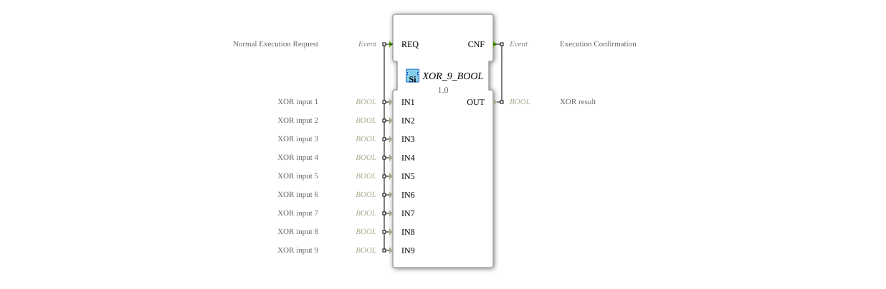

# XOR_9_BOOL

* * * * * * * * * *
## Introduction

The function block `XOR_9_BOOL` is a generic block for calculating the logical exclusive OR (XOR) operation for up to nine Boolean input signals. It implements an n-ary XOR function where the output is `TRUE` if and only if there is an odd number of active inputs, such as `TRUE`. The block complies with the IEC 61131-3 standard and is designed for use in control applications that require checking for odd parity or specific selection or monitoring logic.

## Interface Structure

The function block has a simple event-driven interface with a request event and an acknowledge event.

### **Event Inputs**

- **REQ (Normal Execution Request):** This event triggers the calculation of the XOR function. It is associated with all nine data inputs (`IN1` to `IN9`).

### **Event Outputs**

- **CNF (Execution Confirmation):** This event signals the completion of the calculation. It is output along with the calculated result at data output `OUT`.

### **Data Inputs**

- **IN1 (XOR input 1):** Boolean input 1.
- **IN2 (XOR input 2):** Boolean input 2.
- **IN3 (XOR input 3):** Boolean input 3.
- **IN4 (XOR input 4):** Boolean input 4.
- **IN5 (XOR input 5):** Boolean input 5.
- **IN6 (XOR input 6):** Boolean input 6.
- **IN7 (XOR input 7):** Boolean input 7.
- **IN8 (XOR input 8):** Boolean input 8.
- **IN9 (XOR input 9):** Boolean input 9.

### **Data Outputs**

- **OUT (XOR result):** Boolean result of the n-way XOR operation of all active inputs.

### **Adapters**

This function block does not use adapters.

## Functionality

When the event `REQ` arrives, the logical operation is executed. The output `OUT` is set to `TRUE` if the number of inputs with the value `TRUE` is odd. If the number of `TRUE` inputs is even (or zero), `OUT` is set to `FALSE`. Immediately after the calculation, the acknowledgment event `CNF` is output along with the current value of `OUT`.

The mathematical description is: `OUT = IN1 XOR IN2 XOR IN3 XOR IN4 XOR IN5 XOR IN6 XOR IN7 XOR IN8 XOR IN9`.

## Technical Features

- **Generic Function Block:** The function block is designated as a generic function (`GEN_XOR`), which means it can serve as the basis for deriving specific XOR function blocks with a fixed number of inputs.
- **Hard-wired Logic:** The operation is performed across all nine inputs. For applications with fewer inputs, the unused inputs must be set to a defined value (typically `FALSE`).
- **Event-driven Execution:** The calculation only occurs when the `REQ` event occurs, enabling resource-efficient and deterministic processing.

## State Overview

The function block does not have an internal state in the sense of a memory. Its behavior is purely combinatorial and depends solely on the current values at the data inputs at the time of the ``REQ`` event. The "calculation in progress" state is transient and ends immediately with the output of ``CNF``.

## Application Scenarios

- **Parity Check:** Monitoring whether an odd number of sensors (e.g., limit monitors, safety switches) report an alarm condition.
- **Selection or Toggle Logic:** Control where an action is executed only when the state of an odd number of conditions has changed.
- **Error Detection in Redundant Systems:** Simple plausibility check in systems with multiple redundant channels.
- **Encryption and Coding Methods:** As a fundamental component in simple cryptographic or error-correcting codes.
*
## ⚖️ Comparison with Similar Blocks

- **Standard XOR blocks (e.g., XOR, E_XOR):** These typically have only two inputs. `XOR_9_BOOL` extends this functionality to up to nine inputs in a single block.
- **OR blocks (OR) / AND blocks (AND):** Return a `TRUE` if at least one or all inputs are `TRUE`. The XOR logic is more specific (odd number).
- **Parity blocks:** Specialized blocks for parity calculation, often working directly with data words (BYTE, WORD). `XOR_9_BOOL` works with individual Boolean bits and is more flexible in terms of the number of inputs.
- * **Combinatorial Logic Blocks (GEN_AND, GEN_OR):** Similar generic blocks for other basic logical operations.

## Conclusion

The `XOR_9_BOOL` is a specialized, generic function block that provides the logical XOR operation for up to nine signals in a single, event-driven component. Its strength lies in its clear interface and direct implementation of the n-ary XOR function, making it ideal for parity checks and specialized control logic. For applications with a variable or very large number of inputs, the logic may need to be built from multiple basic components.
