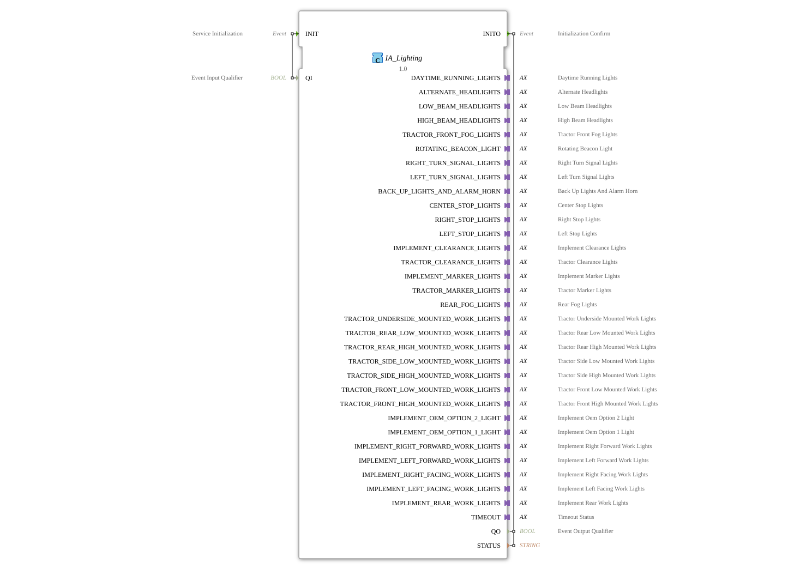

# IA_Lighting

* * * * * * * * * *
## Introduction

The **IA_Lighting** function block serves as an ISOBUS adapter for lighting data (LD) according to ISO 11783-7 (PGN 65088). It encapsulates an internal `I_Lighting` core and converts its 32-bit integer outputs for each lighting function into individual Boolean signals. A variety of adapter plugs transmit the individual lighting functions, such as daytime running lights, low beams, turn signals, work lights, etc., as separate logical signals to the application.

* * * * * * * * * *
## Interface Structure

### **Event Inputs**

| Event | Type | Description |
| INIT | EInit | Initialization of the function block. Triggered by `QI`. |

### **Event Outputs**

| Event | Type | Description |
|----------|-----|-----------------------------|
| INITO | EInit | Confirmation of successful initialization. Output along with `QO` and `STATUS`. |

### **Data Inputs**

| Name | Type | Description |
|------|-----|-----------------------------|
| QI | BOOL | Qualifier for initialization (enabling). |

### **Data Outputs**

| Name | Type | Description |
|------|-----|-----------------------------|
| QO | BOOL | Output qualifier – indicates whether the block is ready for operation. |
| STATUS | STRING | Status message (e.g., error text or success message). |

### **Adapters**

The block has **32 unidirectional adapter plugs** (type `adapter::types::unidirectional::AX`). Each adapter represents a specific lighting function according to ISO 11783-7 and provides an event output (`E1`) and a data output (`D1`) of type `BOOL`:

| Adapter Name | Description |
|--------------|--------------|
| DAYTIME_RUNNING_LIGHTS | Daytime Running Lights |
| ALTERNATE_HEADLIGHTS | Alternative High Beam (e.g., High Beam Assist) |
| LOW_BEAM_HEADLIGHTS | Low Beam |
| HIGH_BEAM_HEADLIGHTS | High Beam |
| TRACTOR_FRONT_FOG_LIGHTS | Front Fog Lights for Tractor |
| ROTATING_BEACON_LIGHT | Rotating Beacon |
| RIGHT_TURN_SIGNAL_LIGHTS | Right Turn Signal |
| LEFT_TURN_SIGNAL_LIGHTS | Left Turn Signal |
| BACK_UP_LIGHTS_AND_ALARM_HORN | Reversing Light and Alarm Horn |
| CENTER_STOP_LIGHTS | Center Brake Light |
| RIGHT STOP LIGHTS | Right Brake Light |
| LEFT STOP LIGHTS | Left Brake Light |
| IMPLEMENT CLEARANCE LIGHTS | Implement Marker Lights |
| TRACTOR CLEARANCE LIGHTS | Tractor Marker Lights |
| IMPLEMENT MARKER LIGHTS | Implement Marker Lights |
| TRACTOR MARKER LIGHTS | Tractor Marker Lights |
| REAR FOG LIGHTS | Rear Fog Lights |
| TRACTOR UNDERSIDE MOUNTED WORK LIGHTS | Tractor Work Lights (Underside Mounted) |
| TRACTOR REAR LOW MOUNTED WORK LIGHTS | Tractor Work Lights (Rear, Low Mounted) |
| TRACTOR REAR HIGH MOUNTED WORK LIGHTS | Tractor Work Lights (Rear, High Mounted) |
| TRACTOR_SIDE_LOW_MOUNTED_WORK_LIGHTS | Tractor work lights (side, low) |
| TRACTOR_SIDE_HIGH_MOUNTED_WORK_LIGHTS | Tractor work lights (side, high) |
| TRACTOR_FRONT_LOW_MOUNTED_WORK_LIGHTS | Tractor work lights (front, low) |
| TRACTOR_FRONT_HIGH_MOUNTED_WORK_LIGHTS | Tractor work lights (front, high) |
| IMPLEMENT_OEM_OPTION_2_LIGHT | Attachment OEM Option 2 Light |
| IMPLEMENT_OEM_OPTION_1_LIGHT | Attachment OEM Option 1 Light |
| IMPLEMENT_RIGHT_FORWARD_WORK_LIGHTS | Attachment work lights (front right) |
| IMPLEMENT_LEFT_FORWARD_WORK_LIGHTS | Attachment work light (front left) |
| IMPLEMENT_RIGHT_FACING_WORK_LIGHTS | Attachment work light (side right) |
| IMPLEMENT_LEFT_FACING_WORK_LIGHTS | Attachment work light (side left) |
| IMPLEMENT_REAR_WORK_LIGHTS | Attachment work light (rear) |
| TIMEOUT | Timeout status of the internal core (Boolean signal). |

* * * * * * * * * *
## Functionality

The function block is initialized via the event input `INIT` with the data value `QI`. Upon successful initialization, the event `INITO` is output, and the data `QO = TRUE` and `STATUS` are set with a success message.

Internally, the module contains a core of type `isobus::tecu::I_Lighting`, which handles the ISOBUS communication for the lighting PGN (Parameter Group Number 65088). The core provides the 32 lighting functions as 32-bit integer values. These integer values are then divided into individual Boolean signals by instances of the module `logiBUS::utils::quarter::QUARTER_TO_BOOL`. Each `QUARTER_TO_BOOL` instance presumably extracts 4 bits from the input value and outputs the corresponding four Boolean outputs – however, the exact structure is application-specific.

The resulting Boolean signals are then provided via the adapter plugs simultaneously with an event (`E1`) on the associated data outputs (`D1`). Thus, when the ISOBUS data is updated, the module provides a synchronous event stream for each individual lighting function.

* * * * * * * * * *
## Technical Features

- **ISOBUS Compliance**: The module implements the standardized PGN 65088 (Lighting Data) according to ISO 11783-7 and can be directly connected to an ISOBUS bus.
- **Bit Division**: The internal 32-bit values from the ISOBUS telegram are divided into individual Boolean signals using `QUARTER_TO_BOOL` modules. The term "quarter" indicates a division into groups of 4 bits each.
- **Unidirectional Adapters**: Each adapter plug is unidirectional (output only) and provides both an event (`E1`) and a Boolean value (`D1`). This allows for easy further processing in IEC 61499 applications, e.g., for controlling actuators.
- **Status Output**: In addition to the actual light status, there is a special adapter, `TIMEOUT`, which signals the timeout status of the ISOBUS core.
* * * * * * * * * *
## State Overview

The module itself does not have an explicit state machine, as it is essentially a data converter. Its behavior is controlled by the internal kernel `I_Lighting`:

- **Initialization**: After a `INIT` event, the kernel switches to the operational state (provided `QI = TRUE` is present). The process is completed with `INITO`.Acknowledged.
- **Data Provisioning**: As long as the core is active, it updates the output data with each incoming ISOBUS telegram and generates an event on the corresponding adapter for each lighting function.
- **Timeout**: The timeout adapter is set if no ISOBUS messages are received.
* * * * * * * * * *
## Application Scenarios

- **Agricultural Control Systems**: Integration of all vehicle lighting (tractor and implement) into an IEC 61499-based control system, e.g., for automatic lighting control according to ISO 11783.
- **ISOBUS Gateway Modules**: This module is suitable as an intermediary layer to convert ISOBUS lighting data into a simpler binary signal format and thus transmit it to programmable logic controllers (PLCs) or visualization systems.
- **Retrofit**: Older tractors without a CAN bus can be equipped with modern ISOBUS lighting control using this adapter.
* * * * * * * * * *
## Comparison with similar modules

Other ISOBUS adapter wrappers exist for other PGNs (e.g., for work hydraulics, seat control, or PTO control). These modules follow the same principle: An internal, specialized core is connected to the application code via an adapter. The main difference lies in the number and type of output signals – `IA_Lighting` offers a particularly high number of lighting functions with 32 adapters. Other adapters (e.g., `IA_ImplementSteer`) have fewer outputs because they report only a few states.

## Conclusion

The function block `IA_Lighting` enables convenient and standardized integration of ISOBUS lighting data into IEC 61499 applications. By splitting the telegram content into individual Boolean signals via adapters, simple further processing in the application logic is achieved. This module is particularly suitable for agricultural control systems that require a complete representation of all common lighting functions according to ISO 11783-7.
