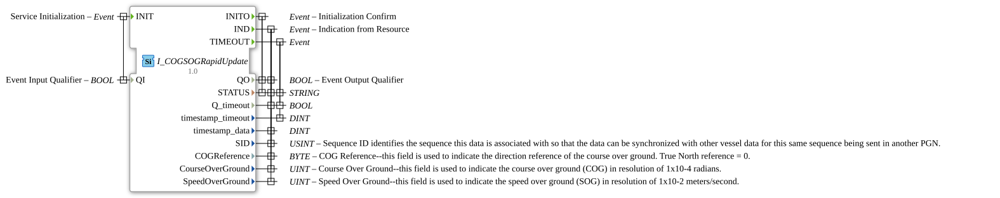

# I_COGSOGRapidUpdate

* * * * * * * * * *
## Introduction

The function block `I_COGSOGRapidUpdate` implements the processing of the NMEA 2000 Parameter Group Number (PGN) 129026 "COG & SOG, Rapid Update". This block is used to receive and provide navigation data, specifically the current course over ground (COG) and speed over ground (SOG) at a high update rate. It is designed for use in maritime or mobile machinery control systems based on the ISOBUS standard.

## Interface Structure

### **Event Inputs**

- **INIT**: Initializes the function block. Triggered together with the qualifier `QI`.

### **Event Outputs**

- **INITO**: Confirms successful initialization. Triggers the outputs `QO` and `STATUS`.
- **IND**: Indicates successful reception and processing of new COG/SOG data. Triggers the corresponding data outputs.
- **TIMEOUT**: Triggered if a timeout occurs during data reception.

### **Data Inputs**

- **QI** (BOOL): Qualifier for the INIT event input. Controls the initialization (`TRUE` = start).

### **Data Outputs**

- **QO** (BOOL): Qualifier for the INITO and IND event outputs. Indicates the general operating status.
- **STATUS** (STRING): Status message providing additional information (e.g., error descriptions).
- **Q_timeout** (BOOL): Indicates whether the last received event was a timeout (`TRUE`) or valid data (`FALSE`).
- **timestamp_timeout** (DINT): Timestamp associated with the TIMEOUT event.
- **timestamp_data** (DINT): Timestamp of the last received valid COG/SOG data.
- **SID** (USINT): Sequence identifier. Enables synchronization of this data with other PGNs sent by the vessel in the same cycle.
- **COGReference** (BYTE): Reference direction for the course over ground. The value `0` represents the "True North" reference. * **CourseOverGround** (UINT): Course over ground (COG). The unit is 1x10 radians.
- **SpeedOverGround** (UINT): Speed over ground (SOG). The unit is 1x10 meters per second.

### **Adapter**

This function block has no adapter interfaces.

## Functionality

The block acts as a passive receiver for the NMEA 2000 PGN 129026. After initialization via `INIT` with `QI=TRUE`, it waits for incoming data frames. Upon receiving a valid frame, the contained data (COG, SOG, reference, SID) is decoded and made available via the `IND` output along with the associated data values. Simultaneously, `Q_timeout` is set to `FALSE`. If no new data frame occurs within a configured time window, a `TIMEOUT` event is generated, and `Q_timeout` is set to `TRUE`. The `STATUS` output can be used for diagnostic purposes.

STATUS`

## Technical Features

- **NMEA 2000 Compliance**: Implements the specification for PGN 129026 exactly.
- **Resolution**: The physical values for heading and speed are encoded in the fixed resolutions defined in the NMEA standard (COG: 0.0001 rad/LSB, SOG: 0.01 m/s/LSB). Conversion to more common units (degrees, knots) must be performed in subsequent blocks, if necessary.
- **Sequencing**: The `SID` supports the correlation of data sent simultaneously in different PGNs.

## Status Overview

1. **Inactive**: Before initialization.
2. **Initialized/Pending**: After successful `INIT`. The module listens on the CAN bus or the corresponding interface on PGN 129026.
3. **Data Reception**: Upon arrival of a frame, the data is processed and a `IND` event is generated.
4. **Timeout**: Activates if expected data does not arrive within the specified time. Triggers a `TIMEOUT` event.

## Application Scenarios

- **Maritime Navigation**: Displays current heading and speed on a multifunction display (MFD).
- **Autonomous Control**: Provides basic navigation data for autopilots or routing algorithms of construction machinery.
- **Data Logging**: Logs vehicle movement data with high temporal resolution.
- - **Sensor Fusion**: Combining COG/SOG data with other position and motion sensors (e.g., GNSS, gyroscope) to improve overall accuracy.

## ⚖️ Comparison with Similar Components

- **Compared to Generic CAN Receiver Blocks**: `I_COGSOGRapidUpdate` is specialized for PGN 129026. It handles the complete decoding of the raw data according to the NMEA specification and provides the physical values directly. A generic receiver would only deliver the raw bytes.
- **Compared to PGN 129025 (COG/SOG)**: PGN 129026 is the "Rapid Update" variant, optimized for a higher update rate and lower latency, while PGN 129025 can contain additional fields such as timestamps. The choice of function block depends on the application's requirements for data timeliness and scope.

## 🛠️ Related Exercises

- [Exercise_079](../../../../Uebungen/test_B/Uebungen_doc/Uebung_079.md)

## Conclusion

The `I_COGSOGRapidUpdate` function block is an essential component for any ISOBUS- or NMEA 2000-based system that relies on precise and rapidly updated course and speed information over ground. Its standards-compliant implementation ensures reliable data exchange and easy integration into higher-level control and display systems.
