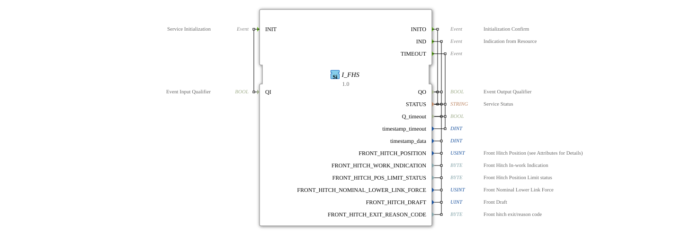

# I_FHS

* * * * * * * * * *
## Introduction

The **I_FHS** is a standards-compliant function block for front-mounted implement status information according to ISO 11783-7 (PGN 65094).
Developed under the EPL-2.0 license, it enables the monitoring and control of front-mounted implements in modern agricultural systems.

## Interface Structure

### **Event Inputs**

- `INIT`: Initialization Request

### **Event Outputs**

- `INITO`: Initialization Acknowledgement
- `IND`: Status Indication
- `TIMEOUT`: Timeout Event

### **Data Inputs**

- `QI` (BOOL): Initialization Qualifier

### **Data Outputs**

- `QO` (BOOL): Status Qualifier
- `STATUS` (STRING): Operational Status
- `timestamp_*` (DINT): Timestamp
- `Q_timeout` (BOOL): Timeout Indicator

## Parameters (SPN Details)

| Parameter | SPN | Type | Length | Scale | Value Range | Description |
|-----------|-------|-------|-------|------------|--------------|--------------|
| `FRONT_HITCH_POSITION` | 1872 | USINT | 8 bits | 0.4%/bit | 0-100% | Current Position of Front Attachment |
| `FRONT_HITCH_WORK_INDICATION` | 1876 | BYTE | 2 bits | 4 States | 0-3 | Working Status Indicator |
| `FRONT_HITCH_POS_LIMIT_STATUS` | 5150 | BYTE | 3 bits | 8 states | 0-7 | Position limit status |
| `FRONT_HITCH_NOMINAL_LOWER_LINK_FORCE` | 1880 | USINT | 8 bits | 0.8%/bit | -100% to +100% | Normal lower link force |
| `FRONT_HITCH_DRAFT` | 1878 | UINT | 16 bits | 10 N/bit | -320 kN to +320 kN | Pulling force at front implement |
| `FRONT_HITCH_EXIT_REASON_CODE` | 5816 | BYTE | 6 bits | 64 states | 0-63 | Basic code for system shutdown |

## Functionality

1. **Initialization**:
- Activation via `INIT` event
- Confirmation via `INITO` with status information
2. **Data Update**:
- Automatic status messages via `IND` event
- Contains all relevant front-mounted implement parameters
3. **Error Handling**:
- Timeout detection via `TIMEOUT` event
- Detailed status codes in the `STATUS` field

## Technical Features

✔ **ISO 11783-7 compliant** (PGN 65094)

✔ **Real-time** status monitoring
✔ **Comprehensive parameters** for front-mounted implements
✔ **Integrated fault diagnostics**

## Application Scenarios

- **Front Loader Control**: Precise Position Control
- **Force Measurement**: Real-time Monitoring of Traction Forces
- **Safety Systems**: Detection of Limit Exceedances
- **Diagnostics**: Systematic Fault Analysis

## ⚖️ Comparison with Similar Modules

| Feature | I_FHS | Standard Hitch Control | Advanced Hitch Manager |
|---------------|-------|------------------------|------------------------|
| ISO Standard | ✔ | ✖ | ✖ |
| Front Mounting | ✔ | ✖ | ✔ |
| Force Measurement | ✔ | ✔ | ✔ |
| Diagnostic Codes | ✔ | ✖ | ✔ |

## 🛠️ Related Exercises

* [Exercise_079](../../../../Uebungen/test_B/Uebungen_doc/Uebung_079.md)

## Conclusion

The I_FHS module offers comprehensive front implement control:

- **Standard-compliant**: Full ISO 11783-7 compatibility
- **Precise**: High-resolution measurement parameters
- **Reliable**: Integrated fault detection

Essential for:

- Modern front loader systems
- Precision agriculture
- Safety-critical applications