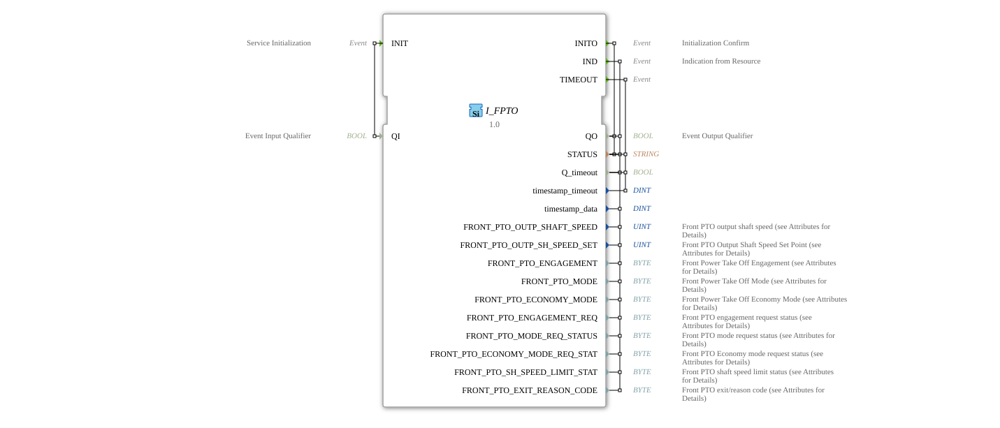

# I_FPTO
* * * * * * * * * *
## Introduction
The **I_FPTO** is a standards-compliant function block for controlling and monitoring the front power take-off (FPTO) output shaft, developed under the EPL 2.0 license.
Version 1.0 implements the ISO 11783-7 specification (PGN 65092) for measuring and controlling FPTO parameters.

## Interface Structure

### **Event Inputs**
- `INIT`: Initialization Request (with qualifier `QI`)

### **Event Outputs**
- `INITO`: Initialization Confirmation (with status)
- `IND`: Indication Event with all FPTO parameters
- `TIMEOUT`: Timeout Event

### **Data Inputs**
- `QI` (BOOL): Qualifier for Initialization

### **Data Outputs**
- `QO` (BOOL): Qualifier for Output Events
- `STATUS` (STRING): Operating status message
- `Q_timeout` (BOOL): Timeout indicator
- `timestamp_timeout` (DINT): Timeout timestamp
- `timestamp_data` (DINT): Data timestamp

## FPTO Parameters

| Parameter | Type | Description | SPN | Bit length | Scaling |

|-----------|------|--------------|-----|------------|------------|

| `FRONT_PTO_OUTP_SHAFT_SPEED` | UINT | Current FPTO shaft speed | 1882 | 16 | 0.125 rpm/bit |

| `FRONT_PTO_OUTP_SH_SPEED_SET` | UINT | Target speed of FPTO shaft | 1884 | 16 | 0.125 rpm/bit |

| `FRONT_PTO_ENGAGEMENT` | BYTE | FPTO coupling status | 1888 | 2 | 4 states/2 bits |

| `FRONT_PTO_MODE` | BYTE | FPTO operating mode | 1889 | 2 | 4 states/2 bits |

| `FRONT_PTO_ECONOMY_MODE` | BYTE | FPTO economy mode | 1891 | 2 | 4 states/2 bits |

| `FRONT_PTO_ENGAGEMENT_REQ` | BYTE | Coupling request status | 5152 | 2 | 4 states/2 bits |

`FRONT_PTO_MODE_REQ_STATUS` | BYTE | Mode Request State | 5153 | 2 | 4 states/2 bits |

`FRONT_PTO_ECONOMY_MODE_REQ_STAT` | BYTE | Economy Mode Request State | 5154 | 2 | 4 states/2 bits |

`FRONT_PTO_SH_SPEED_LIMIT_STAT` | BYTE | Speed Limit State | 5155 | 3 | 8 states/3 bits |

`FRONT_PTO_EXIT_REASON_CODE` | BYTE | FPTO Failure Base Code | 5817 | 6 | 64 states/6 bits |

## Functionality

1. **Initialization**:

- `INIT` with `QI`=TRUE starts initialization
- `INITO` confirms operational readiness with `QO` and `STATUS`

2. **Data Provision**:

- `IND` provides all FPTO parameters with timestamps
- Automatic updates upon state changes

3. **Error Handling**:

- `TIMEOUT` in case of communication problems
- Detailed status messages in the `STATUS` field

## Technical Features

✔ **ISO 11783-7 compliant** (PGN 65092)

✔ **16-bit Speed measurement** with 0.125 rpm resolution
✔ **State control** for clutch and operating modes

✔ **Diagnostic functions** with basic codes

## Application scenarios
- **Agricultural machinery**: Control of front PTOs on tractors
- **Speed control**: Precise speed control
- **Condition monitoring**: Real-time diagnostics of the FPTO system
- **Energy efficiency**: Economy mode control

## ⚖️ Comparison with similar components

| Feature | I_FPTO | Standard_PTO | Advanced_PTO |

|---------------|--------|--------------|--------------|

| ISO standard | ✔ (ISO 11783-7) | ✔ | ✖ |

| Front PTO | ✔ | ✖ | ✔ |

Economy Mode | ✔ | ✖ | ✔ |

Diagnostic Codes | ✔ | ✖ | ✔ |

## 🛠️ Related Exercises
* [Exercise_079](../../../../Uebungen/test_B/Uebungen_doc/Uebung_079.md)]

## Conclusion

The I_FPTO module offers the standard implementation for front PTO systems:

- **Precise**: High-resolution speed measurement
- **Comprehensive**: Complete condition monitoring
- **Robust**: Integrated fault diagnostics

Ideal for use in:

- Front PTO systems in agricultural machinery
- Applications with high demands on speed accuracy
- Systems with advanced diagnostic requirements