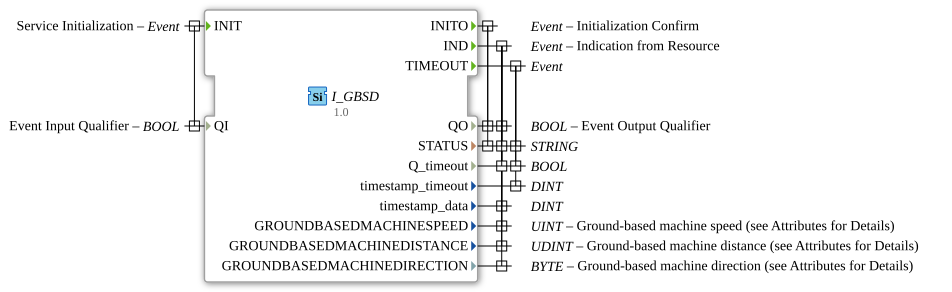

# I_GBSD

* * * * * * * * * *

## Introduction
The **I_GBSD** (Ground-based Speed and Distance) is a standards-compliant function block for measuring vehicle speed, distance, and direction of travel, developed under the EPL-2.0 license.

Version 1.0 implements the ISO 11783-7 specification (PGN 65097) for precise motion data in agricultural and construction machinery.

## Interface Structure

### **Event Inputs**

- `INIT`: Initialization Request (with qualifier `QI`)

### **Event Outputs**

- `INITO`: Initialization Acknowledgement (with status)

- `IND`: Data Indication with Speed, Distance, and Direction

- `TIMEOUT`: Timeout Event

### **Data Inputs**

- `QI` (BOOL): Qualifier for Initialization

### **Data Outputs**

- `QO` (BOOL): Qualifier for Output Events

- `STATUS` (STRING): Operational status message

- `Q_timeout` (BOOL): Timeout indicator

- `timestamp_timeout` (DINT): Timeout timestamp

- `timestamp_data` (DINT): Movement data timestamp

## Movement data parameters

| Parameter | Type | Description | SPN | Bit length | Scale | Accuracy |

|-----------|------|--------------|-----|------------|------------|-------------|

| `GROUNDBASEDMACHINESPEED` | UINT | Machine speed | 1859 | 16 | 0.001 m/s per bit | ±0.1% at >1 m/s |

| `GROUNDBASEDMACHINEDISTANCE` | UDINT | Distance traveled | 1860 | 32 | 0.001 m per bit | ±0.5% cumulative |

| `GROUNDBASEDMACHINEDIRECTION` | BYTE | Direction of travel | 1861 | 2 | 4 states/2 bits | - |

## Direction of travel states

| Value | State | Description |

|------|---------|---------------|

| 0 | Stationary | No movement detected |

| 1 | Forward | Moving forward |

| 2 | Reverse | Moving backward |

| 3 | Undefined | Direction cannot be determined |

## Functionality

1. **Initialization**:

- `INIT` with `QI`=TRUE starts sensor calibration

- `INITO` confirms operational readiness with system status

2. **Data Update**:

- `IND` delivers all motion data with a 100ms update rate

- Distance measurement as a free-running counter (32-bit)

3. **Special Operating Modes**:

- Automatic accuracy adjustment at low speeds (<0.5 m/s)
   - Integrierte Plausibilitätsprüfung der Sensordaten

## Technische Besonderheiten

✔ **ISO 11783-7 konform** (PGN 65097)
✔ **Hochpräzise Messung** mit 1mm Auflösung
✔ **32-bit Distanzzähler** (bis zu 4,294,967km Reichweite)
✔ **Robuste Richtungserkennung** mit 4 Zuständen

## Anwendungsszenarien

- **Präzisionslandwirtschaft**: Geschwindigkeitskontrolle für Saat- und Düngemittel
- **Flächenberechnung**: Automatische Arbeitsflächenmessung
- **Fahrassistenz**: Richtungserkennung bei Rückwärtsfahrt
- **Telematik**: Betriebsdatenerfassung für Maschinenmanagement

## Genauigkeitsmerkmale

| Geschwindigkeitsbereich | Typische Genauigkeit | Update-Rate |
|------------------------|----------------------|-------------|
| > 2 m/s (7.2 km/h) | ±0.1% | 100 ms |

| 0.5 - 2 m/s | ±1% | 200 ms |

| < 0.5 m/s | ±5% | 500 ms |

## ⚖️ Comparison with similar systems

| Feature | I_GBSD | Wheel-based | GPS-based |

|---------|--------|------------|------------|

| Ground contact | ✔ Direct | ✔ Indirect | ✖ |

| Low speed | ✔ Good | ✖ Inaccurate | ✖ Inaccurate |

| Direction detection | ✔ Precise | ✔ | ✖ Ambiguous |

| Signal loss | Robust | Susceptible | Prone to interference |

## 🛠️ Related exercises

* [Exercise_072](../../../../Uebungen/test_B/Uebungen_doc/Uebung_072.md)]
* [Exercise_072b](../../../../Uebungen/test_B/Uebungen_doc/Uebung_072b.md)]
* [Exercise_072c](../../../../Uebungen/test_B/Uebungen_doc/Uebung_072c.md)
* [Exercise_073](../../../../Uebungen/test_B/Uebungen_doc/Uebung_073.md)
* [Exercise_079](../../../../Uebungen/test_B/Uebungen_doc/Uebung_079.md)

## Conclusion

The I_GBSD module provides reliable motion data for mobile machinery:

- **Precision**: Submillimeter-accurate distance measurement
- **Reliability**: Functionality even under poor GPS conditions
- **Flexibility**: Universal application in agriculture and construction machinery

Ideal for:

- Automatic steering systems
- Working width calculations
- Machines with high accuracy requirements
- Applications with frequent changes of direction