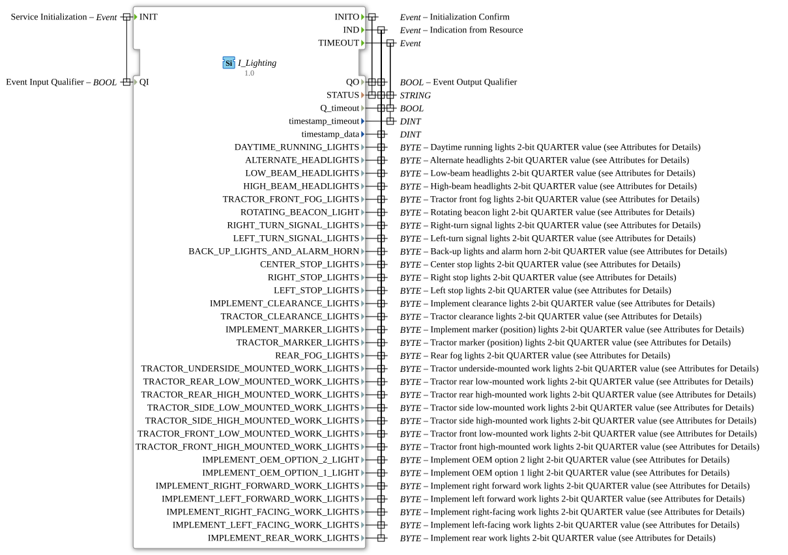

# I_Lighting

* * * * * * * * * *
## Introduction
The **I_Lighting** function block processes the lighting data of an agricultural vehicle according to ISO 11783-7 (ISOBUS). It receives and decodes the parameter group number (PGN) 65088, which transmits the status of all lighting functions of a tractor and connected implements. The block serves as an interface between the ISOBUS network and the application logic for monitoring and controlling the lighting.
## Interface Structure
### **Event Inputs**

| Event | Type | Description | Data Carried |

|----------|-----|---------------|-------------------|

| INIT | EInit | Initializes the block and activates processing. | QI |

### **Event Outputs**

| Event | Type | Description | Data Carried |

|----------|-----|--------------|-------------------|

| INITO | EInit | Confirms successful initialization. | QO, STATUS |

| IND | Event | Signals new lighting data from the bus. | QO, timestamp_data, STATUS, Q_timeout, and all 32 luminaire status outputs |

| TIMEOUT | Event | Triggered when the expected data is not received (timeout). | timestamp_timeout, STATUS, Q_timeout |

### **Data Inputs**

| Name | Data Type | Description |

|------|----------|-------------|

| QI | BOOL | Activation signal for initialization; The function block is started when TRUE. |

### **Data Outputs**

| Name | Data Type | Description |

|------|----------|-------------|

| QO | BOOL | Acknowledgement signal after successful initialization or data processing. |

| STATUS | STRING | Status message (e.g., error messages or operating instructions). |

| Q_timeout | BOOL | Signals whether a timeout has occurred (TRUE = Timeout active). |

| timestamp_timeout | DINT | Timestamp of the last timeout event. |

| timestamp_data | DINT | Timestamp of the last received lighting data. |

| *32 Lighting Outputs* | BYTE | One 2-bit value (QUARTER) for each lighting function. Initial value: 0xFF.   - DAYTIME_RUNNING_LIGHTS   - ALTERNATE_HEADLIGHTS   - LOW_BEAM_HEADLIGHTS   - HIGH_BEAM_HEADLIGHTS  – TRACTOR_FRONT_FOG_LIGHTS  – ROTATING_BEACON_LIGHT  – RIGHT_TURN_SIGNAL_LIGHTS  – LEFT_TURN_SIGNAL_LIGHTS   – BACK_UP_LIGHTS_AND_ALARM_HORN  – CENTER_STOP_LIGHTS  – RIGHT_STOP_LIGHTS  – LEFT_STOP_LIGHTS  – IMPLEMENT_CLEARANCE_LIGHTS  – TRACTOR_CLEARANCE_LIGHTS  – IMPLEMENT_MARKER_LIGHTS  – TRACTOR_MARKER_LIGHTS  – REAR_FOG_LIGHTS  – TRACTOR_UNDERSIDE_MOUNTED_WORK_LIGHTS  – TRACTOR_REAR_LOW_MOUNTED_WORK_LIGHTS  – TRACTOR_REAR_HIGH_MOUNTED_WORK_LIGHTS  – TRACTOR_SIDE_LOW_MOUNTED_WORK_LIGHTS  – TRACTOR_SIDE_HIGH_MOUNTED_WORK_LIGHTS  – TRACTOR_FRONT_LOW_MOUNTED_WORK_LIGHTS  – TRACTOR_FRONT_HIGH_MOUNTED_WORK_LIGHTS  – IMPLEMENT_OEM_OPTION_2_LIGHT   – IMPLEMENT_OEM_OPTION_1_LIGHT   – IMPLEMENT_RIGHT_FORWARD_WORK_LIGHTS   – IMPLEMENT_LEFT_FORWARD_WORK_LIGHTS   – IMPLEMENT_RIGHT_FACING_WORK_LIGHTS   – IMPLEMENT_LEFT_FACING_WORK_LIGHTS   – IMPLEMENT_REAR_WORK_LIGHTS |

### **Adapter**
None.

## Functionality
The **I_Lighting** block is activated by the event `INIT`. This prepares the internal processing. After successful initialization, it acknowledges with `INITO`. The function block then waits for incoming ISOBUS messages (PGN 65088). When a valid message arrives, the event `IND` is triggered, and all lighting outputs are updated with the decoded 2-bit values (QUARTER). Simultaneously, a timestamp is stored in `timestamp_data`. If no new data arrives within a configured time period, the event `TIMEOUT` is triggered, and `Q_timeout` is set to TRUE. The function block thus ensures reliable monitoring of the lighting status.

## Technical Features
- **ISO 11783-7 Compliance:** The function block implements the parameter group PGN 65088 "Lighting Data LD" according to the ISOBUS standard.
- **2-Bit QUARTER Encoding:** Each light output encodes four states in two bits – typical interpretation:   0 = off, 1 = on, 2 = error, 3 = unavailable. The initial value `16#FF` (decimal 255) corresponds to the "unavailable" state.
- **SPN Attributes:** Each output is provided with detailed metadata (SPN, position in the data telegram, scaling, link to the specification), which facilitates traceability and configuration.
- **Timeout Detection:** The module can detect and report the absence of bus messages, e.g., for error handling or redundant behavior.
- **Timestamps:** Both data arrival and timeouts are timestamped (DINT), enabling analysis over time.

## State Overview
The function block does not have an explicit, published state machine. However, its logical behavior can be described as follows:

- **Initialization:** After `INIT`, the function block enters the active state, acknowledged with `INITO`.
- **Ready to Receive:** It waits for incoming messages. Upon receipt → `IND`, it updates all outputs and resets `Q_timeout`.
- **Timeout Monitoring:** If an internal timer expires without new data arriving, the function block briefly enters the timeout state and signals this via `TIMEOUT`. It then returns to the ready-to-receive state.
- **Error handling:** If an error occurs during decoding, `STATUS`Set accordingly.

## Application Scenarios
- **Tractor Lighting Control:** Integration into a vehicle control unit (ECU) for monitoring and displaying the lighting status on the terminal.
- **ISOBUS-Compliant Implements:** Use in implements that report their own lighting via the ISOBUS network (e.g., front loaders, rear-mounted implements).
- **Diagnostics and Troubleshooting:** Reading the lighting status and timeouts for fault analysis or logging in the service workshop.
- **Light Control in Automated Systems:** Combination with other modules for automatically adjusting the lighting to ambient conditions (e.g., day/night detection).

## Comparison with Similar Modules
Similar ISOBUS modules exist for other parameter groups, e.g., **I_Engine** (engine data), **I_Steering** (steering), or **I_WorkState** (working state). In comparison to these:

- **Specialization:** **I_Lighting** is focused on lighting and offers a high number of 32 specific lighting outputs.
- **Data Width:** The outputs are BYTE (2 bits used), while other function blocks often use WORD or DWORD.
- **Timeout Handling:** Not all function blocks implement their own timeout detection – here it is explicitly provided.
- **Initial Value:** The outputs start with 0xFF ("not available"), which enables robust initialization without validity conflicts.

## Conclusion
The **I_Lighting** function block is a specialized, standards-compliant function block for processing ISOBUS lighting data (PGN 65088). It decodes the status of 32 different lighting functions from the CAN bus and offers reliable timeout monitoring. Thanks to detailed SPN metadata and a simple interface, it is ideally suited for integration into agricultural control systems that require precise and standards-compliant light control.
